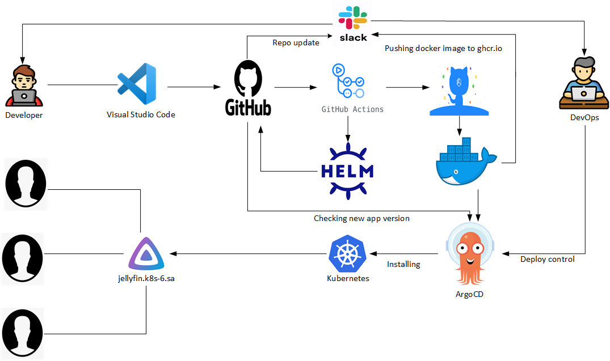

# Project report

## Project description

### Project's reporter: Uladzislau Krejzo

### Group number: md-sa2-25-23

### Pipeline. High Level Design

### Description of application for deployment:

- Application: Jellyfin Media Server

- Programming language: C#, .NET, python

- DB: sqlite3 

## Pipeline

### Technologies which were used in project:

- Orchestration: 
Kubernetes

- Automation tools:
GitHub's action, Argo CD 

- SCM:
GitHub

- Notification:
Slack + email

- Other tools:
Helm, Docker-compose

### CI/CD description:
Developer pushing commits to the master branch with changes of app. Git Action builds docker-compose.yaml to docker image and push it to GitHub container Registry. After that Action creates a HELM diagram package and commit them to repository. Argo CD deploys application in k8s Cluster.

### Rollback flow description and implementation:

Version selection in Argo CD
Release strategy: Recreate

### Perfomance of steps table

| Process owner |                                   Step of deployment                                   | Time     |
|---------------|:--------------------------------------------------------------------------------------:|----------|
| Developer     | make changes to project like docker-compose.yml and Helm deployment files              | ~        |
| Developer     | make commit and push changes to repo                                                   | ~        |
| GitHub Action | build docker image from docker-compose.yaml and push them to GitHub container registry | ~20s     |
| GitHub Action | build and index helm package                                                           | ~40s     |
| GitHub Action | make commit by github action and push to repo                                          | ~5s      |
| DevOps        | watch that were changed repo and appeared new helm-package release                     | ~        |
| DevOps        | try to change/start version of application in helm package (Jellyfin)                  | ~        |
| ArgoCD        | deployment of helm package to Kubernetes cluster                                       | ~1.5 min |

### Links:

Project repository: https://github.com/jankalep/it-academy-project.git

Application site: https://jellyfin.org/

Original dockerimage: https://hub.docker.com/r/jellyfin/jellyfin 

Original jellyfin docker-compose file: https://jellyfin.org/docs/general/installation/container/

Repo used like example for Helm: https://github.com/brianmcarey/jellyfin-helm.git 

My GitHub Action: 