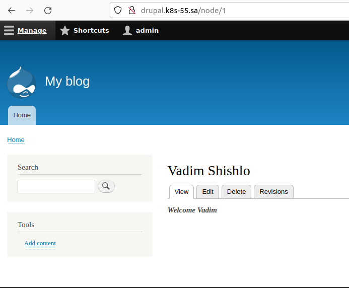
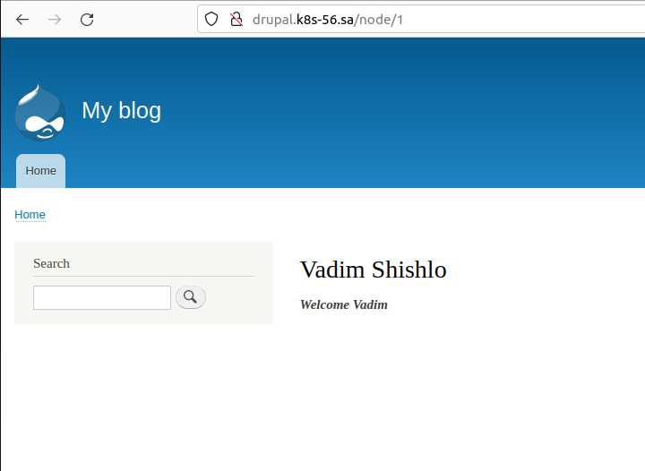
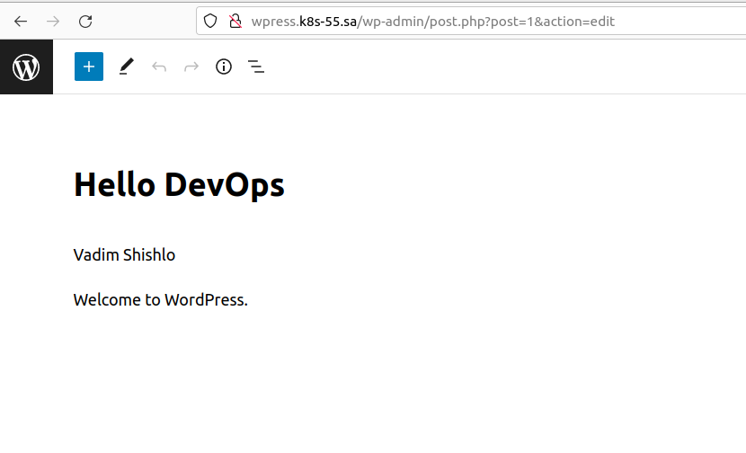
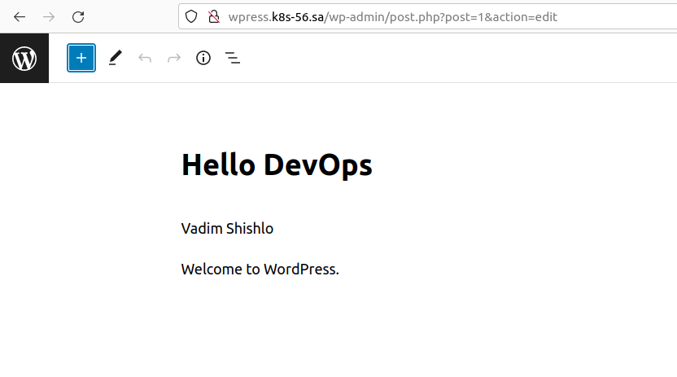

## 13. Kubernetes. Helm

## History of helm run commands
``` Bash
kubectl apply -f namespace.yml

helm repo add bitnami https://charts.bitnami.com/bitnami

helm repo add nfs-subdir-external-provisioner https://kubernetes-sigs.github.io/nfs-subdir-external-provisioner/

helm install nfs-subdir-external-provisioner nfs-subdir-external-provisioner/nfs-subdir-external-provisioner --set nfs.server=192.168.37.105 --set nfs.path=/mnt/IT-Academy/
nfs-data/sa2-20-22/Vadim_Shishlo --namespace homework

helm install wpress bitnami/wordpress --namespace homework --set global.storageClass=nfs-client,wordpressUsername=admin,wordpressPassword=admin,mariadb.auth.rootPassword=admin

kubectl apply -f ingress-wordpress.yml

helm install drupal bitnami/drupal --namespace homework --set global.storageClass=nfs-client,drupalUsername=admin,drupalPassword=admin,mariadb.auth.rootPassword=admin

kubectl apply -f ingress-drupal.yml
```
## Screenshots
* 
* 
* 
* 


