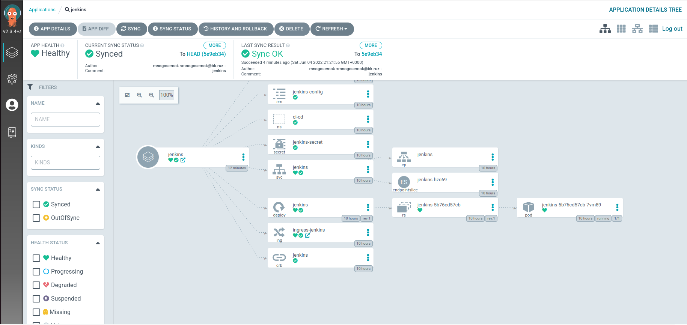
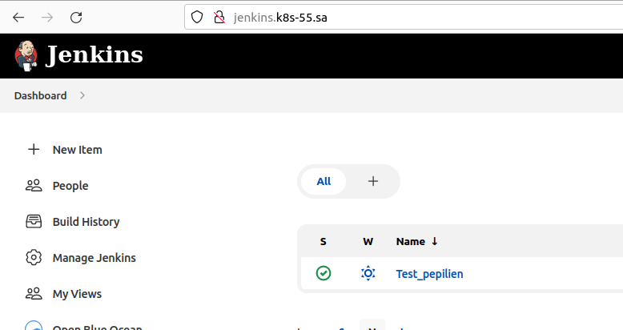

## 14. Kubernetes application deployment
* [GitHub](https://github.com/mnogosemok/JenkinsHelm)
## Run commands
``` Bash
project: default
source:
  repoURL: 'https://github.com/mnogosemok/JenkinsHelm'
  targetRevision: 0.1.0
  chart: jenkins
destination:
  server: 'https://kubernetes.default.svc'
  namespace: ci-cd-helm
syncPolicy:
  automated: {}
```
## Screenshots
* 
* 


