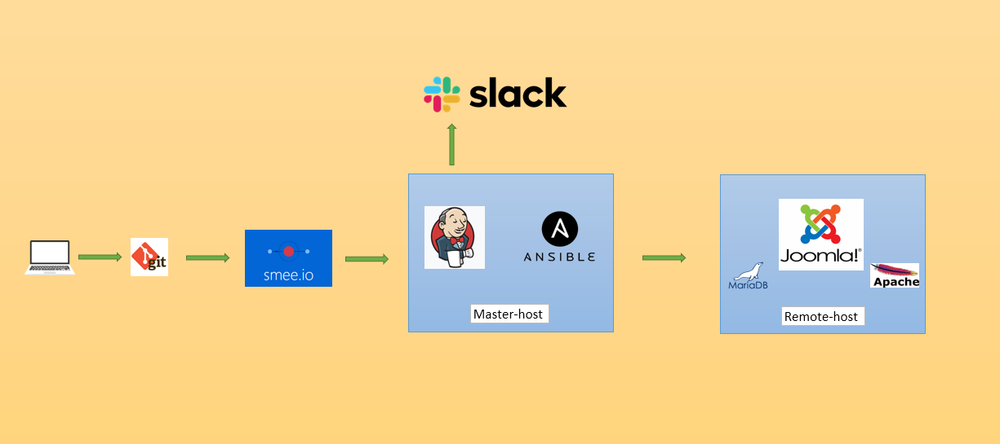

## My project

* ## Project's reporter: Shishlo Vadim
* ## Group number: md-sa2-20-22
* ## Description of application for deployment
* ## Name of application: Joomla
* ## Which programming language is this application written in: PHP
* ## What kind of DB: MariaDB
* ## Link on git repository:
* ## https://github.com/mnogosemok/Project

## Pipeline. High Level Design

* ## Technologies which were used in project
* ## Orchestration: Jenkins
* ## Automation tools: Ansible
* ## SCM: Github
* ## Notification: Slack
* ## CI description: tests of network ports, checks of running services
* ## Deployment flows short description:
* ## Localhost - GitHub - smee.io - Jenkins - Ansible - (Joomla-MariaDB-Apache) - Slack
