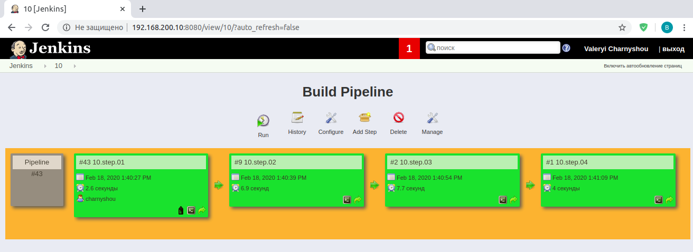

### Check connection to host

```bash
Started by user Valeryi Charnyshou
Running as SYSTEM
Building on master in workspace /var/lib/jenkins/workspace/10.step.01
[10.step.01] $ ansible all -i /tmp/inventory615091694658384976.ini -m ping -f 5 --private-key /tmp/ssh8299494994528577451.key -u chernysh
10.90.101.51 | SUCCESS => {
    "changed": false, 
    "ping": "pong"
}
Triggering a new build of 10.step.02
Finished: SUCCESS
```

### Install nmap

```bash
Started by upstream project "10.step.01" build number 43
originally caused by:
 Started by user Valeryi Charnyshou
Running as SYSTEM
Building on master in workspace /var/lib/jenkins/workspace/10.step.02
[10.step.02] $ ansible all -i /tmp/inventory113291594274714199.ini -a "sudo yum install -y nmap" -f 5 --private-key /tmp/ssh6049889625039818683.key -u chernysh
 [WARNING]: Consider using 'become', 'become_method', and 'become_user' rather
than running sudo
10.90.101.51 | SUCCESS | rc=0 >>
Loaded plugins: fastestmirror
Loading mirror speeds from cached hostfile
 * base: mirror.datacenter.by
 * extras: mirror.datacenter.by
 * updates: mirror.datacenter.by
Package 2:nmap-6.40-19.el7.x86_64 already installed and latest version
Nothing to do
Triggering a new build of 10.step.03
Finished: SUCCESS
```

### Check and print hosts online

```bash
Started by upstream project "10.step.02" build number 9
originally caused by:
 Started by upstream project "10.step.01" build number 43
 originally caused by:
  Started by user Valeryi Charnyshou
Running as SYSTEM
Building on master in workspace /var/lib/jenkins/workspace/10.step.03
[10.step.03] $ ansible all -i /tmp/inventory4959995833787302329.ini -a "nmap -sn 10.90.101.0/26" -f 5 --private-key /tmp/ssh2140571966264641113.key -u chernysh
10.90.101.51 | SUCCESS | rc=0 >>

Starting Nmap 6.40 ( http://nmap.org ) at 2020-02-18 16:41 +03
Nmap scan report for 10.90.101.2
Host is up (0.00086s latency).
Nmap scan report for 10.90.101.20
Host is up (0.00042s latency).
Nmap scan report for 10.90.101.31
Host is up (0.00026s latency).
Nmap scan report for 10.90.101.40
Host is up (0.00037s latency).
Nmap scan report for 10.90.101.43
Host is up (0.0011s latency).
Nmap scan report for 10.90.101.50
Host is up (0.00089s latency).
Nmap scan report for 10.90.101.51
Host is up (0.00010s latency).
Nmap done: 64 IP addresses (7 hosts up) scanned in 1.53 seconds
Triggering a new build of 10.step.04
Finished: SUCCESS
```

### Remove nmap

```bash
Started by upstream project "10.step.03" build number 2
originally caused by:
 Started by upstream project "10.step.02" build number 9
 originally caused by:
  Started by upstream project "10.step.01" build number 43
  originally caused by:
   Started by user Valeryi Charnyshou
Running as SYSTEM
Building on master in workspace /var/lib/jenkins/workspace/10.step.04
[10.step.04] $ ansible all -i /tmp/inventory4733136956134692844.ini -a "sudo yum remove -y nmap" -f 5 --private-key /tmp/ssh646870673636598785.key -u chernysh
 [WARNING]: Consider using 'become', 'become_method', and 'become_user' rather
than running sudo
10.90.101.51 | SUCCESS | rc=0 >>
Loaded plugins: fastestmirror
Resolving Dependencies
--> Running transaction check
---> Package nmap.x86_64 2:6.40-19.el7 will be erased
--> Finished Dependency Resolution

Dependencies Resolved

================================================================================
 Package        Arch             Version                  Repository       Size
================================================================================
Removing:
 nmap           x86_64           2:6.40-19.el7            @base            16 M

Transaction Summary
================================================================================
Remove  1 Package

Installed size: 16 M
Downloading packages:
Running transaction check
Running transaction test
Transaction test succeeded
Running transaction
  Erasing    : 2:nmap-6.40-19.el7.x86_64                                    1/1 
  Verifying  : 2:nmap-6.40-19.el7.x86_64                                    1/1 

Removed:
  nmap.x86_64 2:6.40-19.el7                                                     

Complete!
Finished: SUCCESS
```

### Screenshot of pipeline




