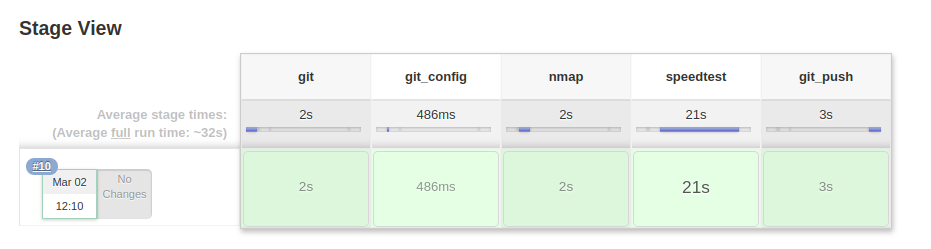
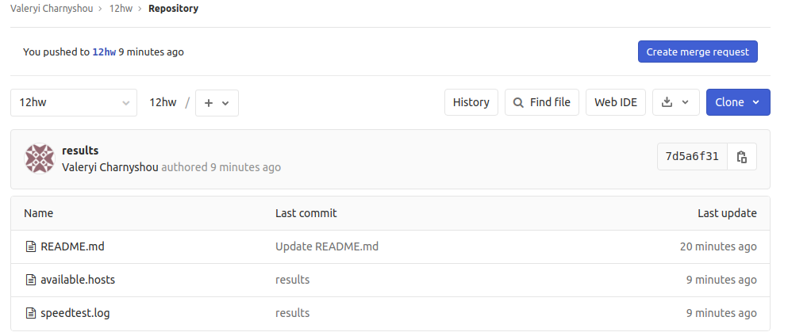

## 12.Jenkins.Hometask

### Jenkinsfile

```bash
pipeline {
    agent { label 'node01' }
    stages {
        stage('git') {
            steps {
                git url: 'git@gitlab.com:valeryicharnyshou/12hw.git'
            }
        }
        stage('git_config') {
            steps {
                sh """
			git config user.email "vcharnyshou@icloud.com"
                        git config user.name "Valeryi Charnyshou"
                        git config --global push.default simple
                        git checkout -b 12hw
					
                    """
            }
        }
        stage('nmap') {
            steps {
                sh """
                        sudo yum install -y nmap
                        sudo nmap -sn -n 192.168.201.1-10 > available.hosts
                    """
            }
        }
        stage('speedtest') {
            steps {
                sh """
                sudo yum install -y wget
                wget https://bintray.com/ookla/rhel/rpm -O bintray-ookla-rhel.repo
                sudo mv bintray-ookla-rhel.repo /etc/yum.repos.d/
                sudo yum -y install speedtest
                speedtest --accept-license > speedtest.log
                """
            }
        }
        stage('git_push') {
            steps {
                sh """
                git add --all
                git commit -m "results"
                git push -u -f origin 12hw
                """
            }
        }
    }
}
```

### Output

```bash
Started by user Valeryi Charnyshou
Running in Durability level: MAX_SURVIVABILITY
[Pipeline] Start of Pipeline
[Pipeline] node
Running on node01 in /var/lib/jenkins/workspace/21
[Pipeline] {
[Pipeline] stage
[Pipeline] { (git)
[Pipeline] git
No credentials specified
Fetching changes from the remote Git repository
 > git rev-parse --is-inside-work-tree # timeout=10
 > git config remote.origin.url git@gitlab.com:valeryicharnyshou/12hw.git # timeout=10
Fetching upstream changes from git@gitlab.com:valeryicharnyshou/12hw.git
 > git --version # timeout=10
 > git fetch --tags --progress git@gitlab.com:valeryicharnyshou/12hw.git +refs/heads/*:refs/remotes/origin/* # timeout=10
Checking out Revision b33292b1c780dc3e74bcf5b97964cf220cbb086c (refs/remotes/origin/master)
Commit message: "Update README.md"
 > git rev-parse refs/remotes/origin/master^{commit} # timeout=10
 > git rev-parse refs/remotes/origin/origin/master^{commit} # timeout=10
 > git config core.sparsecheckout # timeout=10
 > git checkout -f b33292b1c780dc3e74bcf5b97964cf220cbb086c # timeout=10
 > git branch -a -v --no-abbrev # timeout=10
 > git branch -D master # timeout=10
 > git checkout -b master b33292b1c780dc3e74bcf5b97964cf220cbb086c # timeout=10
 > git rev-list --no-walk b33292b1c780dc3e74bcf5b97964cf220cbb086c # timeout=10
[Pipeline] }
[Pipeline] // stage
[Pipeline] stage
[Pipeline] { (git_config)
[Pipeline] sh
+ git config user.email vcharnyshou@icloud.com
+ git config user.name 'Valeryi Charnyshou'
+ git config --global push.default simple
+ git checkout -b 12hw
Switched to a new branch '12hw'
[Pipeline] }
[Pipeline] // stage
[Pipeline] stage
[Pipeline] { (nmap)
[Pipeline] sh
+ sudo yum install -y nmap
Loaded plugins: fastestmirror
Loading mirror speeds from cached hostfile
 * base: ftp.byfly.by
 * extras: ftp.byfly.by
 * updates: ftp.byfly.by
Package 2:nmap-6.40-19.el7.x86_64 already installed and latest version
Nothing to do
+ sudo nmap -sn -n 192.168.201.1-10
[Pipeline] }
[Pipeline] // stage
[Pipeline] stage
[Pipeline] { (speedtest)
[Pipeline] sh
+ sudo yum install -y wget
Loaded plugins: fastestmirror
Loading mirror speeds from cached hostfile
 * base: ftp.byfly.by
 * extras: ftp.byfly.by
 * updates: ftp.byfly.by
Package wget-1.14-18.el7_6.1.x86_64 already installed and latest version
Nothing to do
+ wget https://bintray.com/ookla/rhel/rpm -O bintray-ookla-rhel.repo
--2020-03-02 09:10:27--  https://bintray.com/ookla/rhel/rpm
Resolving bintray.com (bintray.com)... 108.168.194.93
Connecting to bintray.com (bintray.com)|108.168.194.93|:443... connected.
HTTP request sent, awaiting response... 200 OK
Length: unspecified [text/plain]
Saving to: ‘bintray-ookla-rhel.repo’

     0K                                                         623K=0s

2020-03-02 09:10:28 (623 KB/s) - ‘bintray-ookla-rhel.repo’ saved [172]

+ sudo mv bintray-ookla-rhel.repo /etc/yum.repos.d/
+ sudo yum -y install speedtest
Loaded plugins: fastestmirror
Loading mirror speeds from cached hostfile
 * base: ftp.byfly.by
 * extras: ftp.byfly.by
 * updates: ftp.byfly.by
Package speedtest-1.0.0.2_1.5ae238b-1.x86_64 already installed and latest version
Nothing to do
+ speedtest --accept-license
[Pipeline] }
[Pipeline] // stage
[Pipeline] stage
[Pipeline] { (git_push)
[Pipeline] sh
+ git add --all
+ git commit -m results
[12hw 7d5a6f3] results
 2 files changed, 33 insertions(+)
 create mode 100644 available.hosts
 create mode 100644 speedtest.log
+ git push -u -f origin 12hw
remote: 
remote: To create a merge request for 12hw, visit:        
remote:   https://gitlab.com/valeryicharnyshou/12hw/-/merge_requests/new?merge_request%5Bsource_branch%5D=12hw        
remote: 
To git@gitlab.com:valeryicharnyshou/12hw.git
 * [new branch]      12hw -> 12hw
Branch 12hw set up to track remote branch 12hw from origin.
[Pipeline] }
[Pipeline] // stage
[Pipeline] }
[Pipeline] // node
[Pipeline] End of Pipeline
Finished: SUCCESS
```

### Screens





