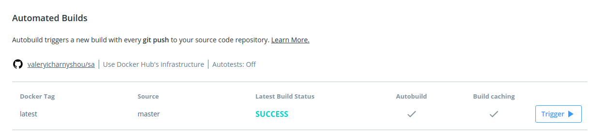

## 13.Docker.Hometask

### Create a Dockerfile of Python port listener

```bash
FROM alpine:latest

RUN apk add --update python

#CMD mkdir /portlistener/

COPY port_listener.py /


EXPOSE 5555

CMD python /port_listener.py
```

### cat port_listener.py

```bash
import socket
import sys
HOST = ''   # Symbolic name, meaning all available interfaces
PORT = 5555 # Arbitrary non-privileged port
s = socket.socket(socket.AF_INET, socket.SOCK_STREAM)
print 'Socket created'
#Bind socket to local host and port
try:
    s.bind((HOST, PORT))
except socket.error as msg:
    print 'Bind failed. Error Code : ' + str(msg[0]) + ' Message ' + msg[1]
    sys.exit()
print 'Socket bind complete'
#Start listening on socket
s.listen(10)
print 'Socket now listening'
#now keep talking with the client
while 1:
    #wait to accept a connection - blocking call
    conn, addr = s.accept()
    print 'Connected with ' + addr[0] + ':' + str(addr[1])
s.close()
```

### Add automated build for that image to Dockerhub using Github <=> Dockerhub integration



### Run image as container and test it

```bash
#docker run -it -d -p 5555:5555 --name pl 1824981/sa
Unable to find image '1824981/sa:latest' locally
latest: Pulling from 1824981/sa
c9b1b535fdd9: Pull complete 
bfd19a398f44: Pull complete 
c9f006de070f: Pull complete 
Digest: sha256:6613498dc4b5105690b396d0b2023a41853c03fc3cb899ddd6c4f6751d70ff2f
Status: Downloaded newer image for 1824981/sa:latest
d3f5314937ccf475b04ef9a32156a9fd88cf2d7b29ff5a26b1b9858700f701d3
# docker container ls
CONTAINER ID        IMAGE               COMMAND                  CREATED             STATUS              PORTS                    NAMES
d3f5314937cc        1824981/sa          "/bin/sh -c 'python …"   11 seconds ago      Up 9 seconds        0.0.0.0:5555->5555/tcp   pl
# telnet 127.0.0.1 5555
Trying 127.0.0.1...
Connected to 127.0.0.1.
Escape character is '^]'.
^C^]
telnet> Connection closed.
```

### Link to Dockerhub

[Dockerhub](https://hub.docker.com/repository/docker/1824981/sa)
