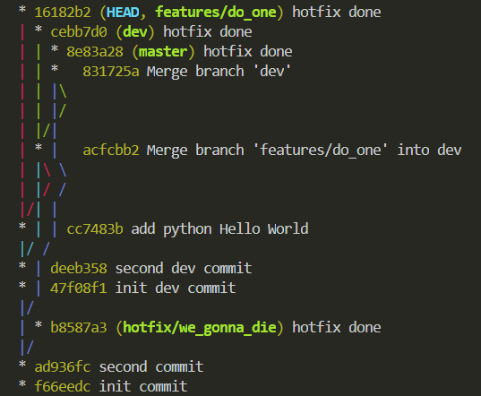

# Homework 02.Git.local

## I use this alias in my `.zshrc`

```bash
alias last="git log --graph --all --oneline --decorate "
```

## - Initialize local repository on your test host

```bash
mkdir 02.git.local
cd 02.git.local
git init
```

## - master (init branch)
```bash
echo "init commit" >> file.txt
git status 
git add .
git status 
git commit -m 'init commit'
last
echo "second commit" >> file.txt
git add file.txt
git status 
git commit -m 'second commit'
```

## - dev (has been created from master)
```bash
git checkout -b dev master 
echo "init commit in dev branch" >> dev_file.txt
git add . && git commit -m 'init dev commit'
last
echo "second commit in dev branch" >> dev_file.txt
git add . && git commit -m 'second dev commit'
```

## - features/do_one (has been created from dev branch)

```bash
git checkout -b features/do_one dev
echo "print('Hello World')" >> do_one.py
python do_one.py
git add .
git commit -m 'add python Hello World'
```

## - hotfix/we_gonna_die (has been created from master branch)

```bash
git checkout master
last
git checkout -b hotfix/we_gonna_die master
echo "init commit in hotfix" >> hotfix.txt
git add .
git commit -m 'hotfix done'
```

## - Release phase

```bash
git chechout dev
git merge features/do_one --no-ff
git checkout master
git merge dev --no-ff
last
```
   
## - Hotfix deploy

```bash
git checkout master
git cherry-pick hotfix/we_gonna_die
git checkout dev
git cherry-pick hotfix/we_gonna_die
git checkout features/do_one
git cherry-pick hotfix/we_gonna_die
```

## - git log


