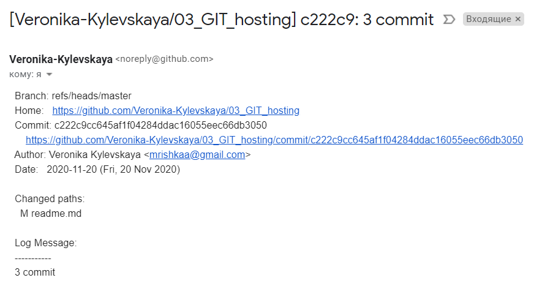
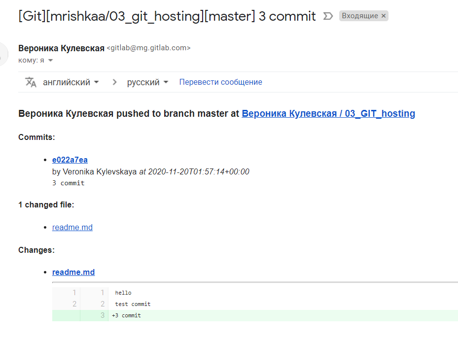
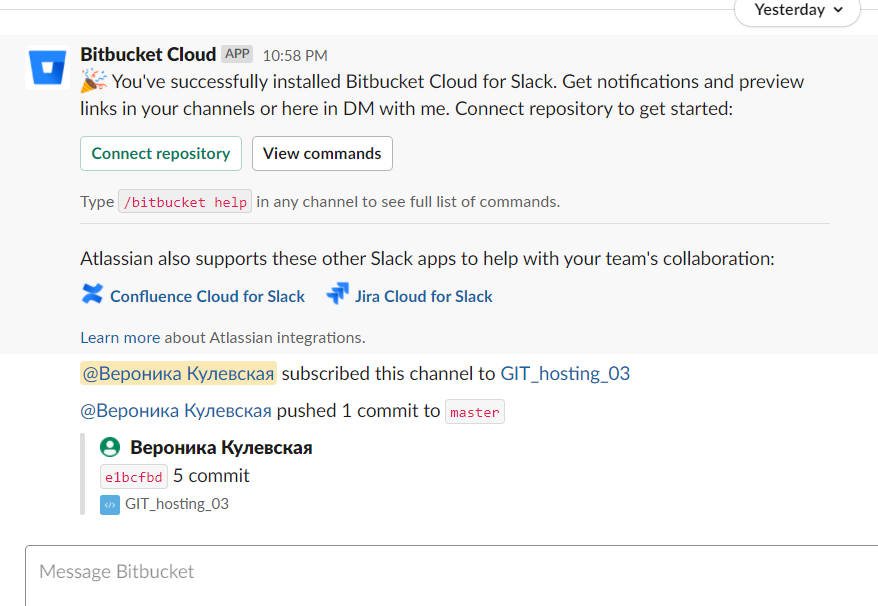
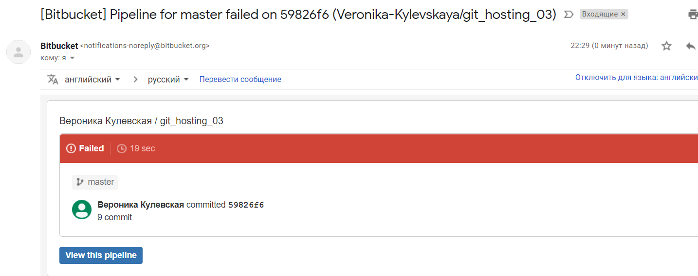
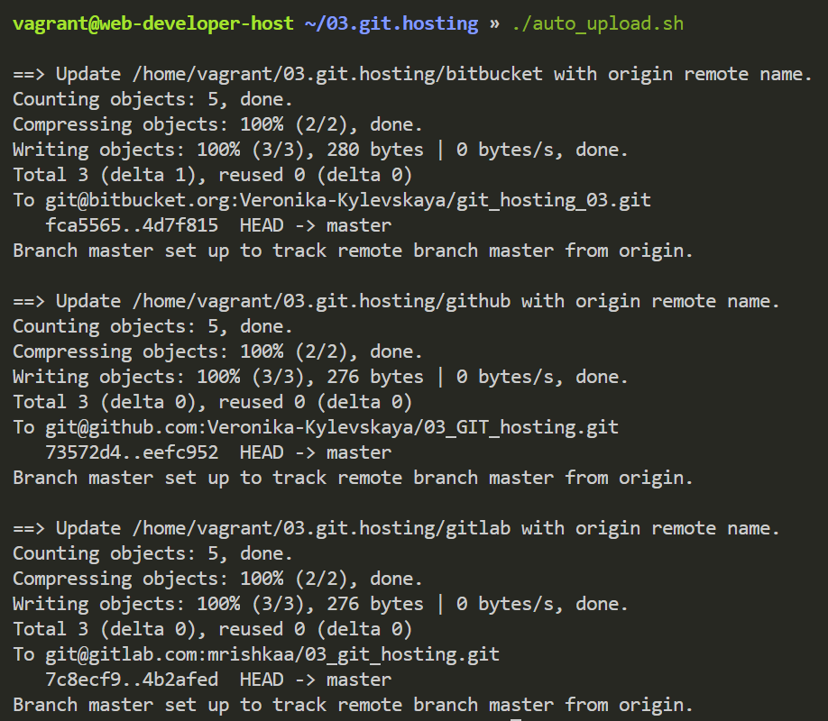

 ## Remote repositories

[bitbucket 03_GIT_hosting](https://bitbucket.org/Veronika-Kylevskaya/git_hosting_03/src/master/)


[gitlab 03_GIT_hosting](https://gitlab.com/mrishkaa/03_git_hosting)


[github 03_GIT_hosting](https://github.com/Veronika-Kylevskaya/03_GIT_hosting)

## Push your local repositories into remote repositories each all
```bash
git remote add origin git@github.com:Veronika-Kylevskaya/03_GIT_hosting.git

git remote add origin git@bitbucket.org:Veronika-Kylevskaya/git_hosting_03.git

git remote add origin git@gitlab.com:mrishkaa/03_git_hosting.git
```
## Create slack/email integration push/commit events






## Automate pushing your changes to all remote repositories
```bash
#!/bin/bash

ROOT_DIR=`pwd`
repos_array=("$(ls $ROOT_DIR)")


push_repos () {
    local repo_folder=$1
    local remote_name=$2

    echo -e "\n==> Update $ROOT_DIR/$repo_folder with $remote_name remote name."
    git push -u $remote_name HEAD   
}


for repo_folder in ${repos_array[*]}
do
    if [ -d "$ROOT_DIR/$repo_folder" -a -d "$ROOT_DIR/$repo_folder/.git" ]; then
        cd "$ROOT_DIR/$repo_folder"
        remote_names=("$(git remote show)")
        for remote in ${remote_names[*]}
        do
            push_repos "$repo_folder" "$remote"
        done
    fi
done
```
 
