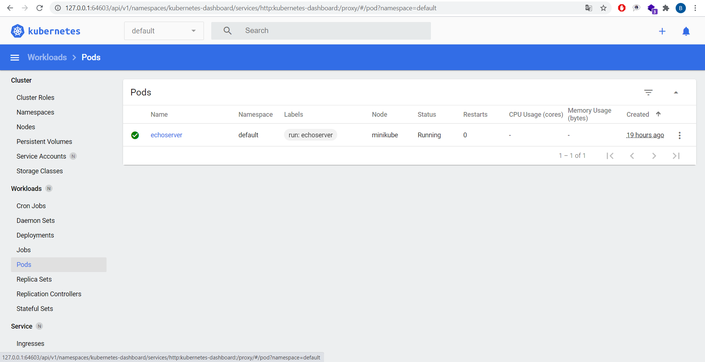

## Installed minikube with commands

```powershell
minikube start --driver='virtualbox'

kubectl.exe get namespaces
NAME              STATUS   AGE
default           Active   41m
kube-node-lease   Active   41m
kube-public       Active   41m
kube-system       Active   41m

kubectl.exe cluster-info
Kubernetes control plane is running at https://192.168.99.100:8443
KubeDNS is running at https://192.168.99.100:8443/api/v1/namespaces/kube-system/services/kube-dns:dns/proxy

minikube dashboard --url
* Enabling dashboard ...
* Verifying dashboard health ...
* Launching proxy ...
* Verifying proxy health ...
http://127.0.0.1:64603/api/v1/namespaces/kubernetes-dashboard/services/http:kubernetes-dashboard:/proxy/

minikube addons enable ingress

kubectl.exe run echoserver --image=gcr.io/google_containers/echoserver:1.4 --port=8080

kubectl.exe get pods
NAME         READY   STATUS              RESTARTS   AGE
echoserver   0/1     ContainerCreating   0          16s
```


## Minikube command with additional CPU/RAM parameters
```powershell
minikube start --driver=virtualbox --cpus 4 --memory 8192
```


## k8s was installed to IT Academy servers

```bash
Wednesday 09 December 2020  21:29:21 +0000 (0:00:00.050)       0:55:53.158 **** 
=============================================================================== 
kubernetes/preinstall : Install packages requirements -------------------------------------------------------- 526.83s
container-engine/docker : ensure docker packages are installed ----------------------------------------------- 162.91s
Gather necessary facts --------------------------------------------------------------------------------------- 156.10s
kubernetes/preinstall : Create kubernetes directories -------------------------------------------------------- 104.10s
kubernetes/master : kubeadm | Initialize first master --------------------------------------------------------- 81.26s
download : download_container | Download image if required ---------------------------------------------------- 77.25s
download : download_container | Download image if required ---------------------------------------------------- 75.44s
download : download_file | Download item ---------------------------------------------------------------------- 72.85s
kubernetes/preinstall : Create cni directories ---------------------------------------------------------------- 62.07s
kubernetes/preinstall : Ensure kube-bench parameters are set -------------------------------------------------- 62.06s
download : download_container | Download image if required ---------------------------------------------------- 61.13s
download : download_container | Download image if required ---------------------------------------------------- 58.93s
download : download_container | Download image if required ---------------------------------------------------- 58.09s
download : download_container | Download image if required ---------------------------------------------------- 57.74s
download : download_container | Download image if required ---------------------------------------------------- 57.17s
download : download_container | Download image if required ---------------------------------------------------- 56.46s
download : download_container | Download image if required ---------------------------------------------------- 55.04s
download : download_container | Download image if required ---------------------------------------------------- 53.24s
download : download_container | Download image if required ---------------------------------------------------- 51.85s
download : download_container | Download image if required ---------------------------------------------------- 48.35s
```