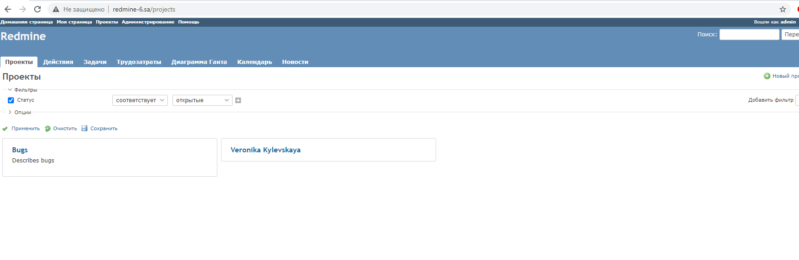

```bash
$ ansible-playbook -i inv.yaml redmine.yaml                                           

PLAY [lh_ubuntu] ************************************************************************************************************************************************************

TASK [Gathering Facts] ******************************************************************************************************************************************************
Sunday 03 January 2021  02:12:21 +0000 (0:00:00.025)       0:00:00.025 ******** 
ok: [lh_ubuntu]

TASK [debug] ****************************************************************************************************************************************************************
Sunday 03 January 2021  02:12:23 +0000 (0:00:01.721)       0:00:01.747 ******** 
ok: [lh_ubuntu] => {
    "msg": "192.168.44.56"
}

TASK [Redmine. Install packages (requirements)] *****************************************************************************************************************************
Sunday 03 January 2021  02:12:23 +0000 (0:00:00.052)       0:00:01.799 ******** 
ok: [lh_ubuntu]

TASK [requirements : Redmine. Clone repository] *****************************************************************************************************************************
Sunday 03 January 2021  02:12:25 +0000 (0:00:02.370)       0:00:04.169 ******** 
ok: [lh_ubuntu]

TASK [redmine_db : mysql_db] ************************************************************************************************************************************************
Sunday 03 January 2021  02:12:25 +0000 (0:00:00.419)       0:00:04.589 ******** 
ok: [lh_ubuntu]

TASK [redmine_db : mysql_user] **********************************************************************************************************************************************
Sunday 03 January 2021  02:12:26 +0000 (0:00:00.419)       0:00:05.008 ******** 
[WARNING]: Module did not set no_log for update_password
ok: [lh_ubuntu]

TASK [redmine_db : Config database] *****************************************************************************************************************************************
Sunday 03 January 2021  02:12:26 +0000 (0:00:00.420)       0:00:05.429 ******** 
ok: [lh_ubuntu]

TASK [redmine_app : Redmine. Change permissions for public folder] **********************************************************************************************************
Sunday 03 January 2021  02:12:27 +0000 (0:00:00.686)       0:00:06.115 ******** 
ok: [lh_ubuntu]

TASK [redmine_app : Redmine. Change permissions for tmp folder] *************************************************************************************************************
Sunday 03 January 2021  02:12:27 +0000 (0:00:00.232)       0:00:06.348 ******** 
ok: [lh_ubuntu]

TASK [redmine_app : Redmine. Setup 01] **************************************************************************************************************************************
Sunday 03 January 2021  02:12:27 +0000 (0:00:00.204)       0:00:06.552 ******** 
changed: [lh_ubuntu]

TASK [redmine_app : Session store secret generation] ************************************************************************************************************************
Sunday 03 January 2021  02:12:34 +0000 (0:00:06.413)       0:00:12.966 ******** 
ok: [lh_ubuntu]

TASK [redmine_app : Redmine. Setup 02] **************************************************************************************************************************************
Sunday 03 January 2021  02:12:34 +0000 (0:00:00.254)       0:00:13.220 ******** 
changed: [lh_ubuntu]

TASK [redmine_app : Configuration files for virtualhost] ********************************************************************************************************************
Sunday 03 January 2021  02:12:42 +0000 (0:00:08.330)       0:00:21.551 ******** 
ok: [lh_ubuntu]

TASK [redmine_test : Add redmine-6.sa to host file] *************************************************************************************************************************
Sunday 03 January 2021  02:12:43 +0000 (0:00:00.420)       0:00:21.971 ******** 
changed: [lh_ubuntu]

TASK [redmine_test : uri] ***************************************************************************************************************************************************
Sunday 03 January 2021  02:12:43 +0000 (0:00:00.185)       0:00:22.157 ******** 
ok: [lh_ubuntu]

TASK [redmine_test : lineinfile] ********************************************************************************************************************************************
Sunday 03 January 2021  02:12:43 +0000 (0:00:00.428)       0:00:22.585 ******** 
changed: [lh_ubuntu]

PLAY RECAP ******************************************************************************************************************************************************************
lh_ubuntu                  : ok=16   changed=4    unreachable=0    failed=0    skipped=0    rescued=0    ignored=0   

Sunday 03 January 2021  02:12:44 +0000 (0:00:00.354)       0:00:22.940 ******** 
=============================================================================== 
redmine_app : Redmine. Setup 02 -------------------------------------------------------------------------------------------------------------------------------------- 8.33s
redmine_app : Redmine. Setup 01 -------------------------------------------------------------------------------------------------------------------------------------- 6.41s
Redmine. Install packages (requirements) ----------------------------------------------------------------------------------------------------------------------------- 2.37s
Gathering Facts ------------------------------------------------------------------------------------------------------------------------------------------------------ 1.72s
redmine_db : Config database ----------------------------------------------------------------------------------------------------------------------------------------- 0.69s
redmine_test : uri --------------------------------------------------------------------------------------------------------------------------------------------------- 0.43s
redmine_db : mysql_user ---------------------------------------------------------------------------------------------------------------------------------------------- 0.42s
redmine_app : Configuration files for virtualhost -------------------------------------------------------------------------------------------------------------------- 0.42s
requirements : Redmine. Clone repository ----------------------------------------------------------------------------------------------------------------------------- 0.42s
redmine_db : mysql_db ------------------------------------------------------------------------------------------------------------------------------------------------ 0.42s
redmine_test : lineinfile -------------------------------------------------------------------------------------------------------------------------------------------- 0.35s
redmine_app : Session store secret generation ------------------------------------------------------------------------------------------------------------------------ 0.25s
redmine_app : Redmine. Change permissions for public folder ---------------------------------------------------------------------------------------------------------- 0.23s
redmine_app : Redmine. Change permissions for tmp folder ------------------------------------------------------------------------------------------------------------- 0.20s
redmine_test : Add redmine-6.sa to host file ------------------------------------------------------------------------------------------------------------------------- 0.19s
debug ---------------------------------------------------------------------------------------------------------------------------------------------------------------- 0.05s
Playbook run took 0 days, 0 hours, 0 minutes, 22 seconds
```

