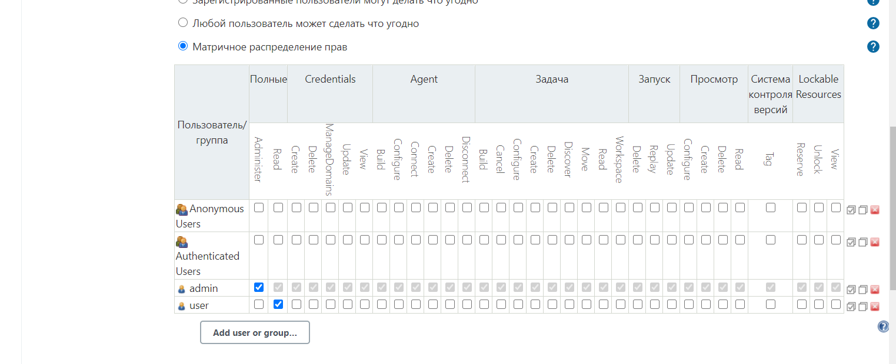
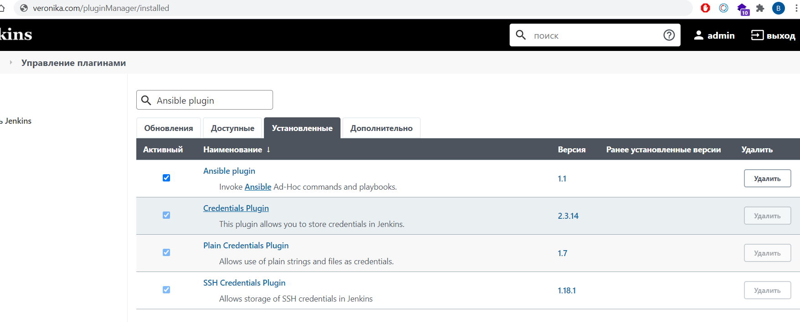
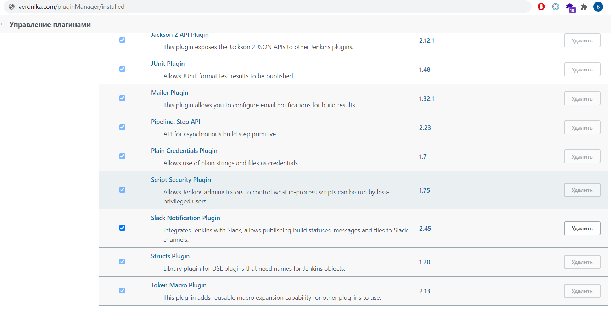

## Vagrantfile
```
Vagrant.configure("2") do |config|
  config.vm.define "Jenkins" do |centos|
    centos.vm.box = "centos/7" 
    centos.vm.network "public_network", ip: "192.168.44.77"
    centos.vm.hostname = "centos-jenkins"
    config.vm.provider "virtualbox" do |vb|
      vb.gui = false
      vb.memory = "2048"
      vb.name = "centos-jenkins"
    end
    centos.vm.provision "ansible_local" do |ansible|
      ansible.playbook = "play.yaml"
      ansible.install_mode = "pip"
      ansible.version = "2.10.5"
    end
  end
end
```
## User to view

## Ansible

## Slack notification
