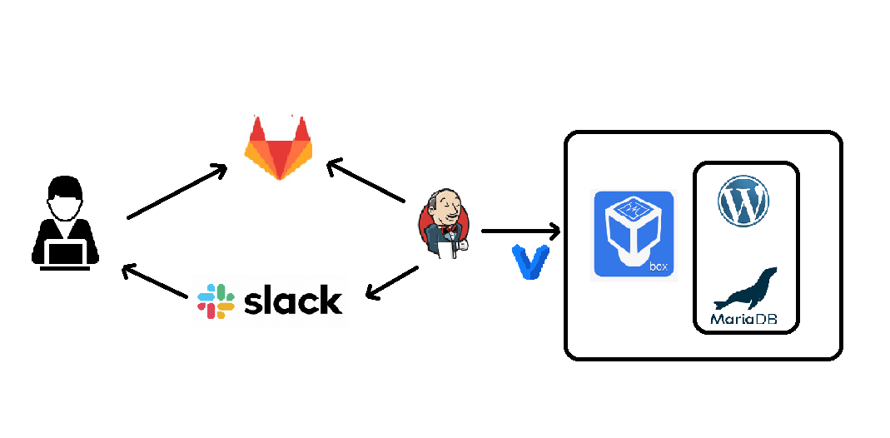

# Project

### Project's reporter: Kylevskaya Veronika
### Group number: Group m-sa2-15-20
#

## Description of application for deployment

### Name: Wordpress
### Application is written in PHP, Web - Nginx
### Database: MariaDB
### GitLAB [pipelines](https://gitlab.com/it-academy-project/pipelines/-/tree/master)

#

#
## Technologies which were used in project
### Orchestration: Jenkins
### Infrastructure: VirtualBox, Vagrant
### SCM: GitLab
### Notification: Slack
