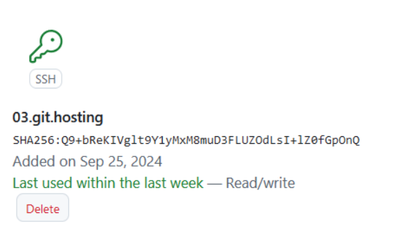
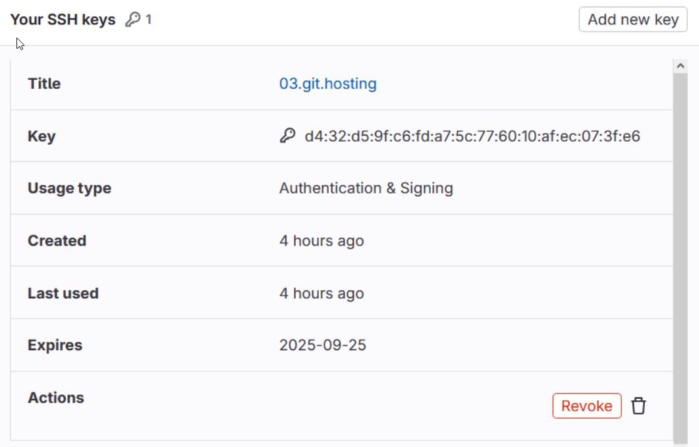
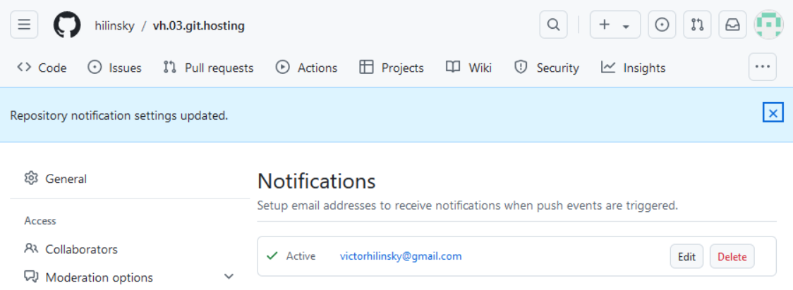
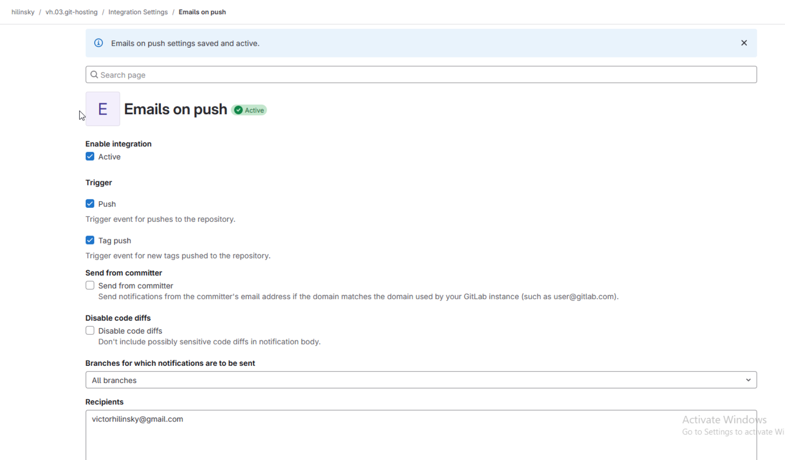
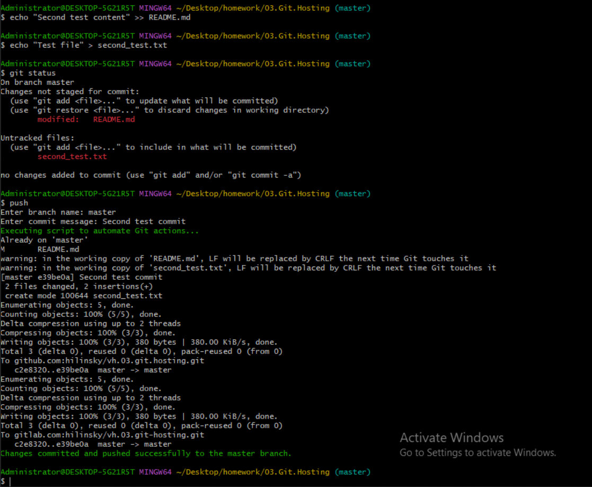

# 03. GIT. Hosting

## Homework Assignment 1: Initializing a Remote Repository
1. Create remote empty repositories (GitHub and GitLab)

    * GitHub url: <https://github.com/hilinsky/vh.03.git.hosting>
    * GitLab url: <https://gitlab.com/hilinsky/vh.03.git-hosting>
 
2. Add ssh key(s) to use ssh authentication
    
     * GitHub ssh key:
       
       
     * GitLab ssh key:
       
       
   
3. Push your local repository into remote repositories each all, one by one
   ```
        git remote add github-hosting git@github.com:hilinsky/vh.03.git.hosting.git
        git remote add gitlab-hosting git@gitlab.com:hilinsky/vh.03.git-hosting.git

        git push github-hosting master
        git push gitlab-hosting master

   ```   
4. Create email integration push/commit events
     
     * GitHub email:
       
       
     * GitLab email:
       
       

8. Automate pushing your changes to all remote repositories (bash/python/go.. scripts), create alias for script in your shell, list of upstream repositories should be extracted automatically for loop

   ```bash
      #!/bin/bash

      GREEN='\033[0;32m'
      NOCOLOR='\033[0m'
      
      read -p "Enter branch name: " branch_name
      read -p "Enter commit message: " commit_msg
      
      #check changes
      check_changes() {
        if [ -z "$(git status --porcelain)" ]; then
          echo "No changes to commit."
          exit 0
        fi
      }
      
      #commit changes
      commit_changes() {
        git add .
        git commit -m "$commit_msg"
      }
      
      echo -e "${GREEN}Executing script to automate Git actions...${NOCOLOR}"
      
      #check if you're inside a Git repository
      if ! git rev-parse --is-inside-work-tree >/dev/null 2>&1; then
        echo "Error: Current directory is not a Git repository."
        exit 1
      fi
      
      #swith to the branch
      git checkout "$branch_name"
      
      check_changes
      
      commit_changes
      
      #get list of tracked repos
      tracked_repos=()
      while IFS= read -r line; do
          tracked_repos+=( "$line" )
      done < <( git remote )
      
      #push changes
      for repo in ${tracked_repos[@]}
      do
            git push $repo $branch_name
      done
      
      echo -e "${GREEN}Changes committed and pushed successfully to the $branch_name branch.${NOCOLOR}"
      
   ```
   ```
   cat ~/.bashrc
   alias push='~/Desktop/homework/scripts/push.sh'
   ```
   

   
   
