# 04. GitOps

## Homework Assignment 1: Setting up a Basic GitHub Action

1. Create a new public repository on GitHub.
   *  GitHub url: <https://github.com/hilinsky/vh.04.gitops>

2. Inside the repository, create a simple Python or JavaScript script (e.g., "hello.py" or "hello.js") that prints "Hello, GitHub Actions!" to the console.
   ```python
      msg = "Hello, GitHub Actions!"
      print(msg)
   ```
  
3. Create a new GitHub Action workflow (.github/workflows/hello.yml) that triggers on every push to the main branch.
   ```yaml
      name: Hello message
      on:
        push:
          branches:
          - master
      jobs:
        build:
          runs-on: ubuntu-latest
          steps: 
            - name: Say Hello, GitHub Actions!
              run: echo "Hello, GitHub Actions!"
   ```

4. Configure the workflow to run the script you created in step 2.
   ```yaml
      name: Hello message
      on:
        push:
          branches:
          - master
      jobs:
        build:
          runs-on: ubuntu-latest
          steps:
          - uses: actions/checkout@v4
          - uses: actions/setup-python@v5
            with:
              python-version: '3.10' 
          - run: python action.py
    ```

5. Push your changes to the repository and observe the GitHub Action run.
   
   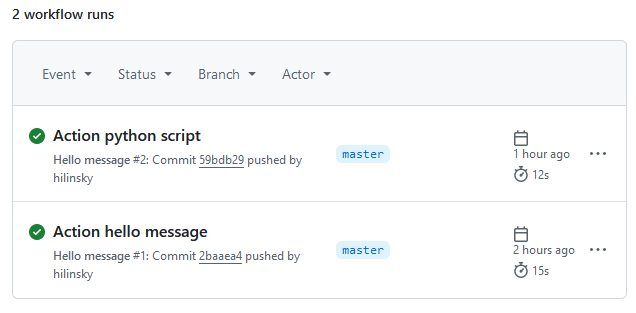
   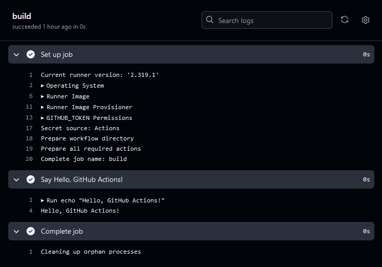
   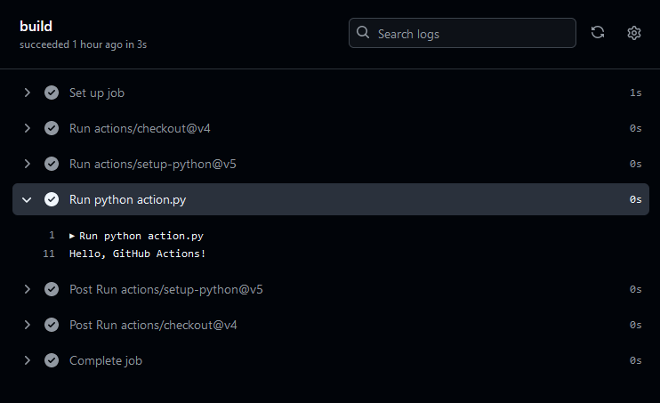

## Homework Assignment 2: Building and Testing with GitHub Actions

1. Choose a programming language of your choice.
   *  Programming language - Python
     
2. Set up a new or use an existing repository.
   *  GitHub url: <https://github.com/hilinsky/vh.04.gitops>
     
4. Create a simple program that performs a basic operation (e.g., calculation, string manipulation).
   ```python
      def calculate_area_square(length: int | float) -> int | float:  
          if not isinstance(length, (int, float)) or length <= 0:  
              raise TypeError("Length must be a positive non-zero number")  
          return length * length
   ```
5. Write unit tests for your program using a testing framework appropriate for the language.
   ```python
      import pytest  
      from calc import calculate_area_square  
        
      def test_calculate_area_square():  
          assert calculate_area_square(2) == 4  
          assert calculate_area_square(2.5) == 6.25  
        
      def test_calculate_area_square_negative():  
          with pytest.raises(TypeError):  
              calculate_area_square(-2)  
        
      def test_calculate_area_square_string():  
          with pytest.raises(TypeError):  
              calculate_area_square("2")  
        
      def test_calculate_area_square_list():  
          with pytest.raises(TypeError):  
              calculate_area_square([2])
   ```
   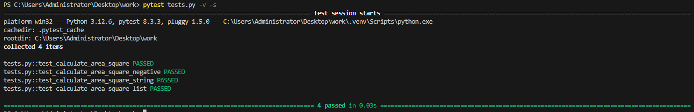
6. Create a GitHub Action workflow that runs the unit tests whenever changes are pushed to the repository.
   ```yaml
      name: Run Unit Test via Pytest
      on:
        push:
          branches:
          - master
      jobs:
        build:
          runs-on: ubuntu-latest
          steps:
          - uses: actions/checkout@v4
          - uses: actions/setup-python@v5
            with:
              python-version: '3.10'
          - name: Install dependencies
            run: |
              python -m pip install --upgrade pip
              if [ -f requirements.txt ]; then pip install -r requirements.txt; fi
          - name: Lint with Ruff
            run: |
              pip install ruff
              ruff --format=github --target-version=py310 .
            continue-on-error: true
          - name: Test with pytest
            run: coverage run -m pytest tests.py -v -s
          - name: Generate Coverage Report
            run: coverage report -m
   ```
7. Ensure the workflow reports whether the tests passed or failed.
   
   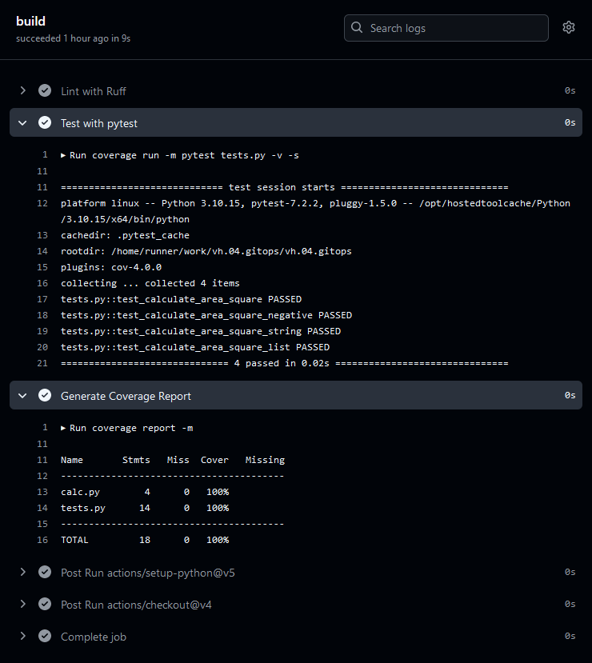
   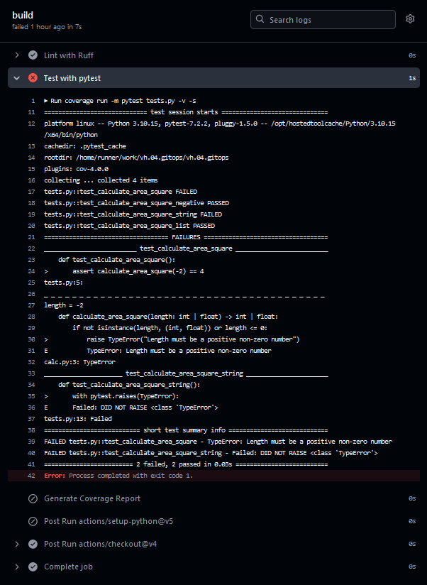

## Homework Assignment 3: Continuous Deployment with GitHub Actions (Optional)

1. Choose a static website or a simple web application project.
   * Static website
     
2. Create a GitHub repository for your project.
   * GitHub url: <https://github.com/hilinsky/hilinsky.github.io>

3. Set up a basic HTML/CSS or the appropriate project structure.
   ```html
      <!DOCTYPE html>
      <html>
      <head>
        <link rel="stylesheet" href="css/style.css">
      </head>
      <body>
      
          <div id="exercisecontainer">
              <h2>Exercise GitOps</h2>
                  <p>Homework Assignment: Continuous Deployment with GitHub Actions (Optional)</p>
                  <ol>
                      <li>Choose a static website or a simple web application project.</li>
                      <li>Create a GitHub repository for your project.</li>
                      <li>Set up a basic HTML/CSS or the appropriate project structure.</li>
                      <li>Create a GitHub Action workflow that automatically builds and deploys the project to GitHub Pages or another hosting service of your choice.</li>
                      <li>Configure the workflow to trigger on every push to the main branch.</li>
                      <li>Push changes to your repository and verify that the website or application is automatically deployed.</li>
                    </ol>
          </div> 
      </body>
      </html> 
   ```

   ```css
      html {
          background-color: #2D3748;
      }
      #exercisecontainer{
          font-family: 'Source Sans Pro', sans-serif;
          text-align: center;
          max-width: 1000px !important;
          padding: 20px 20px 40px 20px;
          border-radius: 15px;
          color: #fff;
          font-size: 18px !important;
          margin: 0 auto;
      }
      #exercisecontainer p {
          font-size: 24px !important;
          margin: 5px;
      }
      #exercisecontainer li {
          text-align: left;
          font-size: 18px !important;
          margin: 5px;
      }
   ```

   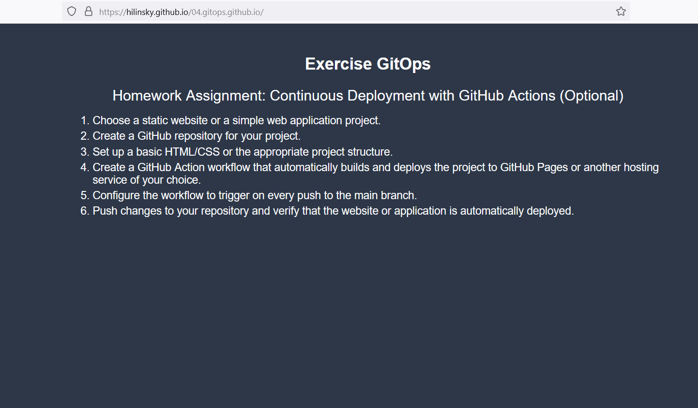
   
4. Create a GitHub Action workflow that automatically builds and deploys the project to GitHub Pages or another hosting service of your choice. 
   ```yaml
      name: Deploy static content to Pages
      on:
        push:
          branches: ["master"]
        workflow_dispatch:
      permissions:
        contents: read
        pages: write
        id-token: write
      concurrency:
        group: "pages"
        cancel-in-progress: false
      jobs:
        deploy:
          environment:
            name: github-pages
            url: ${{ steps.deployment.outputs.page_url }}
          runs-on: ubuntu-latest
          steps:
            - name: Checkout
              uses: actions/checkout@v4
            - name: Setup Pages
              uses: actions/configure-pages@v5
            - name: Upload artifact
              uses: actions/upload-pages-artifact@v3
              with:
                path: '.'
            - name: Deploy to GitHub Pages
              id: deployment
              uses: actions/deploy-pages@v4
   ```

5. Configure the workflow to trigger on every push to the main branch.
   ```yaml
      name: Deploy static content to Pages
      on:
        push:
          branches: ["master"]

   ```
   
 6. Push changes to your repository and verify that the website or application is automatically deployed.
    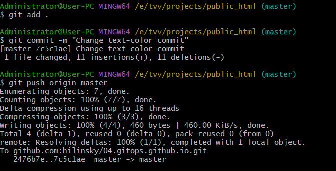
    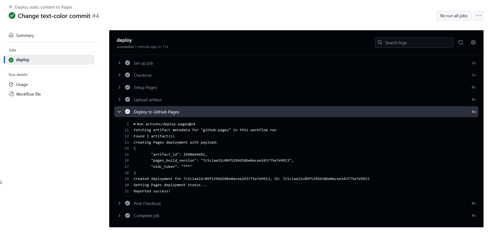
    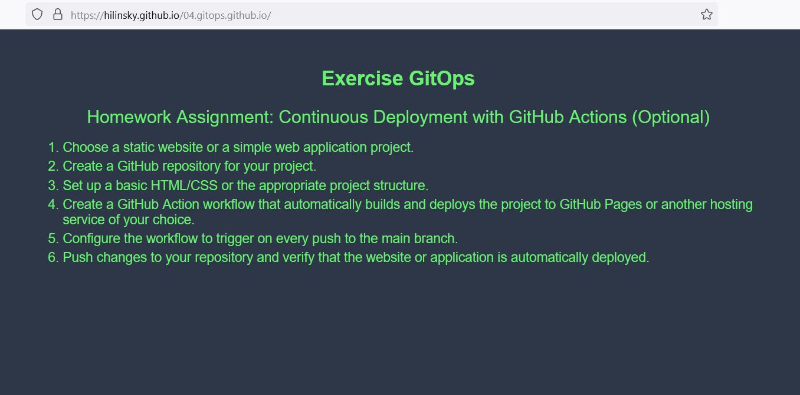

## Homework Assignment 4: Customizing GitHub Actions Workflow (Optional)

1. Choose a project with multiple branches and environments (e.g., development, staging, production).
   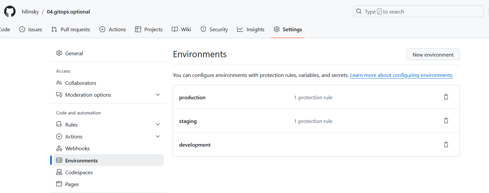
   
2. Set up a GitHub repository for the project.
   *  GitHub url: <https://github.com/hilinsky/vh.04.gitops>
       
3. Create a GitHub Action workflow that deploys the project to different environments based on the branch name.
   ```yaml
      name: CI CD Pipeline

      on:
        push:
          branches:
          - master
      
        workflow_dispatch:
      
      jobs:
        development:
          runs-on: ubuntu-latest
          environment: development
      
          steps:
          - uses: actions/checkout@v2
      
          - name: Run a script
            run: |
              echo "I am running a job in the development environment"
      
        staging:
          runs-on: ubuntu-latest
          environment: staging
          needs: development
          steps:
          - uses: actions/checkout@v2
      
          - name: Run a script
            run: |
              echo "I am running a job in the staging environment"
      
        production:
          runs-on: ubuntu-latest
          environment: production
          needs: staging
          steps:
          - uses: actions/checkout@v2
          
          - name: Run a script
            run: |
              echo "I am running a job in the staging environment"
      
   ```
   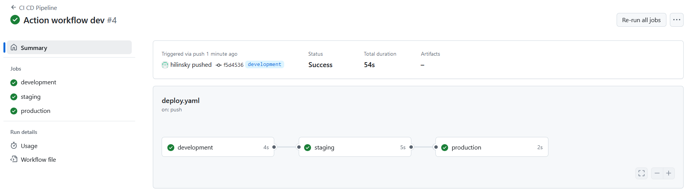
   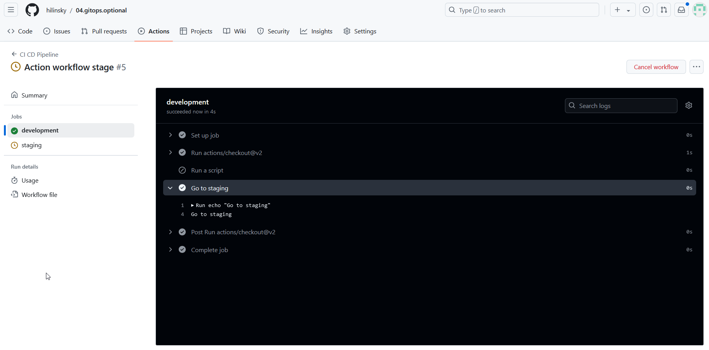
   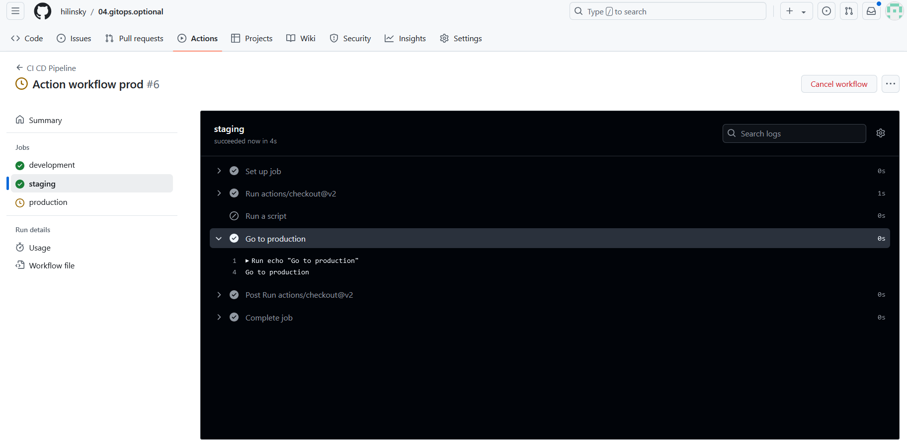
   
5. Customize the workflow using conditional statements and environment-specific variables.
   ```yaml
      name: CI CD Pipeline
      
      on:
        push:
          branches:
          - "*"
      
        workflow_dispatch:
      
      env:
        DEV_ENV: development
        STAGE_ENV: staging
        PROD_ENV: production
      
      jobs:
        development:
          runs-on: ubuntu-latest
          environment: $DEV_ENV
          
          steps:
          - uses: actions/checkout@v2
      
          - name: Run a script
            if: github.ref == 'refs/heads/$DEV_ENV'
            run: |
              echo "I am running a job in the $DEV_ENV environment"
      
          
          - name: Go to staging
            if: github.ref != 'refs/heads/$DEV_ENV'
            run: |
              echo "Go to $STAGE_ENV"
      
        staging:
          runs-on: ubuntu-latest
          environment: $STAGE_ENV
          needs: development
          steps:
          - uses: actions/checkout@v2
      
          - name: Run a script
            if: github.ref == 'refs/heads/$STAGE_ENV' || github.ref == 'refs/heads/$DEV_ENV'
            run: |
              echo "I am running a job in the $STAGE_ENV environment"
          
          - name: Go to production
            if: github.ref != 'refs/heads/$STAGE_ENV' || github.ref != 'refs/heads/$DEV_ENV'
            run: |
              echo "Go to $PROD_ENV"
      
        production:
          runs-on: ubuntu-latest
          environment: production
          needs: staging
          steps:
          - uses: actions/checkout@v2
          
          - name: Run a script
            if: github.ref == 'refs/heads/$PROD_ENV'
            run: |
              echo "I am running a job in the $PROD_ENV environment"
      
   ```
   
6. Test the workflow by pushing changes to various branches and verifying the deployment behavior.
   ```bash
      git add .
      git commit --amend -m "Action workflow dev"
      git push origin development  -f
      
      git checkout staging
      git add .
      git commit --amend -m "Action workflow stage"
      git push origin staging -f
      
      git checkout production
      git add .
      git commit --amend -m "Action workflow prod"
      git push origin production -f
   ```
   
   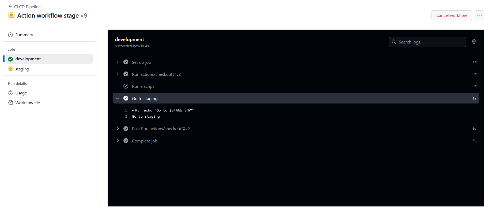
   

