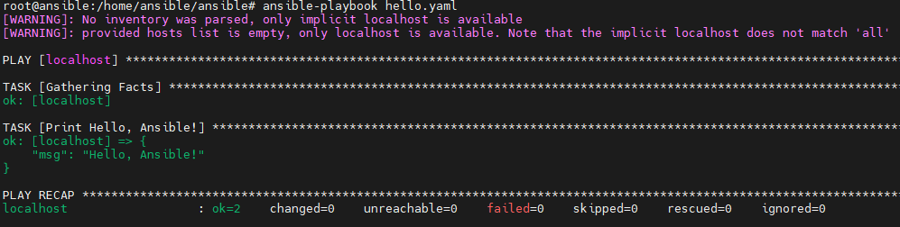
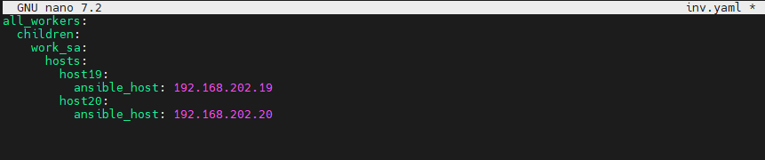
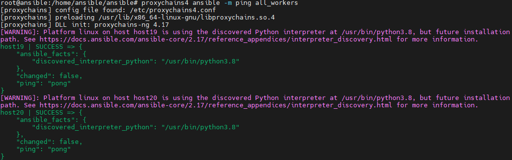
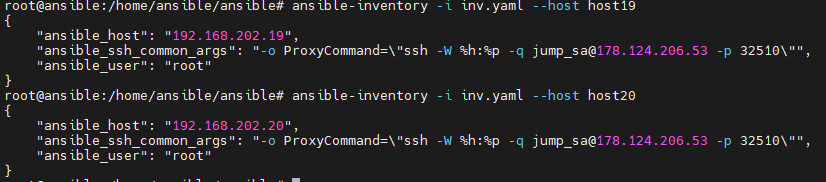
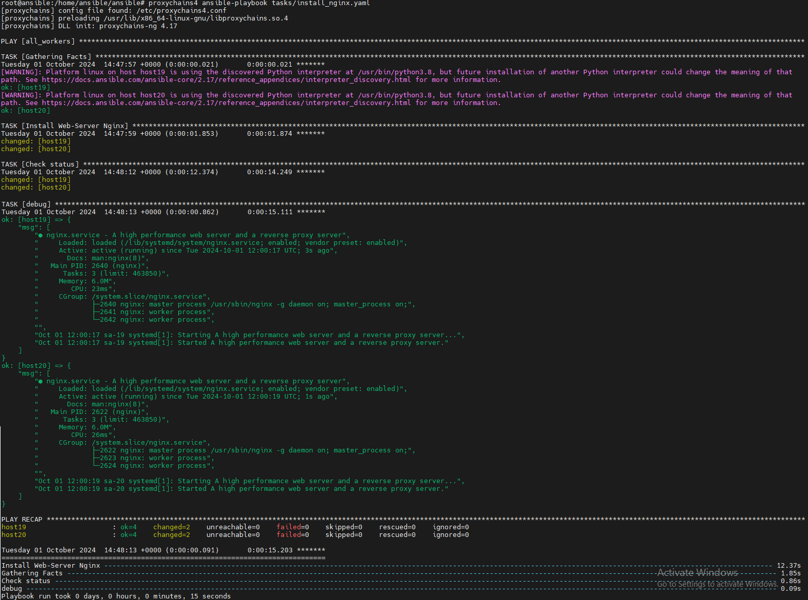
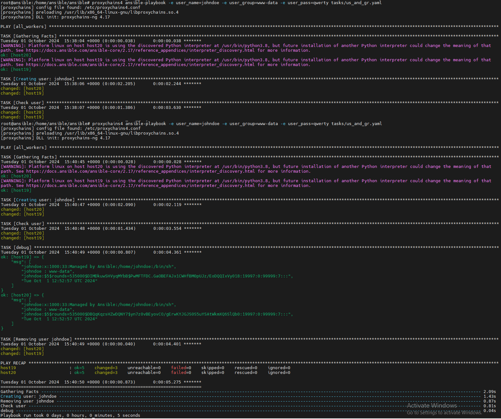

 # 05. Ansible start

## Homework Assignment 1: Setting Up Ansible

1. Install Ansible on your local machine or a virtual environment.
   
   ```bash
   pip3 install ansible
   ```

2. Create a directory for your Ansible playbooks and configuration files.
   
   ```bash
   mkdir ansible
   cd ansible
   ```
   
3. Write an Ansible playbook that prints "Hello, Ansible!" to the console.
   
   ```yaml
   
   - hosts: localhost
     vars:
       msg: "Hello, Ansible!"
    
     tasks:
       - name: Print Hello, Ansible!
         debug:
           msg: "{{ msg }}"
         tags:
           - no_facts
           - always

   ```

4. Run the playbook using the ansible-playbook command and ensure it executes successfully.
   
   ```bash
   ansible-playbook hello.yaml
   ```
5. Document the installation process and the steps you took to run the playbook.

   

## Homework Assignment 2: Managing Remote Hosts

1. Set up a virtual machine (or use an existing one in IT-ACADEMY DC) to act as your remote target.

   
   
2. Ensure SSH access to the remote machine from your local machine.

   

3. Write an Ansible playbook to install a basic package (e.g., vim or htop) on the remote host.
   
   ```yaml

   - hosts: "{{ group | default('all_workers')}}"
     tasks:
       - name: Install Web-Server Nginx
         ansible.builtin.apt:
           name: nginx
           state: latest
           update_cache: yes
    
       - name: Check status
         shell: |
           systemctl status nginx
         register: out
   
       - debug:
           msg: "{{ out.stdout_lines }}"

   ```
      
4. Use inventory files to manage the connection details for the remote host.

   
   
5. Execute the playbook and verify that the package is installed on the remote host.

      

## Homework Assignment 3: Managing Users and Groups

1. Create a playbook to manage users and groups on a remote host. Define tasks to create a new user, assign the user to a specific group, and set a password. Parameterize the playbook to allow dynamic user and group names.

   ```yaml

    - hosts: "{{ group | default('all_workers')}}"
      tasks:
    
      - name: "Creating user: {{ user_name }}"
        ansible.builtin.user:
          name: "{{ user_name }}"
          group: "{{ user_group }}"
          password: "{{ user_pass | password_hash('sha256') }}"
          state: present
          comment: Managed by Ansible
    
      - name: Check user
        shell: |
          grep "{{ user_name }}" /etc/passwd
          groups "{{ user_name }}"
          grep "{{ user_name }}" /etc/shadow
          date
        register: out
    
      - debug:
          msg: "{{ out.stdout_lines }}"
    
      - name: Removing user {{ user_name }}
        ansible.builtin.user:
          name: "{{ user_name }}"
          state: absent
          remove: yes

   ```
   2. Execute the playbook and verify that the user and group configurations are applied.

         