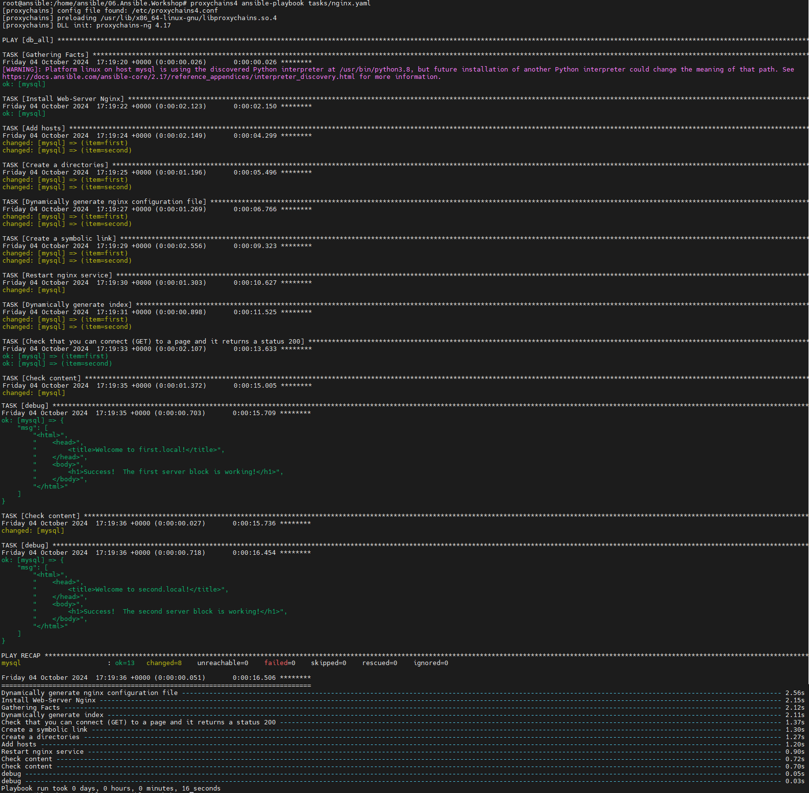

# 06. Ansible Workshop
## Homework Assignment 1: Configuration Management
1. Choose a web server software (e.g., Nginx) for configuration management.

    * WebServer - nginx

2. Write an Ansible playbook to install and configure the chosen web server on a remote host (two virtualhosts using templates).
   Include tasks to create a simple HTML file served by the web server, with unique data inside (host name and FQDN) for each virtualhost.

```yaml
  - hosts: "{{ group | default('db_all')}}"
    vars:
      nginx_hosts:
        - first
        - second
    tasks:
      - name: Install Web-Server Nginx
        ansible.builtin.apt:
          name: nginx
          state: latest
          update_cache: yes
        tags: install
  
      - name: Add hosts
        ansible.builtin.lineinfile:
          path: /etc/hosts
          line: "{{ ansible_host }} {{ item }}.local"
        loop: "{{ nginx_hosts }}"
  
      - name: Create a directories
        ansible.builtin.file:
          path: "/var/www/html/{{ item }}"
          state: directory
          owner: www-data
          group: www-data
          mode: '0755'
        loop: "{{ nginx_hosts }}"
  
      - name: Dynamically generate nginx configuration file
        ansible.builtin.template:
          src: ../templates/nginx_host.conf.j2
          dest: "/etc/nginx/sites-available/{{ item }}.conf"
          mode: "0644"
        loop: "{{ nginx_hosts }}"
  
      - name: Create a symbolic link
        ansible.builtin.file:
          src: "/etc/nginx/sites-available/{{ item }}.conf"
          dest: "/etc/nginx/sites-enabled/{{ item }}.conf"
          state: link
        loop: "{{ nginx_hosts }}"
  
      - name: Restart nginx service
        ansible.builtin.service:
          name: nginx
          state: restarted
  
      - name: Dynamically generate index
        ansible.builtin.template:
          src: ../templates/index.j2
          dest: "/var/www/html/{{ item }}/index.html"
          owner: www-data
          group: www-data
          mode: "0644"
        loop: "{{ nginx_hosts }}"
  
      - name: Check that you can connect (GET) to a page and it returns a status 200
        ansible.builtin.uri:
          url: "http://{{ item }}.local"
        loop: "{{ nginx_hosts }}"
      
      - name: Check content
        shell: |
          curl http://first.local
        register: out
      - debug:
          msg: "{{ out.stdout_lines }}"
  
      - name: Check content
        shell: |
          curl http://second.local
        register: out
      - debug:
          msg: "{{ out.stdout_lines }}"
```

  * Nginx template
    
```nginx
server {
        listen {{ ansible_host }}:80;

        root /var/www/html/{{ item }};
        index index.html;

        server_name {{item}}.local;

        location / {
                try_files $uri $uri/ =404;
        }
}

```

  * Index template
    
```html
<html>
    <head>
        <title>Welcome to {{ item }}.local!</title>
    </head>
    <body>
        <h1>Success!  The {{ item }} server block is working!</h1>
    </body>
</html>

```
3. Run the playbook and ensure the web server is installed, configured, and serving the HTML file.

        
