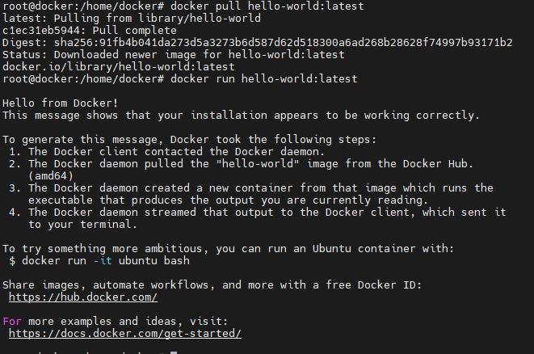
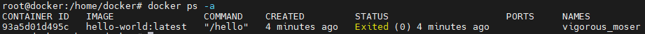
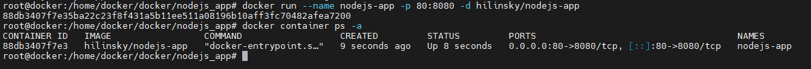
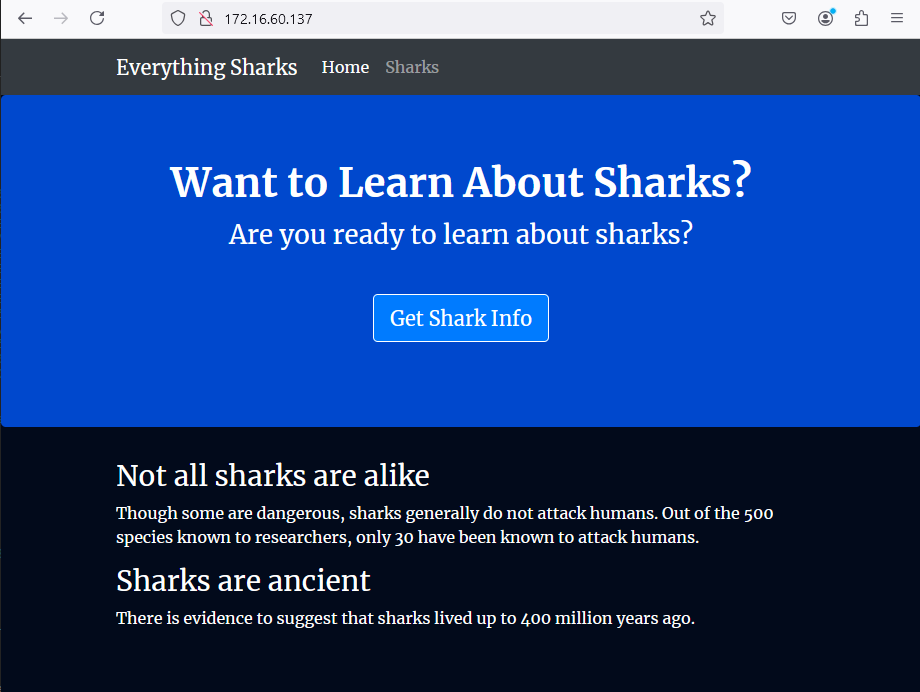
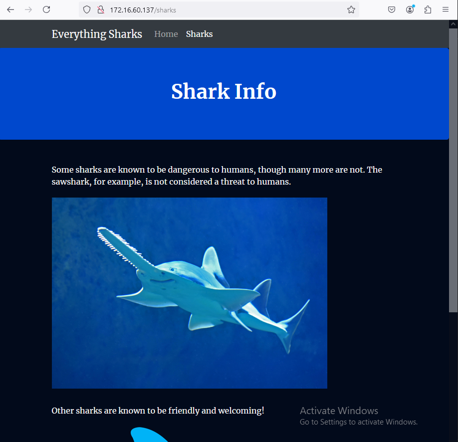

# 07. Docker

## Homework Assignment 1: Docker Installation and Basic Commands

1. Install Docker on your local machine or a virtual environment.
```bash

  proxychains4 apt update

  proxychains4 apt install ca-certificates curl

  install -m 0755 -d /etc/apt/keyrings

  proxychains4 curl -fsSL https://download.docker.com/linux/ubuntu/gpg -o /etc/apt/keyrings/docker.asc

  chmod a+r /etc/apt/keyrings/docker.asc

  echo   "deb [arch=$(dpkg --print-architecture) signed-by=/etc/apt/keyrings/docker.asc] https://download.docker.com/linux/ubuntu \
  $(. /etc/os-release && echo "$VERSION_CODENAME") stable" |   sudo tee /etc/apt/sources.list.d/docker.list > /dev/null

  proxychains4 apt update

  proxychains4 apt install docker-ce docker-ce-cli containerd.io docker-buildx-plugin docker-compose-plugin

```
2. Verify the Docker installation by running the docker --version command.
```bash

    docker --version
    Docker version 27.3.1, build ce12230

```
3. Pull the official "hello-world" Docker image and run a container based on it.

    

4. List the running containers using the docker ps command.

    

5. Document the installation process and the commands used for verification.

## Homework Assignment 2: Building a Docker Image with Dockerfile

1. Create a new directory for your Dockerfile and application code.

```bash

  mkdir nodejs_app

```

2. Write a Dockerfile to build an image for a simple web application (e.g., Flask or Node.js).

* package.json

```json
  {
    "name": "nodejs-app",
    "version": "1.0.0",
    "description": "nodejs app",
    "author": "Hilinsky",
    "license": "MIT",
    "main": "app.js",
    "keywords": [
      "nodejs",
      "bootstrap",
      "express"
    ],
    "dependencies": {
      "express": "^4.16.4"
    }
  }

```

* app.js

```js
  const express = require('express');
  const app = express();
  const router = express.Router();
  
  const path = __dirname + '/views/';
  const port = 8080;
  
  router.use(function (req,res,next) {
    console.log('/' + req.method);
    next();
  });
  
  router.get('/', function(req,res){
    res.sendFile(path + 'index.html');
  });
  
  router.get('/sharks', function(req,res){
    res.sendFile(path + 'sharks.html');
  });
  
  app.use(express.static(path));
  app.use('/', router);
  
  app.listen(port, function () {
    console.log('Example app listening on port 8080!')
  })

```

* views/index.html

```html
  <!DOCTYPE html>
  <html lang="en">
  
  <head>
      <title>About Sharks</title>
      <meta charset="utf-8">
      <meta name="viewport" content="width=device-width, initial-scale=1">
      <link rel="stylesheet" href="https://stackpath.bootstrapcdn.com/bootstrap/4.1.3/css/bootstrap.min.css" integrity="sha384-MCw98/SFnGE8fJT3GXwEOngsV7Zt27NXFoaoApmYm81iuXoPkFOJwJ8ERdknLPMO" crossorigin="anonymous">
      <link href="css/styles.css" rel="stylesheet">
      <link href="https://fonts.googleapis.com/css?family=Merriweather:400,700" rel="stylesheet" type="text/css">
  </head>
  
  <body>
      <nav class="navbar navbar-dark bg-dark navbar-static-top navbar-expand-md">
          <div class="container">
              <button type="button" class="navbar-toggler collapsed" data-toggle="collapse" data-target="#bs-example-navbar-collapse-1" aria-expanded="false"> <span class="sr-only">Toggle navigation</span>
              </button> <a class="navbar-brand" href="#">Everything Sharks</a>
              <div class="collapse navbar-collapse" id="bs-example-navbar-collapse-1">
                  <ul class="nav navbar-nav mr-auto">
                      <li class="active nav-item"><a href="/" class="nav-link">Home</a>
                      </li>
                      <li class="nav-item"><a href="/sharks" class="nav-link">Sharks</a>
                      </li>
                  </ul>
              </div>
          </div>
      </nav>
      <div class="jumbotron">
          <div class="container">
              <h1>Want to Learn About Sharks?</h1>
              <p>Are you ready to learn about sharks?</p>
              <br>
              <p><a class="btn btn-primary btn-lg" href="/sharks" role="button">Get Shark Info</a>
              </p>
          </div>
      </div>
      <div class="container">
          <div class="row">
              <div class="col-lg-6">
                  <h3>Not all sharks are alike</h3>
                  <p>Though some are dangerous, sharks generally do not attack humans. Out of the 500 species known to researchers, only 30 have been known to attack humans.
                  </p>
              </div>
              <div class="col-lg-6">
                  <h3>Sharks are ancient</h3>
                  <p>There is evidence to suggest that sharks lived up to 400 million years ago.
                  </p>
              </div>
          </div>
      </div>
  </body>
  
  </html>

```

* views/sharks.html

```html

  <!DOCTYPE html>
  <html lang="en">
  
  <head>
      <title>About Sharks</title>
      <meta charset="utf-8">
      <meta name="viewport" content="width=device-width, initial-scale=1">
      <link rel="stylesheet" href="https://stackpath.bootstrapcdn.com/bootstrap/4.1.3/css/bootstrap.min.css" integrity="sha384-MCw98/SFnGE8fJT3GXwEOngsV7Zt27NXFoaoApmYm81iuXoPkFOJwJ8ERdknLPMO" crossorigin="anonymous">
      <link href="css/styles.css" rel="stylesheet">
      <link href="https://fonts.googleapis.com/css?family=Merriweather:400,700" rel="stylesheet" type="text/css">
  </head>
  <nav class="navbar navbar-dark bg-dark navbar-static-top navbar-expand-md">
      <div class="container">
          <button type="button" class="navbar-toggler collapsed" data-toggle="collapse" data-target="#bs-example-navbar-collapse-1" aria-expanded="false"> <span class="sr-only">Toggle navigation</span>
          </button> <a class="navbar-brand" href="/">Everything Sharks</a>
          <div class="collapse navbar-collapse" id="bs-example-navbar-collapse-1">
              <ul class="nav navbar-nav mr-auto">
                  <li class="nav-item"><a href="/" class="nav-link">Home</a>
                  </li>
                  <li class="active nav-item"><a href="/sharks" class="nav-link">Sharks</a>
                  </li>
              </ul>
          </div>
      </div>
  </nav>
  <div class="jumbotron text-center">
      <h1>Shark Info</h1>
  </div>
  <div class="container">
      <div class="row">
          <div class="col-lg-6">
              <p>
                  <div class="caption">Some sharks are known to be dangerous to humans, though many more are not. The sawshark, for example, is not considered a threat to humans.
                  </div>
                  
              </p>
          </div>
          <div class="col-lg-6">
              <p>
                  <div class="caption">Other sharks are known to be friendly and welcoming!</div>
                  
              </p>
          </div>
      </div>
  </div>
  
  </html>

```

* views/css/style.css

```css

.navbar {
    margin-bottom: 0;
}

body {
    background: #020A1B;
    color: #ffffff;
    font-family: 'Merriweather', sans-serif;
}

h1,
h2 {
    font-weight: bold;
}

p {
    font-size: 16px;
    color: #ffffff;
}

.jumbotron {
    background: #0048CD;
    color: white;
    text-align: center;
}

.jumbotron p {
    color: white;
    font-size: 26px;
}

.btn-primary {
    color: #fff;
    text-color: #000000;
    border-color: white;
    margin-bottom: 5px;
}

img,
video,
audio {
    margin-top: 20px;
    max-width: 80%;
}

div.caption: {
    float: left;
    clear: both;

```

3. Copy your application code into the image and set the necessary environment.


* Dockerfile

```dockerfile

FROM node:10-alpine

RUN mkdir -p /home/node/app/node_modules && chown -R node:node /home/node/app

WORKDIR /home/node/app

COPY package*.json ./

USER node

RUN npm config set proxy http://172.16.60.1:8118

RUN npm config set https-proxy http://172.16.60.1:8118

RUN npm install

COPY --chown=node:node . .

EXPOSE 8080

CMD [ "node", "app.js" ]

```

4. Build the Docker image using the docker build command.

  

5. Run a container based on the image and access the web application.

  

6. Document the steps taken to create the Dockerfile, build the image, and access the app.

  

  
