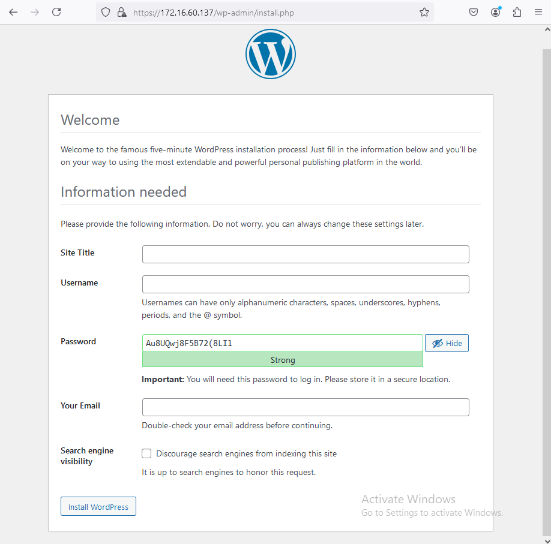
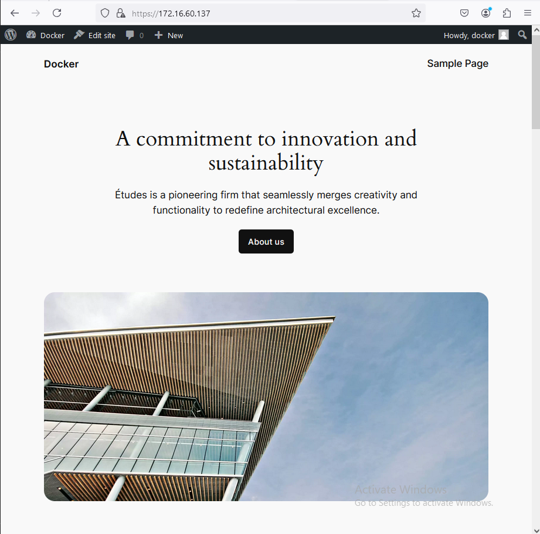
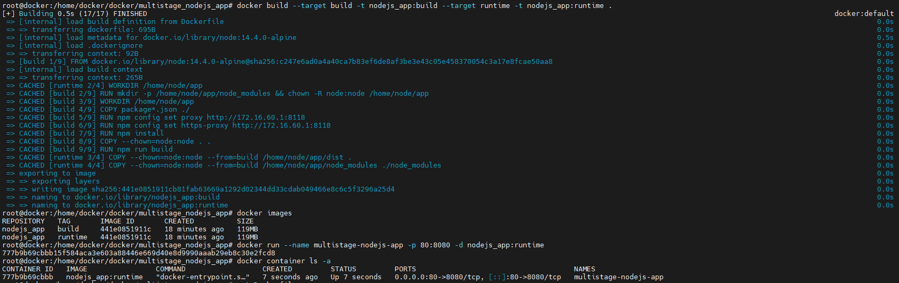
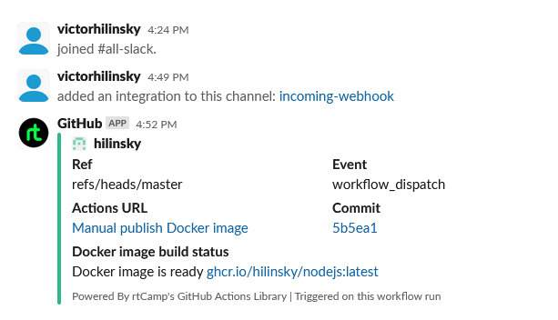

# 08. Docker. Docker compose

## Homework Assignment 1: Docker Compose for Application Stacks

1. Select a combination of services (e.g., web app, database) to create a multi-container application.
* Nginx + MySQL + FPM + WordPress
2. Create a Docker Compose YAML file to define the services, networks, and volumes.

  * docker-compose.yaml

```yaml
  
  services:
    mysql:
      image: mysql:8.0
      container_name: mysql
      restart: unless-stopped
      env_file: .env
      environment:
        - MYSQL_DATABASE=$MYSQL_DB_NAME
        - MYSQL_ROOT_PASSWORD=$MYSQL_ROOT_PASSWORD
        - MYSQL_USER=$MYSQL_USER
        - MYSQL_PASSWORD=$MYSQL_PASSWORD
      volumes:
        - mysql:/var/lib/mysql
      networks:
        - app-network
  
    wordpress:
      depends_on:
        - mysql
      image: wordpress:6.6.2-php8.3-fpm-alpine
      container_name: wordpress
      restart: unless-stopped
      env_file: .env
      environment:
        - WORDPRESS_DB_HOST=mysql:3306
        - WORDPRESS_DB_USER=$MYSQL_USER
        - WORDPRESS_DB_PASSWORD=$MYSQL_PASSWORD
        - WORDPRESS_DB_NAME=$MYSQL_DB_NAME
      volumes:
        - html:/var/www/html
      networks:
        - app-network
  
    nginx:
      depends_on:
        - wordpress
      image: nginx:1.27.2-alpine
      container_name: nginx
      restart: unless-stopped
      ports:
        - 80:80
        - 443:443
      volumes:
        - html:/var/www/html
        - ./nginx:/etc/nginx/conf.d
        - ./certs:/etc/nginx/certs
        - ./snippets:/etc/nginx/snippets
      networks:
        - app-network
  
  volumes:
    html:
    mysql:
  
  networks:
    app-network:
      driver: bridge

```   

3. Configure environment variables and dependencies between services.

  * .env
   
```env
  MYSQL_ROOT_PASSWORD=root_pass
  MYSQL_USER=docker_user
  MYSQL_PASSWORD=docker_pass
  MYSQL_DB_NAME=docker_db
```

  * nginx.conf

```nginx
  
  server {
      listen [::]:80;
      listen 80;
      server_name localhost;
      return 301 https://$host$request_uri;
  }
  
  server {
      listen [::]:443 ssl;
      listen 443 ssl;
      server_name localhost;
  
      include /etc/nginx/snippets/self-signed.conf;
      include /etc/nginx/snippets/ssl-params.conf;
  
      root /var/www/html;
      index index.php;
  
      location / {
          try_files $uri $uri/ /index.php?$args ;
   }
  
      location ~ \.php$ {
          try_files $uri =404;
          fastcgi_buffers 8 16k;
          fastcgi_buffer_size 32k;
          fastcgi_connect_timeout 60;
          fastcgi_read_timeout 300;
          fastcgi_split_path_info ^(.+\.php)(/.+)$;
          fastcgi_pass wordpress:9000;
          fastcgi_index index.php;
          include fastcgi_params;
          fastcgi_param SCRIPT_FILENAME $document_root$fastcgi_script_name;
          fastcgi_param PATH_INFO $fastcgi_path_info;
      }
  }

```

4. Run the application stack using the docker-compose up or docker compose up command.
   
  

5. Access the application through a web browser or API client.

  

  
   
6. Document the Docker Compose file structure and the steps to deploy the application stack.

     

## Homework Assignment 2: Docker build automation (github action)

1. Choose a programming language (e.g., Java, Go, Python) and a sample application.

  * NodeJS app from previous homework

2. Write a multi-stage Dockerfile to build the application with different stages for build and runtime.

```yaml
  # Stage 1: Build the application
  FROM node:14.4.0-alpine AS build
  
  RUN mkdir -p /home/node/app/node_modules && chown -R node:node /home/node/app
  
  WORKDIR /home/node/app
  
  COPY package*.json ./
  
  USER node
  
  RUN npm config set proxy http://172.16.60.1:8118
  
  RUN npm config set https-proxy http://172.16.60.1:8118
  
  RUN npm install
  
  COPY --chown=node:node . .
  
  RUN npm run build
  
  # Stage 2: Create the final image
  FROM node:14.4.0-alpine AS runtime
  
  USER node
  
  WORKDIR /home/node/app
  
  COPY --chown=node:node --from=build /home/node/app/dist .
  
  COPY --chown=node:node --from=build /home/node/app/node_modules ./node_modules
  
  EXPOSE 8080
  
  CMD [ "node", "app.js" ]

```

3. Compile or package the application in the build stage.

```yaml

  FROM node:14.4.0-alpine AS build
  
  RUN mkdir -p /home/node/app/node_modules && chown -R node:node /home/node/app
  
  WORKDIR /home/node/app
  
  COPY package*.json ./
  
  USER node
  
  RUN npm config set proxy http://172.16.60.1:8118
  
  RUN npm config set https-proxy http://172.16.60.1:8118
  
  RUN npm install
  
  COPY --chown=node:node . .
  
  RUN npm run build

```

4. Copy the compiled application into the runtime stage and configure it to run.

```yaml

  FROM node:14.4.0-alpine AS runtime
  
  USER node
  
  WORKDIR /home/node/app
  
  COPY --chown=node:node --from=build /home/node/app/dist .
  
  COPY --chown=node:node --from=build /home/node/app/node_modules ./node_modules
  
  EXPOSE 8080
  
  CMD [ "node", "app.js" ]

```

5. Build the multi-stage Docker image and run a container based on it.

  

6. Push/publish image to docker hub and/or github container register.

  * build.yaml

```yaml

name: Manual publish Docker image
on:
  workflow_dispatch:
    inputs:
      imageToBuild:
        description: 'Component to build'
        required: true
        default: 'nodejs'
      tagImage:
        description: 'Please add tag'
        required: true
        default: 'latest'
jobs:
  push_image:
    name: Push Docker image
    runs-on: ubuntu-latest
    permissions:
      packages: write
      contents: read
    steps:
      - name: Check out the repo
        uses: actions/checkout@v3
      - name: Log in to the Container registry
        uses: docker/login-action@v2
        with:
          registry: ghcr.io
          username: ${{ github.actor }}
          password: ${{ secrets.DOCKER_TOKEN }}

      - name: Build and push image
        uses: docker/build-push-action@v3
        with:
          context: ./${{ inputs.imageToBuild }}
          push: true
          tags: ghcr.io/hilinsky/${{ inputs.imageToBuild }}:${{ inputs.tagImage }}
  notification:
    needs: push_image
    runs-on: ubuntu-latest
    steps:
    - name: Slack Notification
      uses: rtCamp/action-slack-notify@v2
      env:
        SLACK_CHANNEL: all-slack
        SLACK_COLOR: ${{ job.status }}
        SLACK_MESSAGE: "Docker image is ready ghcr.io/hilinsky/${{ inputs.imageToBuild }}:latest"
        SLACK_TITLE: Docker image build status
        SLACK_USERNAME: GitHub
        SLACK_WEBHOOK: ${{ secrets.SLACK_WEBHOOK }}

```

```bash

  docker pull ghcr.io/hilinsky/nodejs:latest

```

7. Slack notification when build failed/success with image name/tag.

  

8. Document the Dockerfile structure, the build process, and the advantages of multi-stage builds.