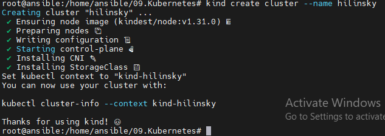

# 09. Kubernetes

## Homework Assignment 1: KinD Kubernetes Cluster Setup

1. Install Docker and KinD on your local machine.

  * Docker

```bash
  
  proxychains4 apt update
  
  apt-get install ca-certificates curl
  
  proxychains4 apt install ca-certificates curl
  
  install -m 0755 -d /etc/apt/keyrings
  
  curl -fsSL https://download.docker.com/linux/ubuntu/gpg -o /etc/apt/keyrings/docker.asc
  
  proxychains4 curl -fsSL https://download.docker.com/linux/ubuntu/gpg -o /etc/apt/keyrings/docker.asc
  
  chmod a+r /etc/apt/keyrings/docker.asc
  
  echo   "deb [arch=$(dpkg --print-architecture) signed-by=/etc/apt/keyrings/docker.asc] https://download.docker.com/linux/ubuntu \
    $(. /etc/os-release && echo "$VERSION_CODENAME") stable" |   sudo tee /etc/apt/sources.list.d/docker.list > /dev/null
  
  proxychains4 apt update
  
  proxychains4 apt install docker-ce docker-ce-cli containerd.io docker-buildx-plugin docker-compose-plugin

```

  * KinD

```bash

  [ $(uname -m) = x86_64 ] && proxychains4 curl -Lo ./kind https://kind.sigs.k8s.io/dl/v0.24.0/kind-linux-amd64
  
  chmod +x ./kind
  
  mv ./kind /usr/local/bin/kind

```

2. Create a KinD cluster with a single control plane node.

```bash

  kind create cluster --name hilinsky

```

  


3. Verify that the cluster is up and running using kubectl.

```bash

  curl -LO "https://dl.k8s.io/release/$(curl -L -s https://dl.k8s.io/release/stable.txt)/bin/linux/amd64/kubectl"
  
  curl -LO "https://dl.k8s.io/release/$(curl -L -s https://dl.k8s.io/release/stable.txt)/bin/linux/amd64/kubectl.sha256"
  
  echo "$(cat kubectl.sha256)  kubectl" | sha256sum --check
  
  install -o root -g root -m 0755 kubectl /usr/local/bin/kubectl
  
  kubectl cluster-info --context kind-hilinsky
  
```

    

## Homework Assignment 2: Minikube Kubernetes Cluster Setup

1. Install Minikube and a hypervisor (e.g., VirtualBox/Docker) on your local machine.

```bash

  curl -LO https://storage.googleapis.com/minikube/releases/latest/minikube-linux-amd64
  install minikube-linux-amd64 /usr/local/bin/minikube && rm minikube-linux-amd64

```

2. Start a Minikube cluster with a single node.

```bash

  minikube start

```

    


3. Confirm that the cluster is operational using kubectl.

    

```bash

  minikube addons enable dashboard

  minikube addons list

```

    


```bash

  kubectl proxy --address='0.0.0.0' --disable-filter=true &

  ssh -L 8001:127.0.0.1:8001 ansible@172.16.60.136 -N -f

```

   

## Homework Assignment 3: GitHub Actions for KinD Cluster Setup

1. Create a GitHub repository for your Kubernetes-related assignments.

  * GitHub repository - https://github.com/hilinsky/09.kubernetes

2. Write a GitHub Actions workflow that sets up a KinD cluster.

  * kind.yaml

```yaml

  name: "Create cluster using KinD"
  on:
    push:
      branches:
      - main
  jobs:
    create-cluster:
      runs-on: ubuntu-latest
      steps:
        - name: Create k8s Kind Cluster
          uses: helm/kind-action@v1
        - name: Test cluster
          run: |
            kubectl cluster-info
            kubectl version -o json | jq .serverVersion
            kubectl get nodes -A

```

3. Configure the workflow to run on every push to a specific branch.

```yaml

  on:
    push:
      branches:
      - main

```

4. Use a Docker container or GitHub-hosted runner for the workflow execution.

    


## Homework Assignment 4: GitHub Actions for Minikube Cluster Setup

1. Enhance the existing GitHub repository with another Actions workflow.

  * GitHub repository - https://github.com/hilinsky/09.kubernetes

2. This time, create a workflow that sets up a Minikube cluster.

  * minikube.yaml

```yaml

  name: "Create cluster using Minikube"
  on:
    - pull_request
  jobs:
    create-cluster:
      runs-on: ubuntu-latest
      steps:
        - name: Start minikube
          id: minikube
          uses: medyagh/setup-minikube@latest
        - name: Test cluster
          run: |
            kubectl cluster-info
            kubectl version -o json | jq .serverVersion
            kubectl get nodes -A

```

3. Configure the workflow to run on pull requests to the repository.


```yaml

  on:
    - pull_request

```

4. Utilize appropriate GitHub Actions features to customize the workflow execution environment.

    

## Please check in the last two assignments:

1. how many nodes they have

    They have one node each:

  * chart-testing-control-plane
  * minikube

2. which latest version of Kubernetes they are using

  * KinD - v1.29.2
  * Minikube - v1.31.0

3. how long they spin up (you can provide just timing)

   
   