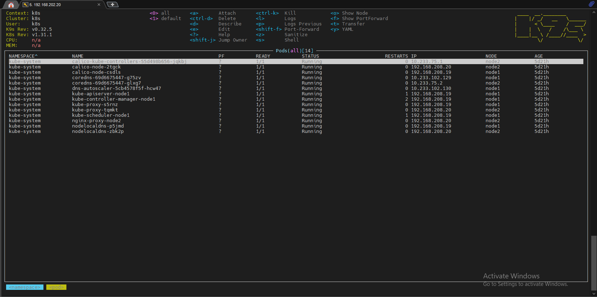
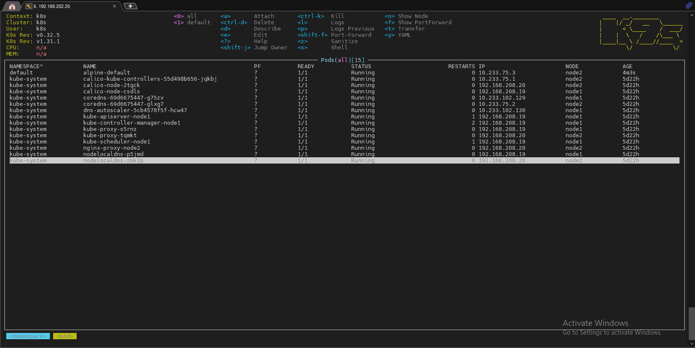
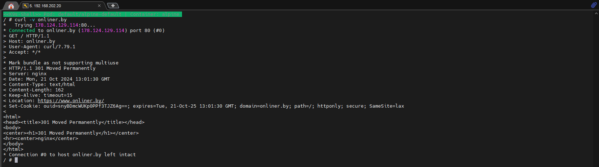
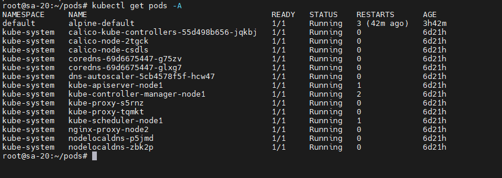
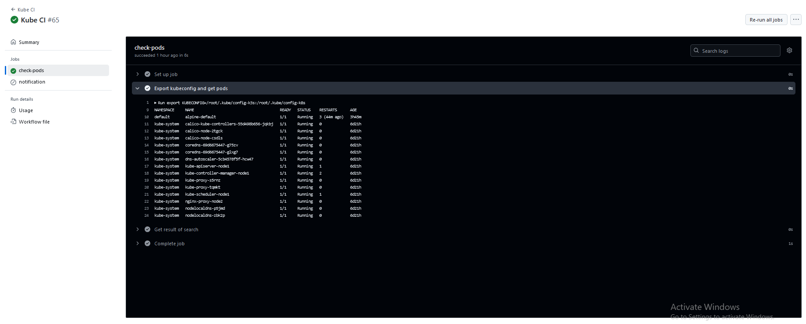
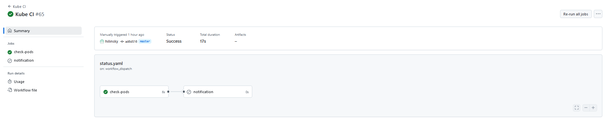
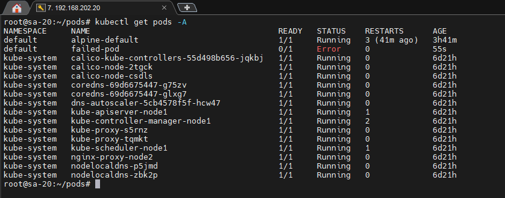
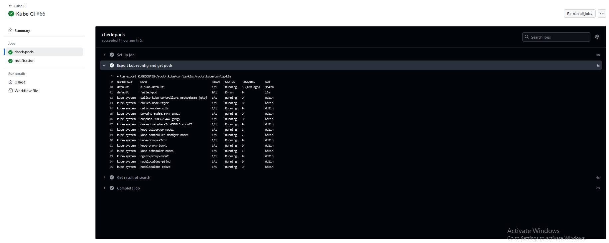
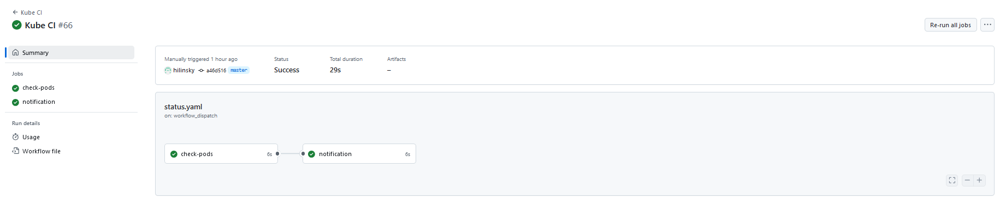
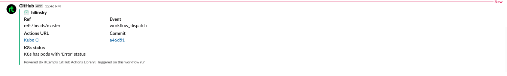

# 10. Kubernetes installation (WS)

## Homework Assignment 1. K8s Installation

### Localhost:

  * Install kubectl for local run

```bash

  curl -LO "https://dl.k8s.io/release/$(curl -L -s https://dl.k8s.io/release/stable.txt)/bin/linux/amd64/kubectl"
  
  curl -LO "https://dl.k8s.io/release/$(curl -L -s https://dl.k8s.io/release/stable.txt)/bin/linux/amd64/kubectl.sha256"
  
  echo "$(cat kubectl.sha256)  kubectl" | sha256sum --check
  
  install -o root -g root -m 0755 kubectl /usr/local/bin/kubectl
  
  kubectl cluster-info --context kind-hilinsky

```

  * Install k9s to maintain cluster

```bash

  wget https://github.com/derailed/k9s/releases/download/v0.32.5/k9s_Linux_amd64.tar

  tar -C /usr/local/bin -xzf k9s_Linux_amd64.tar.gz

```

  * Make print-screen of k9s with pods in all namespaces

  

### Kubernetes host:

  * Finish workshop deployment if it is not done yet. Deploy shell pod in default namespace which you can you use for internal checks inside the cluster

    * alpine-pod.yaml

```yaml
  apiVersion: v1
  kind: Pod
  metadata:
    name: alpine-default
    labels:
      app: alpine
  spec:
    containers:
    - name: alpine 
    image: alpine:3.12
      command:
          - sleep
          - "3600"
      imagePullPolicy: IfNotPresent

```

```bash

  root@sa-20:~/pods# kubectl apply -f alpine-pod.yaml
  pod/alpine-default created

```

  

  

### Monitoring of cluster:

  * Create GitHub action to check status of pods and create slack notification if you have crashed/failed pods

    * status.yaml

```yaml

  name: Kube CI
  on:
    workflow_dispatch:
  jobs:
    check-pods:
      runs-on: my_runner
      outputs:
        STATE_ENV: ${{ steps.init.outputs.STATE_ENV }}
      steps:
        - name: Export kubeconfig and get pods
          run: |
            export KUBECONFIG=/root/.kube/config-k3s:/root/.kube/config-k8s
            kubectl get pods -A
            STATUS_ARRAY=$(kubectl get pods -A | sed -n '2,$p '| awk '{print $2, $4}')
            echo "STATUS_ARRAY_ENV<<EOF" >> $GITHUB_ENV
            echo $STATUS_ARRAY >> $GITHUB_ENV
            echo "EOF" >> $GITHUB_ENV
        - name: Get result of search
          id: init
          run: |
            STATUS="Error"
            if [[ ${STATUS_ARRAY_ENV[@]} =~ $STATUS ]]
            then
              echo "STATE_ENV=TRUE" >> $GITHUB_OUTPUT
            else
              echo "STATE_ENV=FALSE" >> $GITHUB_OUTPUT
            fi
    notification:
      needs: check-pods
      runs-on: ubuntu-latest
      if: needs.check-pods.outputs.STATE_ENV == 'TRUE'
      steps:
      - name: Slack Notification
        uses: rtCamp/action-slack-notify@v2
        env:
          SLACK_CHANNEL: all-slack
          SLACK_COLOR: ${{ job.status }}
          SLACK_MESSAGE: "K8s has pods with 'Error' status"
          SLACK_TITLE: K8s status
          SLACK_USERNAME: GitHub
          SLACK_WEBHOOK: ${{ secrets.SLACK_WEBHOOK }}

```

  * Output "kubectl get pods -A" on host:

  

  * Action workflow output "kubectl get pods -A" :

  

  * Action lifecycle:

  

  * Output "kubectl get pods -A" with error pod on host:

  

  * Action workflow output "kubectl get pods -A" with error pod:

  

  * Action lifecycle with error pod:

  

  * Slack notification:

  
