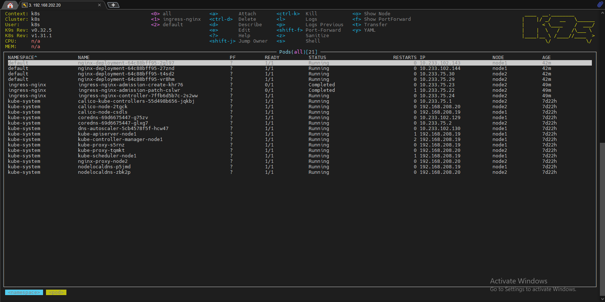
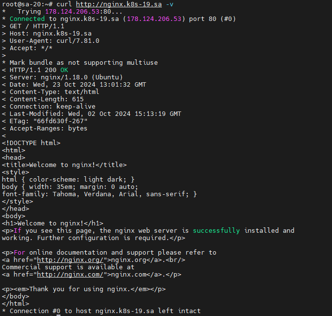
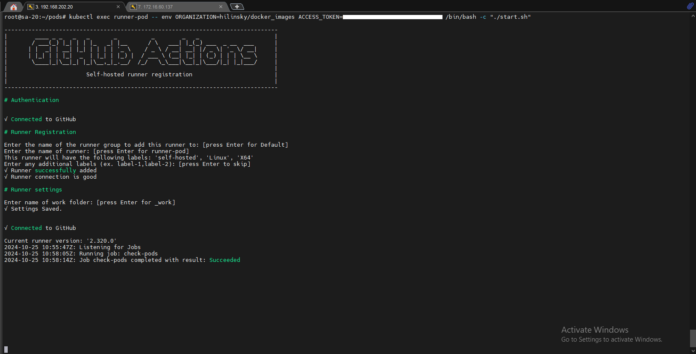
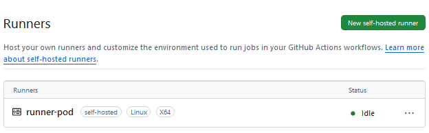
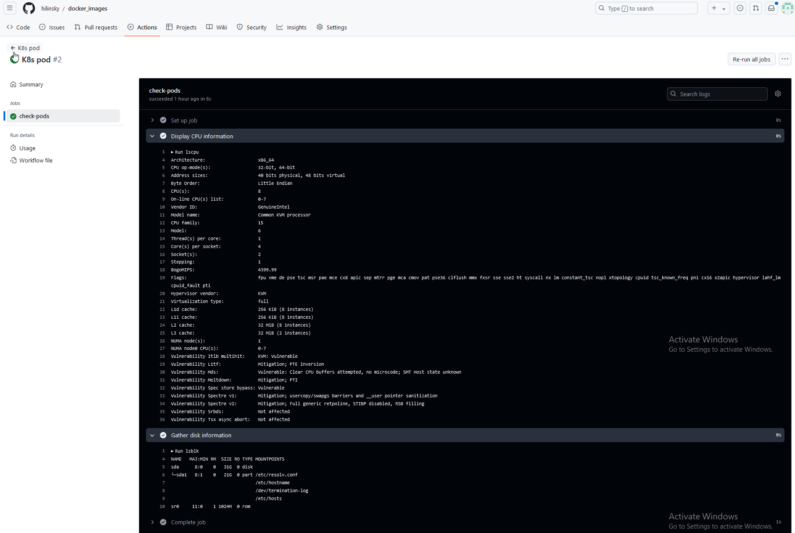

# 11. Kubernetes. Basic objects

## Homework Assignment 1. Nginx deployment

### Create deployment of nginx service:

  * replicas: 4
  * set resources for pods
  * deployment shouldn't have any outage (service is available all time)
  * ingress rule for host name (nginx-test.k8s-<NUMBER>.sa)

    * nginx-deployment.yaml

```yaml
  
  ---
  apiVersion: apps/v1
  kind: Deployment
  metadata:
    name: nginx-deployment
    labels:
      app: nginx
  spec:
    replicas: 4
    strategy:
      type: RollingUpdate
      rollingUpdate:
        maxSurge: 1
        maxUnavailable: 0
    selector:
      matchLabels:
        app: nginx
    template:
      metadata:
        labels:
          app: nginx
      spec:
        containers:
        - name: nginx-container
          image: nginx:latest
          ports:
          - containerPort: 80
          resources:
            requests:
              cpu: 50m
              memory: 50Mi
            limits:
              cpu: 100m
              memory: 100Mi
  ---
  apiVersion: v1
  kind: Service
  metadata:
    name: nginx-service
    labels:
      run: nginx-service
  spec:
    type: LoadBalancer
    ports:
    - port: 80
      protocol: TCP
    selector:
      app: nginx
  ---
  apiVersion: networking.k8s.io/v1
  kind: Ingress
  metadata:
    name: ingress-sa
    annotations:
      nginx.ingress.kubernetes.io/server-alias: "nginx.k8s-20.sa"
  spec:
    ingressClassName: nginx
    rules:
      - host: nginx.k8s-19.sa
        http:
          paths:
            - path: /
              pathType: Prefix
              backend:
                service:
                  name: nginx-service
                  port:
                    number: 80

```

   * Nginx pods:
     
  

   * Nginx ingress:
     
  

   * Curl result:
 
  

## Homework Assignment 2. Self-hosted runner inside k8s (optional)

  * deploy pod inside k8s which should be connected to github as self-hosted runner

    * Dockerfile

```dockerfile

 FROM ubuntu:22.04
 
 ARG RUNNER_VERSION
  
 RUN apt-get update -y && apt-get upgrade -y && useradd -m runner
 
 RUN DEBIAN_FRONTEND=noninteractive apt-get install -y --no-install-recommends \
     curl jq build-essential libssl-dev libffi-dev python3 python3-venv python3-dev >
 
 RUN cd /home/runner && mkdir actions-runner && cd actions-runner \
     && curl -O -L https://github.com/actions/runner/releases/download/v${RUNNER_VER>
     && tar xzf ./actions-runner-linux-x64-${RUNNER_VERSION}.tar.gz
 
 RUN chown -R runner ~runner && /home/runner/actions-runner/bin/installdependencies.>
 
 COPY start.sh start.sh
 
 RUN chmod +x start.sh
 
 USER runner
 
 ENTRYPOINT ["./start.sh"]

```

   * start.sh

```sh

 #!/bin/bash
 
 ORGANIZATION=$ORGANIZATION
 ACCESS_TOKEN=$ACCESS_TOKEN
 
 cd /home/runner/actions-runner
 
 ./config.sh --url https://github.com/${ORGANIZATION} --token ${ACCESS_TOKEN}
 
 cleanup() {
     echo "Removing runner..."
     ./config.sh remove --unattended --token ${ACCESS_TOKEN}
 }
 
 trap 'cleanup; exit 130' INT
 trap 'cleanup; exit 143' TERM
 
 ./run.sh & wait $!

```

   * runner-pod.yaml

```yaml

 apiVersion: v1
 kind: Pod
 metadata:
   name: runner-pod
   labels:
     app: runner
 spec:
   containers:
   - name: runner-container
     image: hilinsky/runner:v1.0
     command: ["/bin/sh", "-c"]
     args: ["sleep 360d"]
     imagePullPolicy: Always
   restartPolicy: Always

```
     
```bash

  kubectl exec runner-pod -- env ORGANIZATION=hilinsky/docker_images ACCESS_TOKEN=XXXXXXXXXXX /bin/bash -c "./start.sh"

```

  

  * Runner:

    * k8s-pod.yaml

```yaml

  name: K8s pod
  on:
    workflow_dispatch:
  jobs:
    check-pods:
      runs-on: self-hosted
      steps:
        - name: Display CPU information
          run: |
            lscpu
        - name: Gather disk information
          run: |
            lsblk

```
 
  

   * CPU and Disks information:

  
