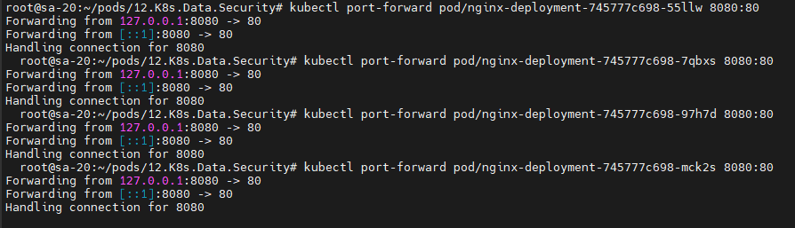
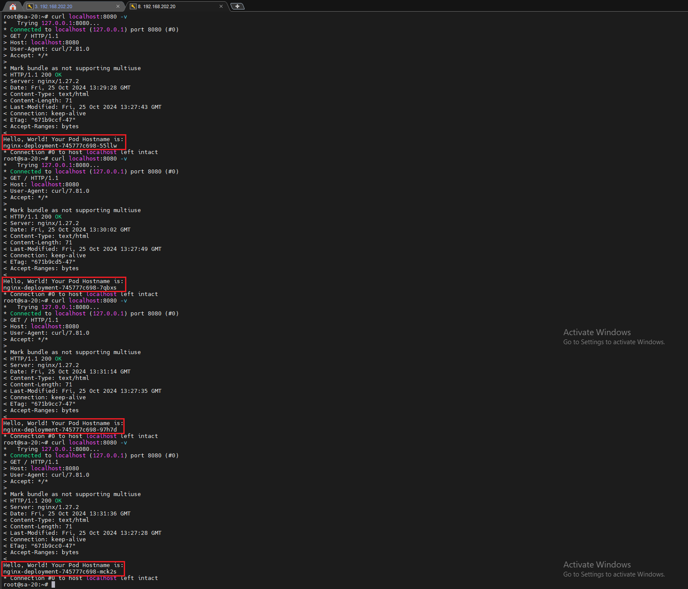
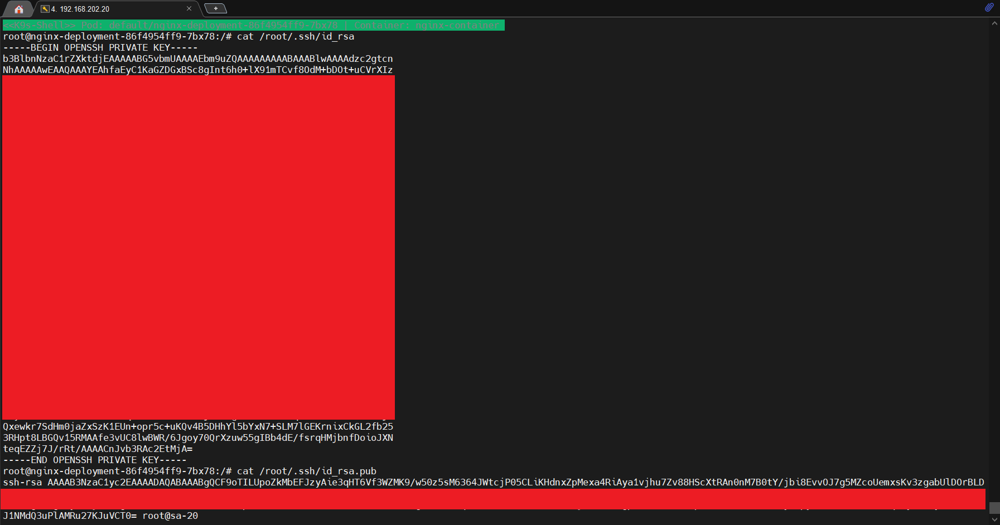

# 12. Kubernetes. Data. Security

## Homework Assignment 1. Config maps and secrets

### You need to improve deployment from previous task:

* Add index.php page as config map, which should display hostname of pod as first level header, or generate index.html inside init container

  * Generating index.html inside init container:

   * nginx-deployment.yaml

```yaml

  apiVersion: apps/v1
  kind: Deployment
  metadata:
    name: nginx-deployment
    labels:
      app: nginx
  spec:
    replicas: 4
    strategy:
      type: RollingUpdate
      rollingUpdate:
        maxSurge: 1
        maxUnavailable: 0
    selector:
      matchLabels:
        app: nginx
    template:
      metadata:
        labels:
          app: nginx
      spec:
        containers:
        - name: nginx-container
          image: nginx:latest
          ports:
          - containerPort: 80
          resources:
            requests:
              cpu: 50m
              memory: 50Mi
            limits:
              cpu: 100m
              memory: 100Mi
          volumeMounts:
          - name: web-content
            mountPath: /usr/share/nginx/html/
        initContainers:
        - name: write-hostname
          image: busybox
          command: ["sh", "-c", "echo $MY_POD_HOSTNAME > /web-content/hostname.txt; echo 'Wrote the Pod Hostname to hostname.txt'"]
          env:
          - name: MY_POD_HOSTNAME
            valueFrom:
              fieldRef:
                fieldPath: metadata.name
          volumeMounts:
          - name: web-content
            mountPath: /web-content
        - name: create-html
          image: busybox
          command: ["sh", "-c", "echo 'Hello, World! Your Pod Hostname is: ' > /web-content/index.html; cat /web-content/hostname.txt >> /web-content/index.html; echo 'Created index.html with the Pod Hostname'"]
          volumeMounts:
          - name: web-content
            mountPath: /web-content
        volumes:
        - name: web-content
          emptyDir: {}
  
  ---
  apiVersion: v1
  kind: Service
  metadata:
    name: nginx-service
    labels:
      run: nginx-service
  spec:
    type: LoadBalancer
    ports:
    - port: 80
      protocol: TCP
    selector:
      app: nginx
  ---
  apiVersion: networking.k8s.io/v1
  kind: Ingress
  metadata:
    name: ingress-sa
    annotations:
      nginx.ingress.kubernetes.io/server-alias: "nginx.k8s-20.sa"
  spec:
    ingressClassName: nginx
    rules:
      - host: nginx.k8s-19.sa
        http:
          paths:
            - path: /
              pathType: Prefix
              backend:
                service:
                  name: nginx-service
                  port:
                    number: 80

```

  

  


* Generate pair public and private keys (or use existing) and add them to the pod for user root as secrets, please use sealsecret object for that

```bash

 cat ~/.ssh/id_rsa | base64 -w 0
 
 cat ~/.ssh/id_rsa.pub | base64 -w 0

```

  * init-secret.yaml

```yaml

 ---
 apiVersion: v1
 kind: Secret
 metadata:
   name: secret-from-manifest
 type: Opaque
 data:
   id_rsa: XXXXXXXX
   id_rsa.pub: XXXXXXXX

```

```bash

 cat init_secret.yaml | kubeseal --format yaml > sealed_secret.yaml

```

  * sealed-secret.yaml

```yaml

 ---
 apiVersion: bitnami.com/v1alpha1
 kind: SealedSecret
 metadata:
   creationTimestamp: null
   name: secret-from-manifest
   namespace: default
 spec:
   encryptedData:
     id_rsa: XXXXXXXX
     id_rsa.pub: XXXXXXXX
   template:
     metadata:
       creationTimestamp: null
       name: secret-from-manifest
       namespace: default
     type: Opaque

```


   * nginx-deployment.yaml

```yaml

 apiVersion: apps/v1
 kind: Deployment
 metadata:
   name: nginx-deployment
   labels:
     app: nginx
 spec:
   replicas: 4
   strategy:
     type: RollingUpdate
     rollingUpdate:
       maxSurge: 1
       maxUnavailable: 0
   selector:
     matchLabels:
       app: nginx
   template:
     metadata:
       labels:
         app: nginx
     spec:
       containers:
       - name: nginx-container
         image: nginx:latest
         ports:
         - containerPort: 80
         resources:
           requests:
             cpu: 50m
             memory: 50Mi
           limits:
             cpu: 100m
             memory: 100Mi
         volumeMounts:
         - name: web-content
           mountPath: /usr/share/nginx/html/
         - name: ssh-keys-volume
           mountPath: "/root/.ssh/"
           readOnly: true
       initContainers:
       - name: write-hostname
         image: busybox
         command: ["sh", "-c", "echo $MY_POD_HOSTNAME > /web-content/hostname.txt; echo 'Wrote the Pod Hostname to hostname.txt'"]
         env:
         - name: MY_POD_HOSTNAME
           valueFrom:
             fieldRef:
               fieldPath: metadata.name
         volumeMounts:
         - name: web-content
           mountPath: /web-content
       - name: create-html
         image: busybox
         command: ["sh", "-c", "echo 'Hello, World! Your Pod Hostname is: ' > /web-content/index.html; cat /web-content/hostname.txt >> /web-content/index.html; echo 'Created index.html with the Pod Hostname'"]
         volumeMounts:
         - name: web-content
           mountPath: /web-content
       volumes:
       - name: web-content
         emptyDir: {}
       - name: ssh-keys-volume
         secret:
           secretName: secret-from-manifest
 
 ---
 apiVersion: v1
 kind: Service
 metadata:
   name: nginx-service
   labels:
     run: nginx-service
 spec:
   type: LoadBalancer
   ports:
   - port: 80
     protocol: TCP
   selector:
     app: nginx
 ---
 apiVersion: networking.k8s.io/v1
 kind: Ingress
 metadata:
   name: ingress-sa
   annotations:
     nginx.ingress.kubernetes.io/server-alias: "nginx.k8s-20.sa"
 spec:
   ingressClassName: nginx
   rules:
     - host: nginx.k8s-19.sa
       http:
         paths:
           - path: /
             pathType: Prefix
             backend:
               service:
                 name: nginx-service
                 port:
                   number: 80

```
* Validate secrets and index.html display

  

