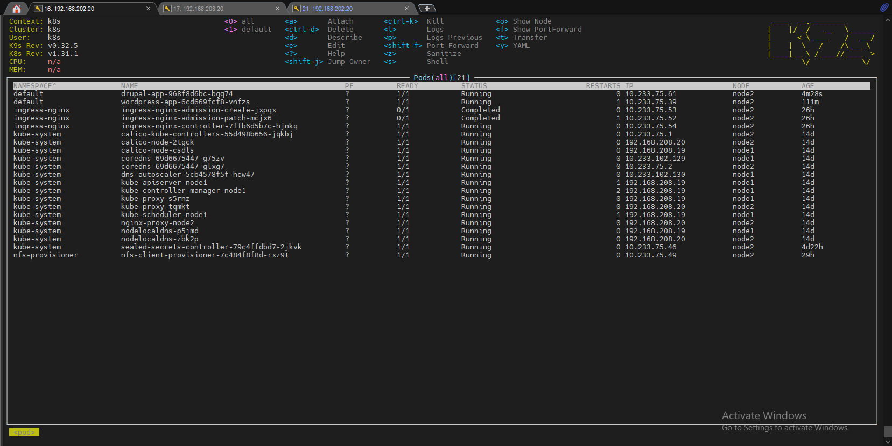
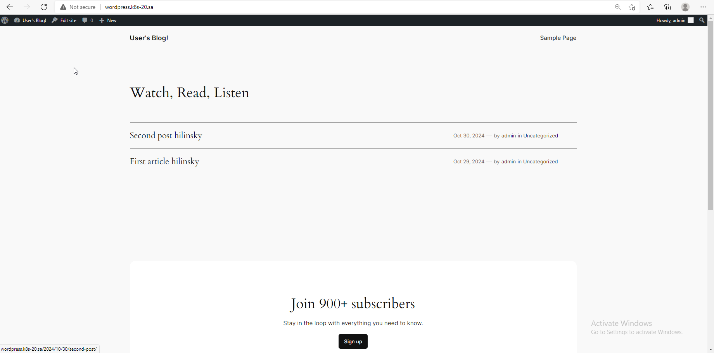
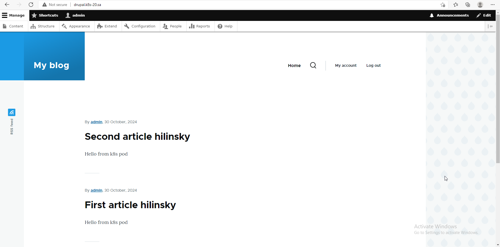

# 13. Kubernetes. Helm

## Homework Assignment 1. Application deployment by Helm

### Deploy in your K8s cluster the following applications using helm charts from public repositories:

  * Wordpress

  * Drupal

```bash

  helm install wordpress-app --set global.defaultStorageClass=nfs-hilinsky,mariadb.enabled=false,externalDatabase.host=192.168.202.19,externalDatabase.port=3306,externalDatabase.user=XXXXXX,externalDatabase.password=XXXXXX,externalDatabase.database=XXXXXX,wordpressUsername=XXXXXX,wordpressPassword=XXXXXX,volumePermissions.enabled=true,ingress.enabled=true,ingress.hostname=wordpress.k8s-20.sa,ingress.ingressClassName=nginx oci://registry-1.docker.io/bitnamicharts/wordpress

  helm install drupal-app --set global.defaultStorageClass=nfs-client,mariadb.enabled=false,externalDatabase.host=192.168.202.19,externalDatabase.port=3306,externalDatabase.user=XXXXXX,externalDatabase.password=XXXXXX,externalDatabase.database=XXXXXX,drupalUsername=XXXXXX,drupalPassword=XXXXXX,volumePermissions.enabled=true,ingress.enabled=true,ingress.hostname=drupal.k8s-20.sa,ingress.ingressClassName=nginx oci://registry-1.docker.io/bitnamicharts/drupal

```

  

### Disable DBs deployment for these deployment and use ansible DBs provisioning from ansible workshop

```bash

  mariadb.enabled=false

```

  * inv.yaml

```yaml

  db_all:
    hosts:
      mariadb:
        ansible_host: 192.168.202.19

```

  * mariadb.yaml

```yaml
  
  ---
  - hosts: mariadb
    vars:
      app_packages:
        - mariadb-server
        - mariadb-client
        - python3-pymysql
        - python3-mysqldb
      db_name: "{{ name_db | default('test') }}"
      db_user: "{{ user_db | default('test') }}"
      db_pass: "{{ pass_db | default('test') }}"
    pre_tasks:
    - name: Validate
      debug:
        msg:
         - "DB name: {{ db_name }}"
         - "DB user: {{ db_user }}"
         - "DB pass: {{ db_pass }}"
    - name: Prepare. Install packages
      apt:
        name: "curl"
        state: latest
        update_cache: yes
      tags: install
    tasks:
    - name: Add MariaDB repos
      shell: |
        curl -LsS -O https://downloads.mariadb.com/MariaDB/mariadb_repo_setup
        bash mariadb_repo_setup --mariadb-server-version=10.6
      tags: install
    - name: MySQL. Install packages
      apt:
        name: "{{ app_packages }}"
        state: latest
      environment:
        DEBIAN_FRONTEND: noninteractive
      tags: install
    - name: MySQL. add bind-address
      ini_file:
        dest: /etc/mysql/my.cnf
        section: mysqld
        option: "bind-address"
        value: "{{ ansible_host }}"
  
    - name: restart mysql if necessary
      command: service mysql restart
  
    - name: Test connect
      wait_for:
        host: "{{ ansible_host }}"
        port: 3306
        timeout: 3
  
    - mysql_db:
        name: "{{ db_name }}"
        state: absent
        login_unix_socket: /var/run/mysqld/mysqld.sock
      tags: never
  
    - mysql_db:
        name: "{{ db_name }}"
        encoding: utf8
        login_unix_socket: /var/run/mysqld/mysqld.sock
  
    - mysql_user:
        name: "{{ db_user }}"
        host: "%"
        password: "{{ db_pass }}"
        priv: "{{ db_name }}.*:ALL"
        login_unix_socket: /var/run/mysqld/mysqld.sock
      no_log: yes

```

```bash

  ansible-playbook -i inv.yaml mariadb.yaml -e name_db=XXXXXX -e user_db=XXXXXX -e pass_db=XXXXXX -l mariadb -u root

```

### After deployment you have to login to both application and create dummy article with your name as title

  * wordpress.k8s-20.sa:

  

  * drupal.k8s-20.sa:

  
