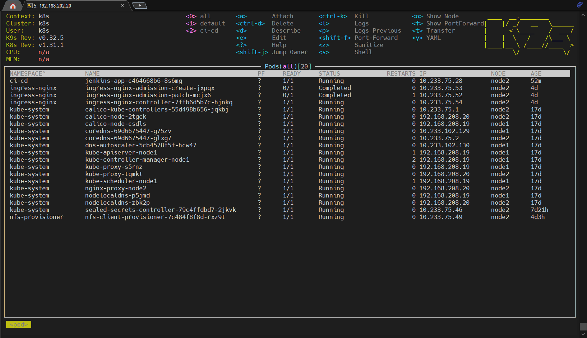
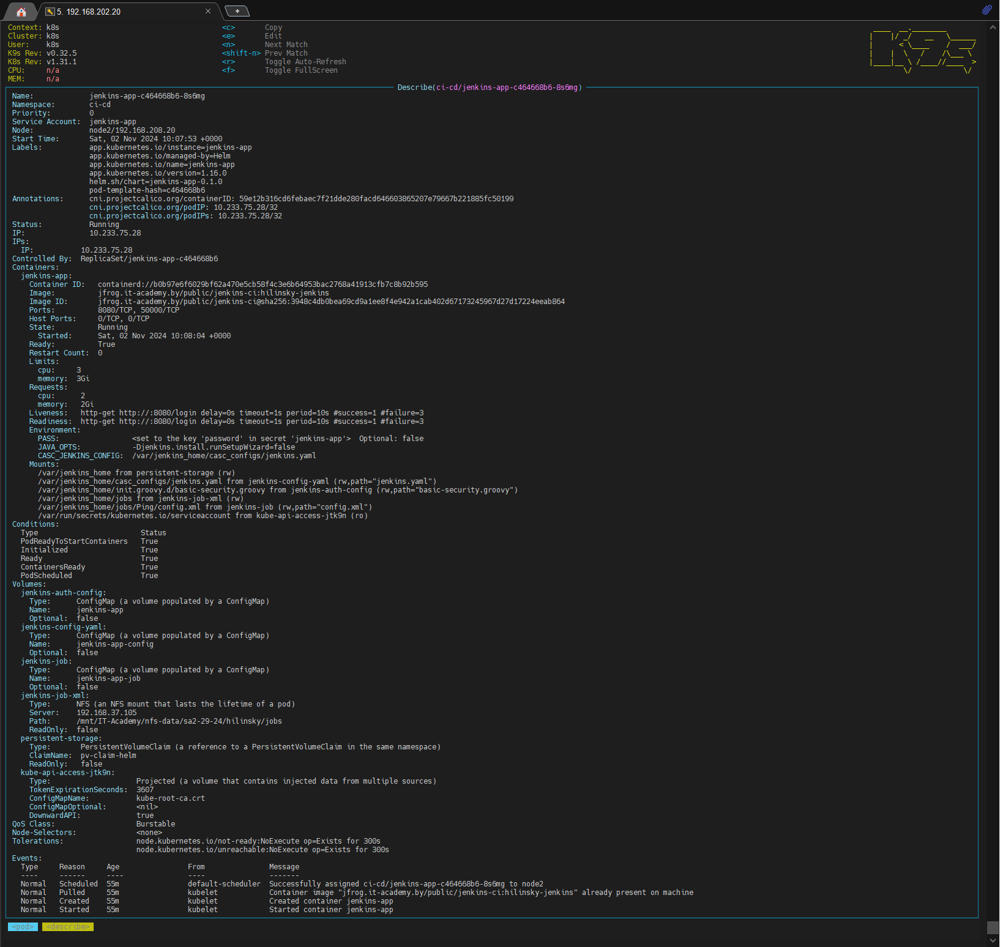
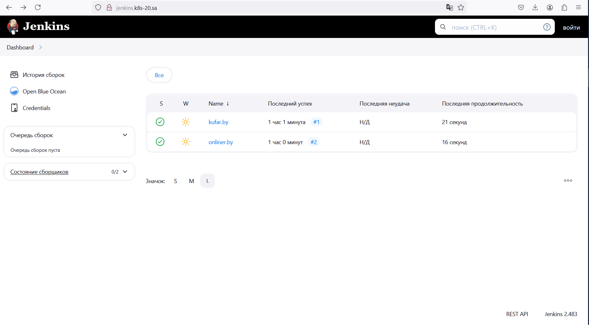

# 14. Kubernetes application deployment

## Homework Assignment 1. Transform Jenkins deployment to Helm

  * Finish application deployment
  * Create helm package for your Jenkins application:

      * all variables should be inside variable file:

        * values.yaml

        ```yaml

          # Default values for jenkins-app.
          # This is a YAML-formatted file.
          # Declare variables to be passed into your templates.
          
          # This will set the replicaset count more information can be found here: https://kubernetes.io/docs/concepts/workloads/controllers/replicaset/
          replicaCount: 1
          
          # This sets the container image more information can be found here: https://kubernetes.io/docs/concepts/containers/images/
          image:
            registry: jfrog.it-academy.by
            repository: public/jenkins-ci:hilinsky-jenkins
            # This sets the pull policy for images.
            # pullPolicy: Always
            pullPolicy: IfNotPresent
            # Overrides the image tag whose default is the chart appVersion.
            tag: ""
          
          # This is for the secretes for pulling an image from a private repository more information can be found here: https://kubernetes.io/docs/tasks/configure-pod-container/pull-image-private-registry/
          imagePullSecrets: []
          # This is to override the chart name.
          nameOverride: ""
          fullnameOverride: ""
          namespaceOverride: ""

          #This section builds out the service account more information can be found here: https://kubernetes.io/docs/concepts/security/service-accounts/
          serviceAccount:
            # Specifies whether a service account should be created
            create: true
            # Automatically mount a ServiceAccount's API credentials?
            automount: true
            # Annotations to add to the service account
            annotations: {}
            # The name of the service account to use.
            # If not set and create is true, a name is generated using the fullname template
            name: ""
          
          # This is for setting Kubernetes Annotations to a Pod.
          # For more information checkout: https://kubernetes.io/docs/concepts/overview/working-with-objects/annotations/
          podAnnotations: {}
          # This is for setting Kubernetes Labels to a Pod.
          # For more information checkout: https://kubernetes.io/docs/concepts/overview/working-with-objects/labels/
          podLabels: {}
          
          usePodSecurityContext: true
          
          podSecurityContext:
            runAsUser: 1000
            runAsGroup: 1000
            fsGroup: 1000
          
          securityContext:
            # capabilities: {}
            #   drop:
            #   - ALL
            # readOnlyRootFilesystem: false
            runAsNonRoot: true
            runAsUser: 1000
            runAsGroup: 1000
          
          # This is for setting up a service more information can be found here: https://kubernetes.io/docs/concepts/services-networking/service/
          service:
            # This sets the service type more information can be found here: https://kubernetes.io/docs/concepts/services-networking/service/#publishing-services-service-types
            type: ClusterIP
            # This sets the ports more information can be found here: https://kubernetes.io/docs/concepts/services-networking/service/#field-spec-ports
            port: 8080
          
          # This block is for setting up the ingress for more information can be found here: https://kubernetes.io/docs/concepts/services-networking/ingress/
          ingress:
            enabled: true
            className: "nginx"
            annotations: {}
              # kubernetes.io/ingress.class: nginx
              # kubernetes.io/tls-acme: "true"
            hosts:
              - host: jenkins.k8s-20.sa
                paths:
                  - path: /
                    pathType: Prefix
            tls: []
            #  - secretName: chart-example-tls
            #    hosts:
            #      - chart-example.local
          
          resources:
            # We usually recommend not to specify default resources and to leave this as a conscious
            # choice for the user. This also increases chances charts run on environments with little
            # resources, such as Minikube. If you do want to specify resources, uncomment the following
            # lines, adjust them as necessary, and remove the curly braces after 'resources:'.
            limits:
              cpu: 3
              memory: 3Gi
            requests:
              cpu: 2
              memory: 2Gi
          pvc:
            storage_class: nfs-hilinsky
            storage_size: 10Gi
          # This is to setup the liveness and readiness probes more information can be found here: https://kubernetes.io/docs/tasks/configure-pod-container/configure-liveness-readiness-startup-probes/
          livenessProbe:
            httpGet:
              path: /login
              port: 8080
          readinessProbe:
            httpGet:
              path: /login
              port: 8080
          
          #This section is for setting up autoscaling more information can be found here: https://kubernetes.io/docs/concepts/workloads/autoscaling/
          autoscaling:
            enabled: false
            minReplicas: 1
            maxReplicas: 100
            targetCPUUtilizationPercentage: 80
            # targetMemoryUtilizationPercentage: 80
          
          # Additional volumes on the output Deployment definition.
          
          volumes:
            - name: jenkins-auth-config
              configMap:
                name: jenkins-app
            - name: jenkins-config-yaml
              configMap:
                name: jenkins-app-config
            - name: jenkins-job
              configMap:
                name: jenkins-app-job
            - name: jenkins-job-xml
              nfs:
                server: 192.168.37.105
                path: /mnt/IT-Academy/nfs-data/sa2-29-24/hilinsky/jobs
            - name: persistent-storage
              persistentVolumeClaim:
                claimName: pv-claim-helm
          # Additional volumeMounts on the output Deployment definition.
          volumeMounts:
            - name: jenkins-auth-config
              mountPath: /var/jenkins_home/init.groovy.d/basic-security.groovy
              subPath: basic-security.groovy
            - name: jenkins-config-yaml
              mountPath: /var/jenkins_home/casc_configs/jenkins.yaml
              subPath: jenkins.yaml
            - name: jenkins-job-xml
              mountPath: /var/jenkins_home/jobs
            - name: jenkins-job
              mountPath: /var/jenkins_home/jobs/Ping/config.xml
              subPath: config.xml
            - name: persistent-storage
              mountPath: /var/jenkins_home
          
          admin:
            password: ""
          
          slave:
            port: 50000
          
          nodeSelector: {}
          
          tolerations: []
          
          affinity: {}

        ```
        
      * publish helm on your repository: https://github.com/hilinsky/k8s-helm

## Homework Assignment 2. Add pre-set tasks to Jenkins deployment (Optional)

  * Add as config map of your Jenkins tasks to the manifests:
    Configmaps are mounted always as readonly filesystem, so you can only read the file, never write, change owner, etc.
    If I mount config.xml as configMap object, Jenkins doesn't does not see this task.
    Manipulations with volumes defaultMode and changing the user of the container also does not work, because configMap ignores securityContext values.
    Instead, I decided to mount these jobs as a folder on the NFS server with a pre-created file config.xml:

    ```yaml

          volumes:
            - name: jenkins-auth-config
              configMap:
                name: jenkins-app
            - name: jenkins-config-yaml
              configMap:
                name: jenkins-app-config
            - name: jenkins-job
              configMap:
                name: jenkins-app-job
            - name: jenkins-job-xml
              nfs:
                server: 192.168.37.105
                path: /mnt/IT-Academy/nfs-data/sa2-29-24/hilinsky/jobs
            - name: persistent-storage
              persistentVolumeClaim:
                claimName: pv-claim-helm
    
          # Additional volumeMounts on the output Deployment definition.
          volumeMounts:
            - name: jenkins-auth-config
              mountPath: /var/jenkins_home/init.groovy.d/basic-security.groovy
              subPath: basic-security.groovy
            - name: jenkins-config-yaml
              mountPath: /var/jenkins_home/casc_configs/jenkins.yaml
              subPath: jenkins.yaml
            - name: jenkins-job-xml
              mountPath: /var/jenkins_home/jobs
            - name: jenkins-job
              mountPath: /var/jenkins_home/jobs/Ping/config.xml
              subPath: config.xml
            - name: persistent-storage
              mountPath: /var/jenkins_home

    ```

    ```bash

       helm install jenkins-app --set namespaceOverride=ci-cd --set admin.password=XXXXXX jenkins-app-0.1.0.tgz --dry-run

    ```

    ```console
    NAME: jenkins-app
    LAST DEPLOYED: Sat Nov  2 10:50:16 2024
    NAMESPACE: default
    STATUS: pending-install
    REVISION: 1
    HOOKS:
    ---
    # Source: jenkins-app/templates/tests/test-connection.yaml
    apiVersion: v1
    kind: Pod
    metadata:
      name: "jenkins-app-test-connection"
      labels:
        helm.sh/chart: jenkins-app-0.1.0
        app.kubernetes.io/name: jenkins-app
        app.kubernetes.io/instance: jenkins-app
        app.kubernetes.io/version: "1.16.0"
        app.kubernetes.io/managed-by: Helm
      annotations:
        "helm.sh/hook": test
      namespace: ci-cd
    spec:
      containers:
        - name: wget
          image: busybox
          command: ['wget']
          args: ['jenkins-app:8080']
      restartPolicy: Never
    MANIFEST:
    ---
    # Source: jenkins-app/templates/namespace.yaml
    apiVersion: v1
    kind: Namespace
    metadata:
      name: ci-cd
    ---
    # Source: jenkins-app/templates/serviceaccount.yaml
    apiVersion: v1
    kind: ServiceAccount
    metadata:
      name: jenkins-app
      labels:
        helm.sh/chart: jenkins-app-0.1.0
        app.kubernetes.io/name: jenkins-app
        app.kubernetes.io/instance: jenkins-app
        app.kubernetes.io/version: "1.16.0"
        app.kubernetes.io/managed-by: Helm
      namespace: ci-cd
    automountServiceAccountToken: true
    ---
    # Source: jenkins-app/templates/secret.yaml
    apiVersion: v1
    kind: Secret
    metadata:
      name: jenkins-app
      namespace: ci-cd
    type: Opaque
    data:
      password: "XXXXXX"
    ---
    # Source: jenkins-app/templates/configmap.yaml
    apiVersion: v1
    kind: ConfigMap
    metadata:
      name: jenkins-app
      namespace: ci-cd
    data:
      basic-security.groovy: |
        #!groovy
        import jenkins.model.*
        import hudson.security.*
        def instance = Jenkins.getInstance()
        println "--> creating local user 'admin'"
        def password = System.getenv("PASS")
        def hudsonRealm = new HudsonPrivateSecurityRealm(false)
        hudsonRealm.createAccount('admin', password)
        instance.setSecurityRealm(hudsonRealm)
        def strategy = new FullControlOnceLoggedInAuthorizationStrategy()
        strategy.setAllowAnonymousRead(true)
        instance.setAuthorizationStrategy(strategy)
        instance.save()
    ---
    # Source: jenkins-app/templates/configmap.yaml
    apiVersion: v1
    kind: ConfigMap
    metadata:
      name: jenkins-app-config
      namespace: ci-cd
    data:
      jenkins.yaml: |
            jenkins:
              numExecutors: 2
              clouds:
              - kubernetes:
                  containerCapStr: "10"
                  maxRequestsPerHostStr: "32"
                  jenkinsUrl: "http://jenkins-app:8080"
                  name: "kubernetes"
                  namespace: "ci-cd"
                  skipTlsVerify: true
            credentials:
              system:
                domainCredentials:
                - credentials:
                  - usernamePassword:
                      description: "Githubuser"
                      id: "some_randome"
                      password: "XXXXXXXXXXX"
                      scope: GLOBAL
                      username: "git_hub_user"
            unclassified:
              location:
                adminAddress: "victorhilinsky@gmail.com"
                url: "http://jenkins.k8s-20.sa/"
              shell:
                shell: "/bin/bash"
    ---
    # Source: jenkins-app/templates/configmap.yaml
    apiVersion: v1
    kind: ConfigMap
    metadata:
      name: jenkins-app-job
      namespace: ci-cd
    data:
      config.xml: |
          <?xml version='1.1' encoding='UTF-8'?>
          <flow-definition plugin="workflow-job@1460.v28178c1ef6e6">
            <actions>
              <org.jenkinsci.plugins.pipeline.modeldefinition.actions.DeclarativeJobAction plugin="pipeline-model-definition@2.2214.vb_b_34b_2ea_9b_83"/>
              <org.jenkinsci.plugins.pipeline.modeldefinition.actions.DeclarativeJobPropertyTrackerAction plugin="pipeline-model-definition@2.2214.vb_b_34b_2ea_9b_83">
                <jobProperties/>
                <triggers/>
                <parameters/>
                <options/>
              </org.jenkinsci.plugins.pipeline.modeldefinition.actions.DeclarativeJobPropertyTrackerAction>
            </actions>
            <description></description>
            <keepDependencies>false</keepDependencies>
            <properties>
              <com.sonyericsson.rebuild.RebuildSettings plugin="rebuild@332.va_1ee476d8f6d">
                <autoRebuild>false</autoRebuild>
                <rebuildDisabled>false</rebuildDisabled>
              </com.sonyericsson.rebuild.RebuildSettings>
            </properties>
            <definition class="org.jenkinsci.plugins.workflow.cps.CpsFlowDefinition" plugin="workflow-cps@3990.vd281dd77a_388">
              <script>pipeline {
            agent {
              kubernetes {
                  containerTemplate {
                  name &apos;curl-test&apos;
                  image &apos;pluhin31/wget_curl:latest&apos;
                  ttyEnabled true
                  command &apos;sleep 180&apos;
                  }
            }
            }
            stages {
              stage(&apos;Ping&apos;) {
                steps {
                  container(&apos;curl-test&apos;) {
                    sh &quot;&quot;&quot;#!/bin/sh
                      curl --version
                          curl https://kufar.by
                          wget -O - https://kufar.by | egrep &quot;https://[0-9a-z]+[.]kufar[.]by&quot; -o | sort -u &gt; tmp.out
                          cat tmp.out
                          curl \$(cat tmp.out) -I | egrep HTTP
                    &quot;&quot;&quot;
                  }
                }
              }
            }
          }</script>
              <sandbox>true</sandbox>
            </definition>
            <triggers/>
            <disabled>false</disabled>
    ---
    # Source: jenkins-app/templates/pvc.yaml
    apiVersion: v1
    kind: PersistentVolumeClaim
    metadata:
      annotations:
        nfs.io/storage-path: jenkins-app
      name: pv-claim-helm
      namespace: ci-cd
      labels:
        helm.sh/chart: jenkins-app-0.1.0
        app.kubernetes.io/name: jenkins-app
        app.kubernetes.io/instance: jenkins-app
        app.kubernetes.io/version: "1.16.0"
        app.kubernetes.io/managed-by: Helm
    spec:
      accessModes:
        - ReadWriteMany
      storageClassName: nfs-hilinsky
      resources:
        requests:
          storage: 10Gi
    ---
    # Source: jenkins-app/templates/rbac.yaml
    apiVersion: rbac.authorization.k8s.io/v1
    kind: ClusterRoleBinding
    metadata:
      name: jenkins-app
      namespace: ci-cd
    roleRef:
      apiGroup: rbac.authorization.k8s.io
      kind: ClusterRole
      name: cluster-admin
    subjects:
    - kind: ServiceAccount
      name: jenkins-app
      namespace: ci-cd
    ---
    # Source: jenkins-app/templates/service.yaml
    apiVersion: v1
    kind: Service
    metadata:
      name: jenkins-app
      namespace: ci-cd
      labels:
        helm.sh/chart: jenkins-app-0.1.0
        app.kubernetes.io/name: jenkins-app
        app.kubernetes.io/instance: jenkins-app
        app.kubernetes.io/version: "1.16.0"
        app.kubernetes.io/managed-by: Helm
    spec:
      type: ClusterIP
      ports:
        - port: 8080
          targetPort: 8080
          protocol: TCP
          name: master
        - port: 50000
          targetPort: 50000
          protocol: TCP
          name: slave
      selector:
        app.kubernetes.io/name: jenkins-app
        app.kubernetes.io/instance: jenkins-app
    ---
    # Source: jenkins-app/templates/deployment.yaml
    apiVersion: apps/v1
    kind: Deployment
    metadata:
      name: jenkins-app
      namespace: ci-cd
      labels:
        helm.sh/chart: jenkins-app-0.1.0
        app.kubernetes.io/name: jenkins-app
        app.kubernetes.io/instance: jenkins-app
        app.kubernetes.io/version: "1.16.0"
        app.kubernetes.io/managed-by: Helm
    spec:
      replicas: 1
      selector:
        matchLabels:
          app.kubernetes.io/name: jenkins-app
          app.kubernetes.io/instance: jenkins-app
      template:
        metadata:
          labels:
            helm.sh/chart: jenkins-app-0.1.0
            app.kubernetes.io/name: jenkins-app
            app.kubernetes.io/instance: jenkins-app
            app.kubernetes.io/version: "1.16.0"
            app.kubernetes.io/managed-by: Helm
        spec:
          serviceAccountName: jenkins-app
          securityContext:
            fsGroup: 1000
            runAsGroup: 1000
            runAsUser: 1000
          containers:
            - name: jenkins-app
              securityContext:
                runAsGroup: 1000
                runAsNonRoot: true
                runAsUser: 1000
              image: jfrog.it-academy.by/public/jenkins-ci:hilinsky-jenkins
              imagePullPolicy: IfNotPresent
              env:
                - name: PASS
                  valueFrom:
                    secretKeyRef:
                      name: jenkins-app
                      key: password
                - name: JAVA_OPTS
                  value: "-Djenkins.install.runSetupWizard=false"
                - name: CASC_JENKINS_CONFIG
                  value: /var/jenkins_home/casc_configs/jenkins.yaml
              ports:
                - name: http-port
                  containerPort: 8080
                  protocol: TCP
                - name: jnlp-port
                  containerPort: 50000
                  protocol: TCP
              livenessProbe:
                httpGet:
                  path: /login
                  port: 8080
              readinessProbe:
                httpGet:
                  path: /login
                  port: 8080
              resources:
                limits:
                  cpu: 3
                  memory: 3Gi
                requests:
                  cpu: 2
                  memory: 2Gi
              volumeMounts:
                - mountPath: /var/jenkins_home/init.groovy.d/basic-security.groovy
                  name: jenkins-auth-config
                  subPath: basic-security.groovy
                - mountPath: /var/jenkins_home/casc_configs/jenkins.yaml
                  name: jenkins-config-yaml
                  subPath: jenkins.yaml
                - mountPath: /var/jenkins_home/jobs
                  name: jenkins-job-xml
                - mountPath: /var/jenkins_home/jobs/Ping/config.xml
                  name: jenkins-job
                  subPath: config.xml
                - mountPath: /var/jenkins_home
                  name: persistent-storage
          volumes:
            - configMap:
                name: jenkins-app
              name: jenkins-auth-config
            - configMap:
                name: jenkins-app-config
              name: jenkins-config-yaml
            - configMap:
                name: jenkins-app-job
              name: jenkins-job
            - name: jenkins-job-xml
              nfs:
                path: /mnt/IT-Academy/nfs-data/sa2-29-24/hilinsky/jobs
                server: 192.168.37.105
            - name: persistent-storage
              persistentVolumeClaim:
                claimName: pv-claim-helm
    ---
    # Source: jenkins-app/templates/ingress.yaml
    apiVersion: networking.k8s.io/v1
    kind: Ingress
    metadata:
      name: jenkins-app
      namespace: ci-cd
      labels:
        helm.sh/chart: jenkins-app-0.1.0
        app.kubernetes.io/name: jenkins-app
        app.kubernetes.io/instance: jenkins-app
        app.kubernetes.io/version: "1.16.0"
        app.kubernetes.io/managed-by: Helm
    spec:
      ingressClassName: nginx
      rules:
        - host: "jenkins.k8s-20.sa"
          http:
            paths:
              - path: /
                pathType: Prefix
                backend:
                  service:
                    name: jenkins-app
                    port:
                      number: 8080
    
    NOTES:
    1. Get the application URL by running these commands:
      http://jenkins.k8s-20.sa/

    ```
    * Status of pod:
      
    

    * Description of pod:

    

    * Jenkins jobs:

    
    