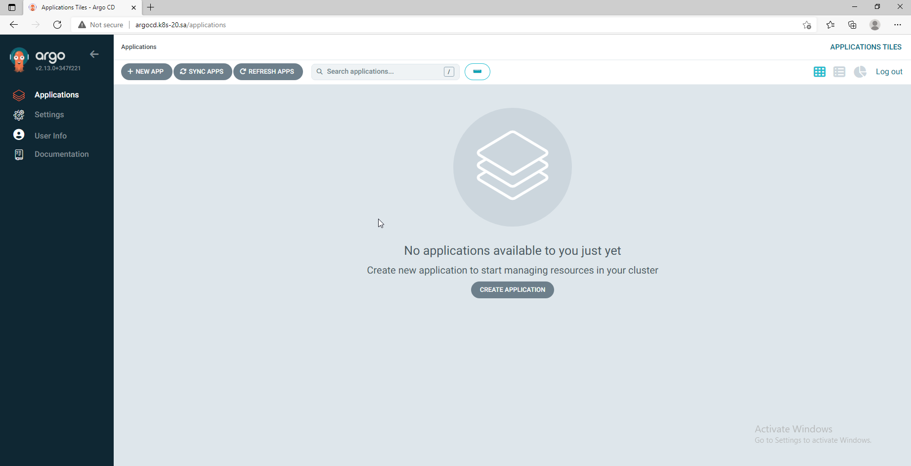
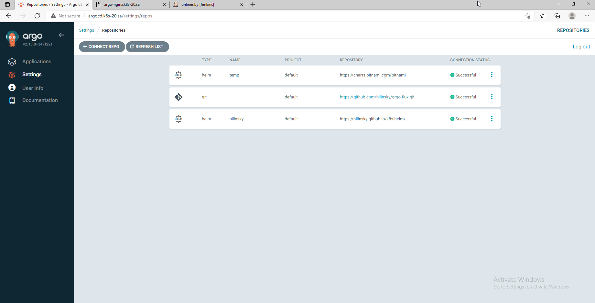
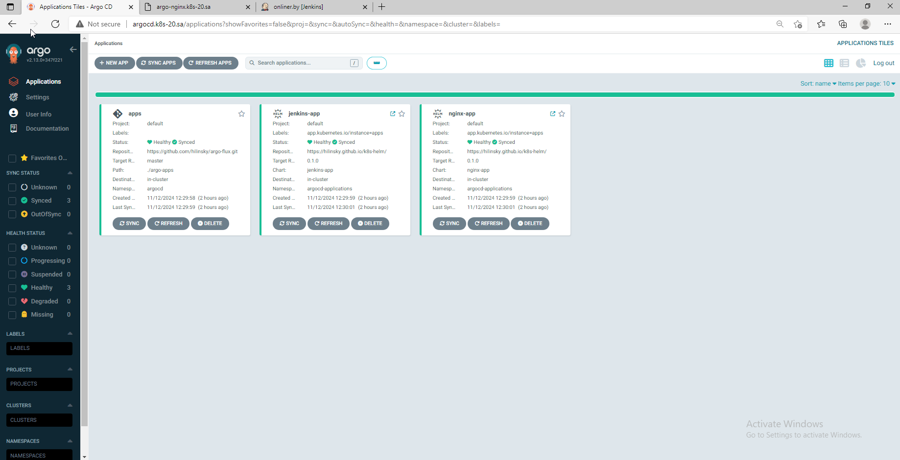
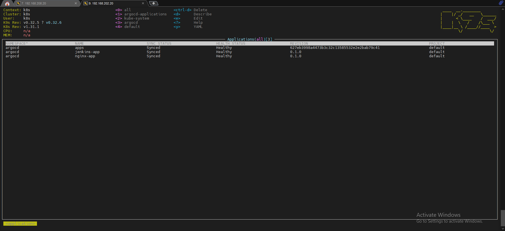
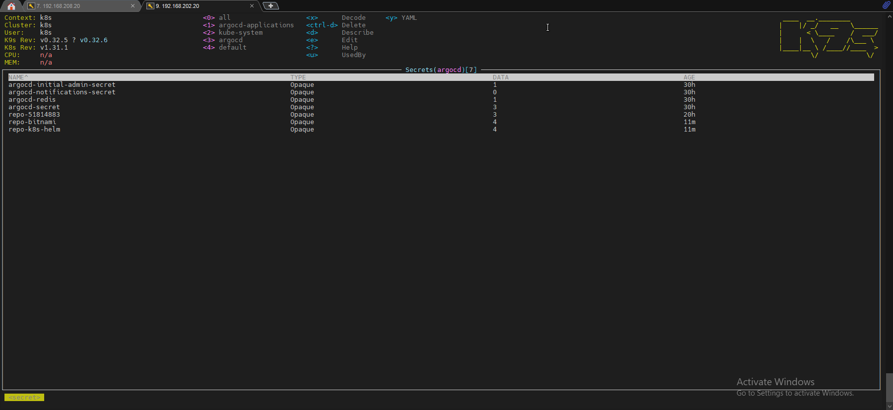

# 15. Kubernetes CI CD

## Homework Assignment 1. ArgoCD deployment and application

  * deploy ArgoCD into your cluster

  ```bash

    kubectl create namespace argocd
    
    wget https://raw.githubusercontent.com/argoproj/argo-cd/stable/manifests/install.yaml -O argocd-install.yaml
    
    kubectl apply -f argocd-install.yaml -n argocd

  ```

  
  
  * add your repositories with helm packages as source for deployment

   ```yaml
    ---
    source:
      chart: nginx-app
      repoURL: https://hilinsky.github.io/k8s-helm/
      targetRevision: 0.1.0

    ---
    source:
      chart: jenkins-app
      repoURL: https://hilinsky.github.io/k8s-helm/
      targetRevision: 0.1.0

   ```
  
  * create separate repository which contains application manifests for ArgoCD: https://github.com/hilinsky/argo-flux.git
    * application objects:
      * nginx-app/nginx-app.yaml
      ```yaml

        ---
        apiVersion: argoproj.io/v1alpha1
        kind: Application
        metadata:
          name: nginx
          namespace: argocd
        spec:
          destination:
            namespace: argocd-applications
            server: https://kubernetes.default.svc
          project: default
          source:
            chart: nginx-app
            helm:
              parameters:
              - name: ingress.hosts[0].host
                value: app-argo.k8s-20.sa
              - name: ingress.hosts[0].paths[0].path
                value: /
              - name: ingress.hosts[0].paths[0].pathType
                value: ImplementationSpecific
            repoURL: https://hilinsky.github.io/k8s-helm/
            targetRevision: 0.1.0
          syncPolicy:
            automated:
              prune: true
            syncOptions:
            - CreateNamespace=true

      ```

      * jenkins-app/jenkins-app.yaml

       ```yaml

        ---
        apiVersion: argoproj.io/v1alpha1
        kind: Application
        metadata:
          name: jenkins-app
          namespace: argocd
        spec:
          destination:
            namespace: argocd-applications
            server: https://kubernetes.default.svc
          project: default
          source:
            chart: jenkins-app
            helm:
              parameters:
              - name: ingress.hosts[0].host
                value: argo-jenkins.k8s-20.sa
              - name: ingress.hosts[0].paths[0].path
                value: /
              - name: ingress.hosts[0].paths[0].pathType
                value: ImplementationSpecific
            repoURL: https://hilinsky.github.io/k8s-helm/
            targetRevision: 0.1.0
          syncPolicy:
            automated:
              prune: true
            syncOptions:
            - CreateNamespace=true

      ```
    * git secrets objects as sealsecret objects:
        * .repos-sources/bitnami-sealed-secret.yaml
      ```yaml
       
       ---
       apiVersion: bitnami.com/v1alpha1
       kind: SealedSecret
       metadata:
         creationTimestamp: null
         name: repo-bitnami
         namespace: argocd
       spec:
         encryptedData:
           name: AgAK8ERm5dKiSiURBOEkTvlnogS9XFymSebYOsbiGI12pWJtLd3lIygK1eFOSsYiz90S4s/Xy2lIVZ4ksRnNkn6H658b+faoKJdmxriWnlMzQvWHbkrk36K6bbQIerC0/tqW8bMYxOMrySn6vs38BUjAvf8dLG8wqA/qx7cvF4Uo68RcV2/fjhELuC+QiVyUrn5VEi3NUde+uZ/gqoI+IWKt5OWktO9NhsjuRdbpNG34iG/4lg5l8jN0KwuITXwLVCamhujchbuDAf6KT+bQQOFSjSvpaxNAzEVKjDRVEjFkNLEzv/z92vvYBaSYPEUqwWPzgwbShl+yiun9HVxa0v6ZdgP+igkmVq0owyZMyd9cA4Ysmg6ysNiEV1bEAlNHd+CKfp/OSiGIPaeqXcnpkdDBNipSuWQ5ImZeWOjai8ccWtVWh8S70dpSImMpCIHeNM79kdp8WqXfN+4Nzu9vImyTw6p/Uvr6/JK9TTMW5vnN9gx8TeKyjVBQXJaFlJlZYITyICjJ+cvoGsN3GxAk2eBXVQIDmqjivh/1DDEc3DOHXR63ZXwyZXIDK0gN7Ah/F9ptDRw/53nqAmSQefXmVt4sgOd9pxUs8jbmuKzBqMcV01RMVDhs467Z4Ry2yrtLXJUA5mDZ4x+lhT1CfehEdSqmEeS/UvTYt/pc8iDAzlp+uhTTgV76xVM6sF+W9CilOZ3tuW1N
           project: AgBMA4xuWljmgK1Az382B4ik+Cx0bbtowho+nVF+5Yk8utKUYWe8TT+TW11+5fsww230RUQ/+f6CAz3+SSebLgfH7s3soc9B3KeJE9bgTjn/iWSLgx/cROMBG5eKIE+inAHfKFpQ+tTw3LLQ4Oa233ENXOQH/uPx7RVxPlqG2QCRtC4dLpEKNusDqW+3emZ7+CCHdB7Ad7a4FO8wofiJ7R7D1du5T+PkV9E0ODgCIxKZi0HqvBwJm37VFdLIUoVi+4LXovBMtjZAOn7fBM14KhoB7VzYcG734GTZhYSbN1+c7hGyZtaHAEPM1jwzQwzr82vsCbjKTceYJpC3D/p8GipGlPMXceNPE5VTqr/ytiwnRTkkEIv9ZqJCQq0EYKaWC1EzXiJvcZLRwremclaZxShR8ZGqan1fEMhF+tzOvPNrMm/hjLr/2hk9mgm1GF8WFZkHfWUUd46phA1mW3WIBul76ehKr8wOi2XBNtfvTT0yitEXysHP61odvOc6blD0Na7IZzyRCTIVif0Gi7DIeC/DEPOyFpY7jcWY4JCm9YX7gHJ/Txv/k+yTSZx9LGzQdowlXhK0sbR3kkgPzGvMDHwEE0+TT1HmAbBjC7Yf5KHutLaObxmCGstzPHxV+0GO7ZhYSjKzDd2S6Pfg64PX1uZOrEAPk5ogS8Ih/wce5OkYAcZJX/LPxqLPucXE3wZSK2HmKGQuDk2S
           type: AgAp9dUyonheUucr0itiBhUE4U/tnXDfiW3Txj4AJwFOQ6VqeqMPz7W6GFduNzUi5RbMv0QmsxKLK73iryTxoh67APqmHFxy4ds0jcjA0qlOp0hlIiq3k4LsHHI3096xczleSK2G23o0oMgpbL0jN7QUU4VVYNAcgC2qFOJDdwRtWKxj8Y2+gwNMdhDNy7JlxJ8TOMvF0iT8Sf6Ij1EiuQ/OBaBM81FkGL3oYtQyCBoDFzNwK90TMkjrPLCEuZemSWyllspCsiCKL/eDrqzKwkpUAcu9RpRhLhwDqcko2aMTamuAvjHznAVNPEzkgcls+RQAZ1gT0zq9zHnOPqv6dqahmC2bIkx/W38OxMdHQDz9QY86cPeyhNLyR+EmidaXvB8xGE5zyUsvAXDl7JjnvxL0ckSmjvdN8jnQrbbWhKkpAPvtelZgN1VWKswcWafnVygYg/sR8EBoP1l54frADj38S3Oyq/CrGCWyzWDJSl0zHL0JnZrEj4E4QeEDW13UPSG6IHD/OKoxtwpeWYWoZwHUZxovfjSTB8NZb1kxwB0fwIAXuQAbpLT6Nan4u8GV/ar0GOmLYH8TydKNqhkY+Gg28dw0n4Jq5azvMSmfzad4YPe04N8pHDIsHnq8REo6QTWyjlNBXXqEI9JaBx0WrkPtBNj4p26lV0/hxXOIZqzV91P4XrNb2iVOzgH3So8lA3wVeGNv
           url: AgCAaUenwxvMBVDPytS2ayNWmEKThOnj/7Def6hIxoRjjoYg1xZsDBw7r7SDjwZytWtZgFujPn1L7FK2jQ3TlBOzwoOr99+xPyg8dzNKamDQLnynEaX8MystBf8wsDlTN/u3Zx14C0F+oshpC/b8eajhbiqstBvnkmGCoNG0WAVJ9d7Lj0z65MHdMNde2HBJEMp8l3dRJZRzyrKeycBYzBDmmnAOHV03TXrOpcR29fsgoFedbW+OtVtX3jWOmsRou8NqqnsXq46yOR6jBwXuVadqYVQzHdZlF/97Au2ifDVLCnGNh/56O8CPv63WzhTXT3SC0GIwQrTMqVbXhcMbuBIGS/3C08IrY0pdq/6AjMA3r+s5h6dgo8AtMkNleTY8XuCMV7RQwMFsiJj6zzPAQWbZvNKEQb6GMjRZ/EfYXb5R246nagl3IWax1gXaLOC64hWiPQAbH5Q5paLggNUdBiB18w9rXJr2hjsF7SQ2y0SyiED8Bk/WlVHHnNMZPuO2zWefu5RitsGTuzOoLM+Hbdu9G2LJsweQVL7J8r5q05xXqmDfEtrU45H2RjsoJ6WyP3WcHv4rIED1sPoIMPaqALwxsDIvdUpSatOblaKAs7BNulrC8bvUplssRSR+DLQv1SjnMEGj9vLObIUSFyh7qfKdDz0uthR33F/vOrlZBUtndcOq8qX9nY6PsYSlPm2nCm7io4eg4knd0jXOWOjdauRy01Xcbnjm61+F/sczrFCs1a1B
         template:
           metadata:
             annotations:
               managed-by: argocd.argoproj.io
             creationTimestamp: null
             labels:
               argocd.argoproj.io/secret-type: repository
             name: repo-bitnami
             namespace: argocd
           type: Opaque

      ```

      * .repos-sources/hilinsky-sealed-secret.yaml
      ```yaml
             
       ---
       apiVersion: bitnami.com/v1alpha1
       kind: SealedSecret
       metadata:
         creationTimestamp: null
         name: repo-k8s-helm
         namespace: argocd
       spec:
         encryptedData:
           name: AgBe4bzOo6ZDM+7F2wKgp6Umazg+DTgn+SUREwb8uTlFwg6lRbxUEdOzHtmx/WRy9/7razj8ocbtLgSDuAg4CAmW9sk5MGd+kL119nnm8b3zCuYTTN8oCNpUsDcx1l2KwmaTqTM/iuIqRqjkLM4rjYV7/hkimAqzGR8Lb+jvp1otFINJvBIURRGl8k8Xr1J52Ref13ufWdHtYhCLeTGq0hDqjXJbQmpbxqHkLqJor4PuWTJmv3BgJf2nqNILtARc42/DZ0sN+zNSszdTeXGKTHiSCsv4wBmgwBg8e6/Qar4KUcmUa0evhZFw2exgx2xdOoA7de5XdXcAkxSm/QeY57RfjrlYbvV+/vhbYiTJys8xsLVYeH1esus1zCtrlYKvcLfYigmxKmDYJJB3lXhu8BmZLvJxsyuYuD7OwvowsPjKuHXLeobP0Iyay957yDszLCwGwS+uEe1FdkYgc5PVnRCMBO4YKe3v8ylGURu6KdUaW6z5zVOp6NEIgzQ5ocGjz4HGpH8iRkIafEHVnMjPL2PGBRQt7mu+yP3O3l1YuriLmOZWANqYPZpK4XX+Lw+g7/sftiSVhViwdOOvtYh8tuFoQavvydonKXfqWglT7C5G2ONeisHuThKQu4y6HvBwDYF/BlhsNChe1IC8O6MUAadsiM/bQX6TiE+ikLKLjLnXKfCrhEFSgotHgbzJzk43RBYxLcks3R/xtw==
           project: AgAZ2dItLv/wLotdF1+WxP1kRVotmkrEsW83Df5QoG/mvPJxuQW9oTYLK02WiUwjD6l5G4J/y9dWty6BswrGCOMKBAGtMW7OoAytpdk4H7ESjnm2e3rScd5OWaWQoSMYVL/rzK7UkMTFaOiO2wmaDNZbhbgxCSKo9h0obRw11wbFFNmIWshXydsO1eohgZzytO3spXuvqIY4wUX9RwH9BXl7lKm0mE7TlPQW4MDc9nswyrKIj38tD7JoAE/7giwFTOVxNAk91si4STvvDuJkf7w8/+RaCfE7d5c00wE8DyLNo8/Vw1UQ6fEBqluVoYB8jVhQPd90Ud33rc74DZ2BS8WLKtGw1Rn9Ky3ufgGeAhdN7SIGOrsEZKl1Vcn/5JSnQyaVi/hfvRKyOdwPKzG6irRDC0AvJrYjLJyBM8mS2o4zRadhEziKcYOecCt/KLfQyFIeXuZM8ScLcNM2RHOHb+ap2W7Eza+lSp6Idm12eGGhyteIy7kImqa18bI/0lCT8dwBRaVXt4ferRb3SocB31B0Sujk1EVdCER/pfSwLYT4KxQy/AonViFYBPWZqiatOm8/peH4NhsvxV2ibxOqh+M6lTbsL2p3p8Zy3CgURSgfFzK8FGmVTiLEeVX7lOCNmIqVeHDMI7cxCyMBHXDcTrXP8lKRa8+7JS+o2mHvL8wICeR7q6y8qh+QWGsKJodHO4XRPFX0sByW
           type: AgAvRlFB5TvXJM2wb0byJ0mTGiVSIpELTmDNPSdM/7/rej2kEuZVsIH4HUqwEeeHqe3KUY+milIKK5BBacP3jsLEnnnI9ejBqFko7wd+AkyjAgHYNXTuKTl2cX030eFWZlLCXmpC0iujApPyah7XTHK7wXOgz0bU121VhPdfPBrzJ27bE88UZRAl89jeJ8qgZnl5zCANhJM21BAGMbM5SFS7GkWoRJLROUrKsmCL+kOd5fmtg7afeUeVBxLrGpyxXwn8ZWiRLwnQe6j5mcFaj1FwKkr4xVfSD3hlcQ/cyKE6FDIGo2wvlq7GFWScvD8RGdYnKpPwLkC+Rx0I6OkftpwwisEfGZkLTogctzq2tGM9LSKHJ7A0tuP7NYkzwpEPEa3uO5WKjrjwUV1dDfqDkuYxzV2hDKOhDiLhCfeCQPd0C3vr6RaApdDm6cg1eieit0HTbkLeRIORq4k/19cYoQy46oE4q1n8gJxyE90n7XYEAZ4h/MRyU5Szwum8VkvgUP2Q3o0n52Tn3pmu7r1VsxGfVDyuP5L/AHBJn6G7cAjssklvfMaXxLzqMkyvbAEdBnle84qD6e8yht6btx3+Ixqp0+XhWLSyk9mejJ/WwsxB65HIxb4FOUGb2nCLOvDDaiQN53YbJxNu6MM/z1esAPuq7iJiXEW67U73YKoKa8jHtGFLXU/06b7A0LFxHf1Ah/RdGJwf
           url: AgAcQbWor24pmxW9xGyCQsVEfp/Dnd2T2UXrISLBroP0QEwa1aUUnolwSJ6a/3lhFjUfJ/YrafNSMdTi4ias8oosuP0xSZWKReQDe1nZj7Sly+xb1JhL4TnMBXuoJ6vNlNsZtz2YtSCTDg2NnidrFqIsXKS6hzEWTp3OG5LkaLy1dAaOwVMtNBnWxaXqBIPkLZXqYpTQix5bz1xj0kpjME6T2lu9BqnC25aRwP/874QjTp3lS87QMTMC7Y1miWHDVpQ6dBieTfgQ8d9fiaLGjBELTBhULw0ofE+jX0CeuwWqQ4gMMyTOQG2Hg2nAcKGcqGSzIEK3yj/J2u8SF+i+aBh3ipK0+HbVgUrradAQv42gDt3d2yNqJI1/ePxZpfCCfiZuUJPmdsKBqBafI2yqkv8imuQ+p849Ri5SlJ6aX9F6VOsrJkS++OlAharLbWUYhn984CFic0CKNUOYZic/rH4DjyeYyfA/hMKWMSLFZuoQ8GONdUEgEKp/ldesJMOPTgFkPG+K78zK06L6/MrIyYtutDR34UqD+DvYBpMrUQG5T5DK+2JX8sI05s8uiubSfR+qEfEF3WY5DqgrOyTNvvNbopwJwgQRY2nIFMOyB7rKkkUQMf6DH05Vmj5jw95hLYbhUZq8jdi7PXy+hpFab8/JM5SR9OgbBynt8AYRCDNaHi1hsn5ntEKo9AVEzBrANJ8oDYrsUbO4OmsovUXNFSSGMDtNPnln8EIBZr2YqCsbzEd75VY=
         template:
           metadata:
             annotations:
               managed-by: argocd.argoproj.io
             creationTimestamp: null
             labels:
               argocd.argoproj.io/secret-type: repository
             name: repo-k8s-helm
             namespace: argocd
           type: Opaque

      ```
  
  * add this repository as project for your applications:

    * Git repository:
    

    * Applications:
    

    * K8s applications:
    

    * K8s secrets:  
    

Links your repositories, pritscreen of your project in ArgoCD add to PR
