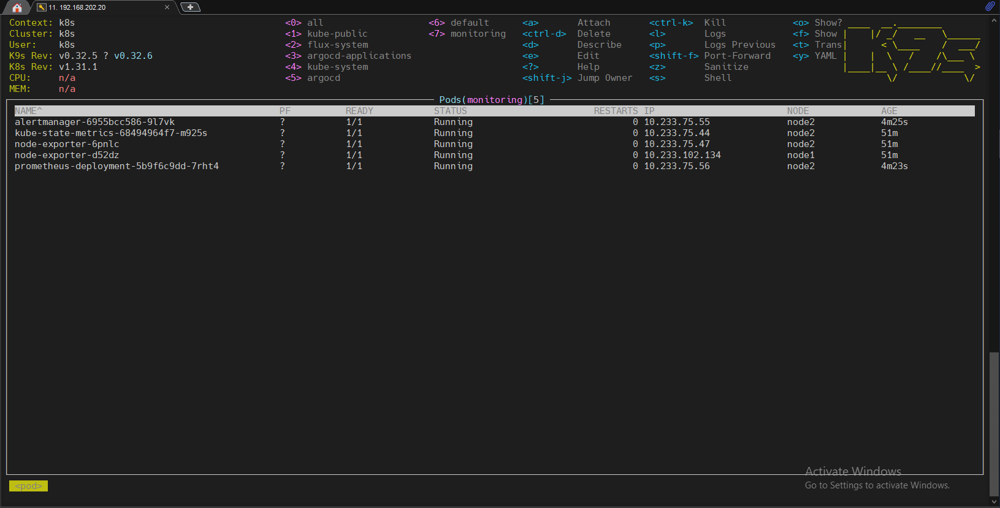
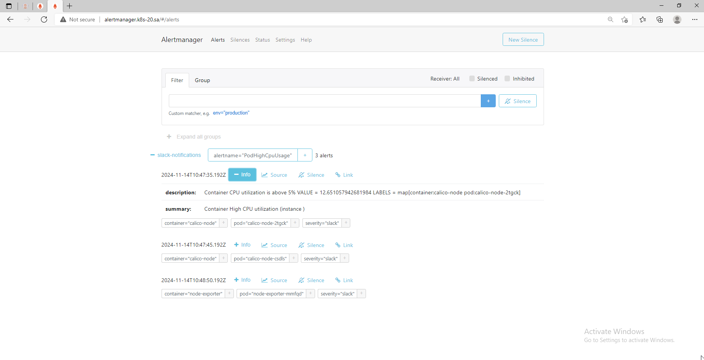
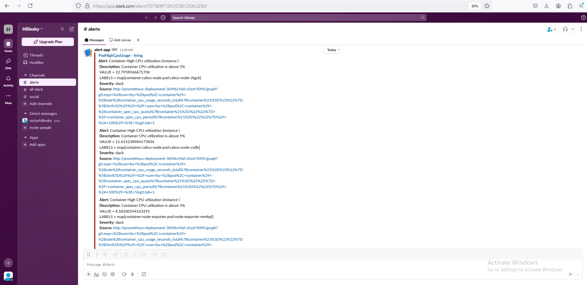
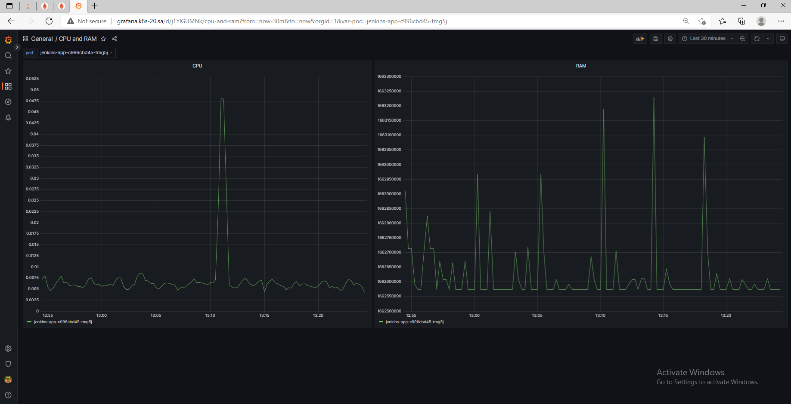
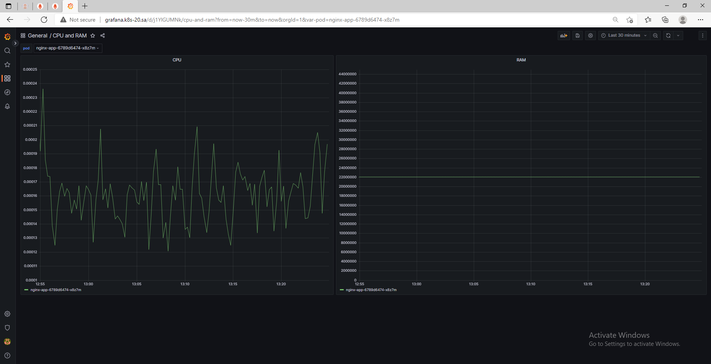

# 16. Technical and service monitoring

## Homework Assignment 1: Deploy and setup Prometheus Alertmanager
* Deploy Prometheus + Alertmanager:

  

* Setup slack notification for Alertmanager
    * Add alert for CPU overload per pods:

      ```yaml

          groups:
          - name: CPU overload alert
            rules:
            - alert: PodHighCpuUsage
              expr: (sum(rate(container_cpu_usage_seconds_total{container!=""}[3m])) by (pod, container) / sum(container_spec_cpu_quota{container!=""}/container_spec_cpu_period{container!=""}) by (pod, container) * 100) > 5
              for: 1m
              labels:
                severity: slack
              annotations:
                summary: Container High CPU utilization (instance {{ $labels.instance }})
                description: "Container CPU utilization is above 5%\n  VALUE = {{ $value }}\n  LABELS = {{ $labels }}"

      ```
      
    * Emulate payload to test alert
    * Thresholds can be any value as you wish
* Expose Prometheus web UI:

    * Prometheus web UI:
      
    

    * Alertmanager web UI:
      
    

    * Slack notifications:
      
    

## Homework Assignment 2: Use Grafana to display load of pods
* Deploy Grafana

    * Grafana web UI:
      
    
  
* Add Prometheus as metrics source

```json

    {
        "apiVersion": 1,
        "datasources": [
            {
               "access":"proxy",
                "editable": true,
                "name": "prometheus",
                "orgId": 1,
                "type": "prometheus",
                "url": "http://prometheus-service:8080",
                "version": 1
            }
        ]
    }

```
  
* Create dashboard with CPU and memory graphs per pods

```typescript

    sum by (pod) (rate(container_cpu_usage_seconds_total{pod="$pod"}[1m]))
    sum by (pod) (container_memory_working_set_bytes{pod="$pod"})

```

   

   

Prepare PR with your manifests, config files and screenshots (received notification in slack, Grafana dashboard)