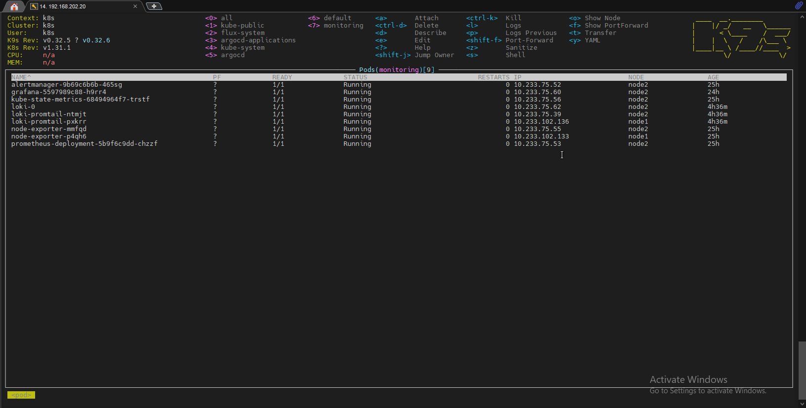
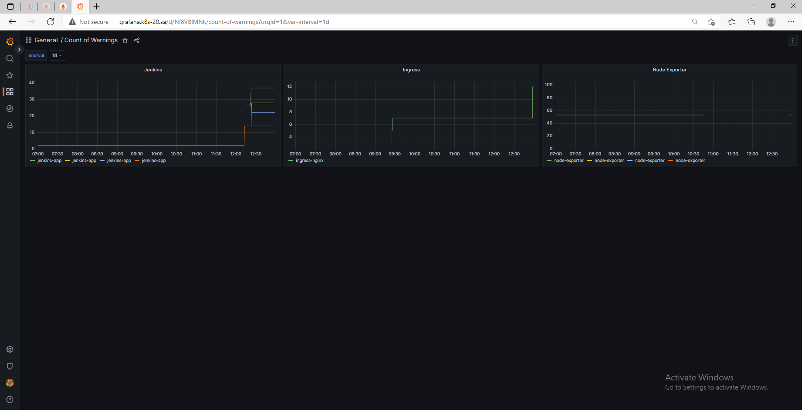

# 17. Log monitoring

## Homework Assignment 1: Use grafana Loki for log monitoring

* Deploy Grafana loki inside your cluster:

  
  
* Create Grafana dashboard to monitor counts errors for the following application inside your cluster
    * Jenkins

  ```typescript

    count_over_time({app="jenkins-app"} |= "INFO"[$interval])

  ```
  
    * Ingress
      
  ```typescript

    count_over_time({app="ingress-nginx"} |= "INFO"[$interval])

  ```
    * Node-Exporter
      
  ```typescript

    count_over_time({app="node-exporter"} |= "info"[$interval])

  ```
      
* Dashboard style can be any of your choice
* Counts of error should be as parameter from list: 5m, 1h, 1d

   

Create screenshot of your dashboard, and json export add to PR