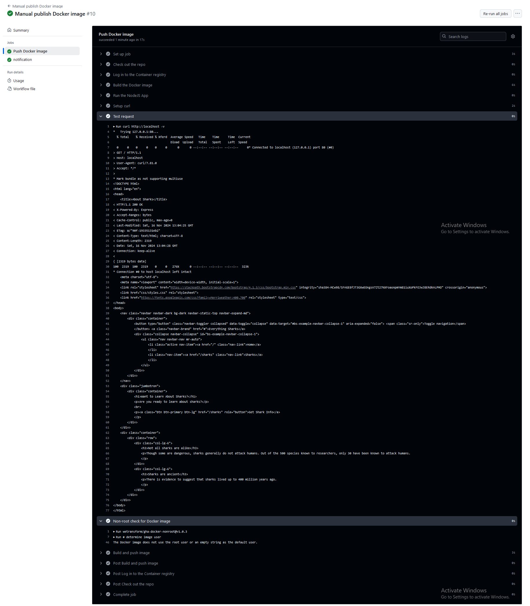
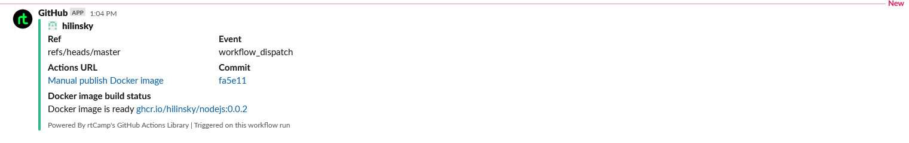
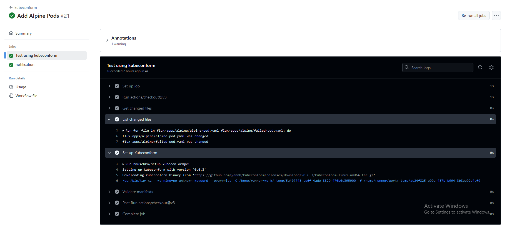
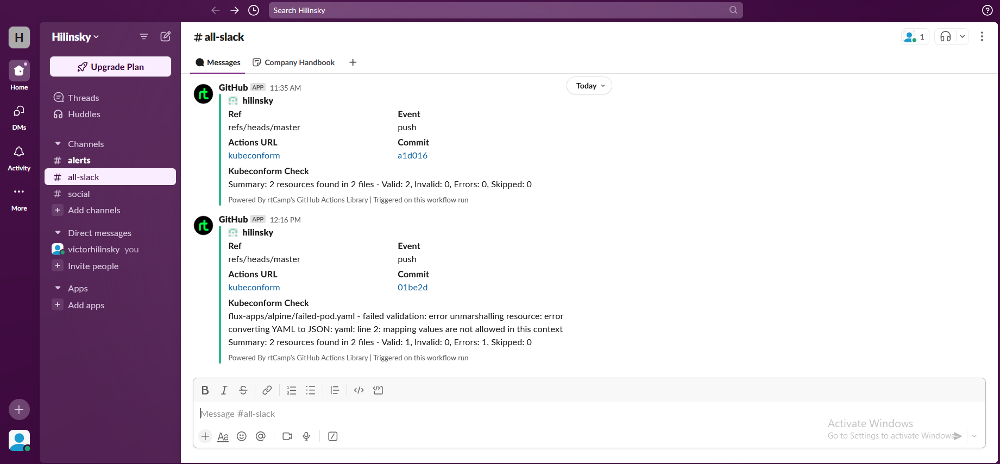

# 18. Testing

## Homework Assignment 1: Automate Docker images test by github action
  
Deploy docker image for test, test by requesting data from image, test if image has not root access inside:

* docker-test.yaml
  
  ```yaml

    name: Manual publish Docker image
    on:
      workflow_dispatch:
        inputs:
          imageToBuild:
            description: 'Component to build'
            required: true
            default: 'nodejs'
          tagImage:
            description: 'Please add tag'
            required: true
            default: 'latest'
    jobs:
      push_image:
        name: Push Docker image
        runs-on: ubuntu-latest
        permissions:
          packages: write
          contents: read
        steps:
          - name: Check out the repo
            uses: actions/checkout@v3
          - name: Log in to the Container registry
            uses: docker/login-action@v2
            with:
              registry: ghcr.io
              username: ${{ github.actor }}
              password: ${{ secrets.DOCKER_TOKEN }}
          - name: Build the Docker image
            run: docker build --file ./${{ inputs.imageToBuild }}/Dockerfile --tag hilinsky/${{ inputs.imageToBuild }}:${{ inputs.tagImage }} ./${{ inputs.imageToBuild }}
          - name: Run the NodeJS App
            run: docker run --name ${{ inputs.imageToBuild }}-app -p 80:8080 -d hilinsky/${{ inputs.imageToBuild }}:${{ inputs.tagImage }}
          - name: Setup curl
            run: sudo apt install curl
          - name: Test request
            run: curl http://localhost -v
          - name: Non-root check for Docker image
            uses: wetransform/gha-docker-nonroot@v1.0.3
            with:
              image-ref: hilinsky/${{ inputs.imageToBuild }}:${{ inputs.tagImage }}
              fail-for-root: true
          - name: Build and push image
            uses: docker/build-push-action@v3
            with:
              context: ./${{ inputs.imageToBuild }}
              push: true
              tags: ghcr.io/hilinsky/${{ inputs.imageToBuild }}:${{ inputs.tagImage }}
      notification:
        needs: push_image
        runs-on: ubuntu-latest
        steps:
        - name: Slack Notification
          uses: rtCamp/action-slack-notify@v2
          env:
            SLACK_CHANNEL: all-slack
            SLACK_COLOR: ${{ job.status }}
            SLACK_MESSAGE: "Docker image is ready ghcr.io/hilinsky/${{ inputs.imageToBuild }}:${{ inputs.tagImage }}"
            SLACK_TITLE: Docker image build status
            SLACK_USERNAME: GitHub
            SLACK_WEBHOOK: ${{ secrets.SLACK_WEBHOOK }}

  ```
  
* Action log output:

  

* Slack notification:

  

## Homework Assignment 2: Create CI for testing Kubernetes manifests using kubeconform
Start on push or create PR to manifests repository, all tools are inside container/pods, integrate notification about status of validation, (optional) if you have more then one manifest, you have to implement parallel validation for them

* kubeconform-test.yaml
  
  ```yaml

    name: kubeconform
    on:
      push:
        branches:
          - master
      pull_request:
      workflow_dispatch:
    permissions:
      contents: read
    jobs:
      kubeconform:
        name: Test using kubeconform
        runs-on: ubuntu-latest
        outputs:
          CHECK_OUTPUT: ${{ steps.init.outputs.CHECK_OUTPUT }}
        steps:
          - uses: actions/checkout@v3
            with:
                fetch-depth: ${{ github.event_name == 'pull_request' && 2 || 0 }}
          - name: Get changed files
            id: changed-files
            run: |
                if ${{ github.event_name == 'pull_request' }}; then
                    echo "changed_files=$(git diff --name-only -r HEAD^1 HEAD | xargs)" >> $GITHUB_OUTPUT
                else
                    echo "changed_files=$(git diff --name-only ${{ github.event.before }} ${{ github.event.after }} | xargs)" >> $GITHUB_OUTPUT
                fi
          - name: List changed files
            run: |
                for file in ${{ steps.changed-files.outputs.changed_files }}; do
                    echo "$file was changed"
                done
          - name: Set up Kubeconform
            uses: bmuschko/setup-kubeconform@v1
          - name: Validate manifests
            id: init
            run: |
                CHECK_OUTPUT=""
                for line in $(kubeconform -schema-location default --summary -schema-location 'https://raw.githubusercontent.com/datreeio/CRDs-catalog/main/{{.Group}}/{{.ResourceKind}}_{{.ResourceAPIVersion}}.json' ${{ steps.changed-files.outputs.changed_files }}); do
                  CHECK_OUTPUT="${CHECK_OUTPUT} $line"
                done
                echo "::set-output name=CHECK_OUTPUT::$CHECK_OUTPUT"
                echo $CHECK_OUTPUT
      notification:
        needs: kubeconform
        runs-on: ubuntu-latest
        steps:
        - name: Slack Notification
          uses: rtCamp/action-slack-notify@v2
          env:
            SLACK_CHANNEL: all-slack
            SLACK_COLOR: ${{ job.status }}
            SLACK_MESSAGE: ${{ needs.kubeconform.outputs.CHECK_OUTPUT }}
            SLACK_TITLE: Kubeconform Check
            SLACK_USERNAME: GitHub
            SLACK_WEBHOOK: ${{ secrets.SLACK_WEBHOOK }}

  ```

* Action log output:

  

  

* Slack notification:

  

Create PR to with your github action files and short report
