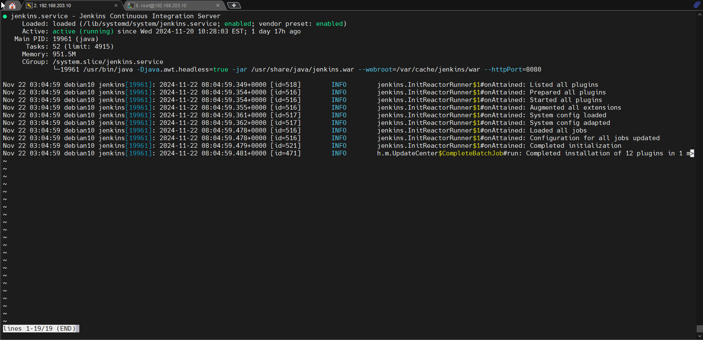
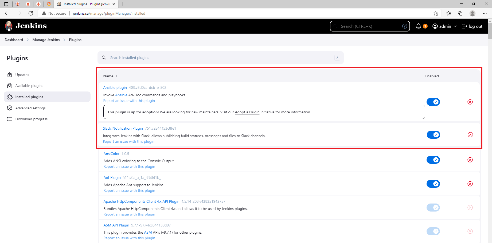
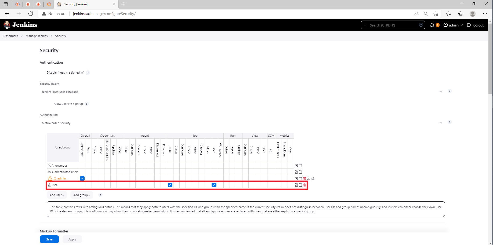
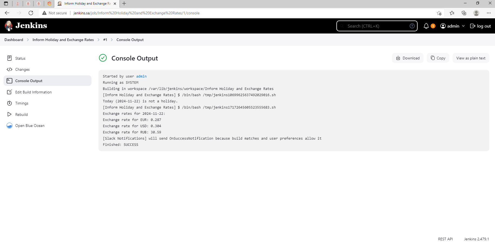
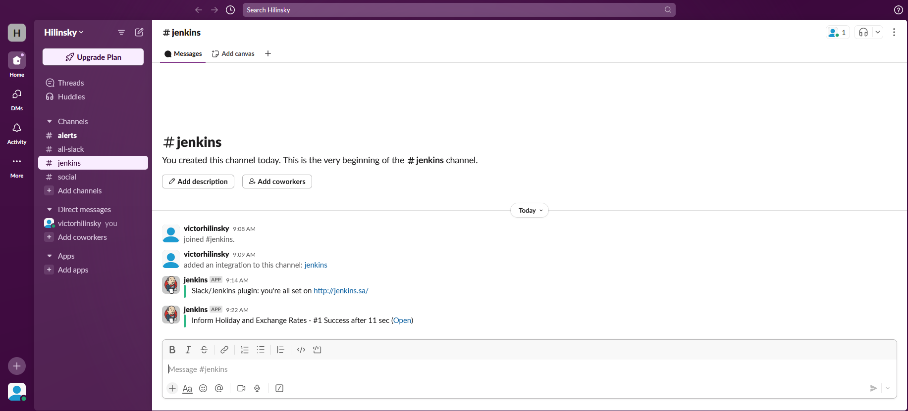

# 19. Jenkins. Start

## Homework Assignment 1: Deploy Jenkins

* Install Jenkins:

```bash

  sudo apt update -y
  sudo apt upgrade -y
  sudo apt install openjdk-17-jdk -y
  wget -q -O - https://pkg.jenkins.io/debian-stable/jenkins.io.key | sudo apt-key add -
  echo "deb https://pkg.jenkins.io/debian-stable binary/" | sudo tee /etc/apt/sources.list.d/jenkins.list
  sudo apt update
  sudo apt install jenkins -y
  sudo systemctl start jenkins
  sudo systemctl enable jenkins
  sudo systemctl status jenkins

```
  

* Setup the following:
  * install plugins: Ansible, slack notification:

    

  * add restricted user to view Jobs, without any changes inside Jobs and Jenkins settings:

    
    
* Hide Jenkins behind the web server (Nginx, Apache):

  ```bash
  
    cat /etc/nginx/sites-available/jenkins.conf

  ```
  
  ```nginx

    server {
        listen 80;
        server_name jenkins.sa;
    
        location / {
            proxy_pass http://localhost:8080;
            proxy_set_header Host $host;
            proxy_set_header X-Real-IP $remote_addr;
            proxy_set_header X-Forwarded-For $proxy_add_x_forwarded_for;
            proxy_set_header X-Forwarded-Proto $scheme;
        }
    }

  ```

  ```bash
  
    sudo ln -s /etc/nginx/sites-available/jenkins.conf /etc/nginx/sites-enabled/jenkins.conf
  
  ```

  ```bash

    ssh -J XXXXXXX@XXX.XXX.XXX.XX:XXXXX -L 80:127.0.0.1:80 root@192.168.203.10

  ```

## Homework Assignment 2: Create Job

* Create job to run each day and collect data and send to the slack:
  * Check if today holiday in Belarus:

  ```bash

      #!/bin/bash

      # Set your API endpoint and key
      API_URL="https://date.nager.at/api/v2/PublicHolidays"
      COUNTRY_CODE="BY"  # Change to your country code as needed
      TODAY=$(date +%Y-%m-%d)
      
      # Fetch holiday data for the current year
      CURRENT_YEAR=$(date +%Y)
      RESPONSE=$(curl -s "${API_URL}/${CURRENT_YEAR}/${COUNTRY_CODE}")
      
      # Check if the API call was successful
      if [ $? -ne 0 ]; then
          echo "Failed to fetch holiday data."
          exit 1
      fi
      
      # Check if today is a holiday
      if echo "$RESPONSE" | grep -q "\"date\":\"$TODAY\""; then
          echo "Today ($TODAY) is a holiday."
      else
          echo "Today ($TODAY) is not a holiday."
      fi

  ```

  * Inform about exchange rates for current day (please find any):

  ```bash

      #!/bin/bash
      
      # Set your API endpoint and key (if required)
      API_URL="https://api.exchangerate-api.com/v4/latest/BYN"  # Change 'USD' to your base currency
      
      # Fetch exchange rate data
      RESPONSE=$(curl -s "$API_URL")
      
      # Check if the API call was successful
      if [ $? -ne 0 ]; then
          echo "Failed to fetch exchange rate data."
          exit 1
      fi
      
      # Extract the date and rates from the response
      DATE=$(echo "$RESPONSE" | jq -r '.date')
      RATES=$(echo "$RESPONSE" | jq -r '.rates')
      
      # Inform about the exchange rates
      echo "Exchange rates for $DATE:"
      
      #echo "$RATES" | jq -r 'to_entries | .[] | "\(.key): \(.value)"'
      
      # For example, to get the exchange rate for EUR and GBP and RUB:
      EUR_RATE=$(echo "$RATES" | jq -r '.EUR')
      USD_RATE=$(echo "$RATES" | jq -r '.USD')
      RUB_RATE=$(echo "$RATES" | jq -r '.RUB')
      
      echo "Exchange rate for EUR: $EUR_RATE"
      echo "Exchange rate for USD: $USD_RATE"
      echo "Exchange rate for RUB: $RUB_RATE"

  ```

    

  * Can be included in simple message in slack:
    
    
    
Please add nginx/Apache config file and xml file for job into PR