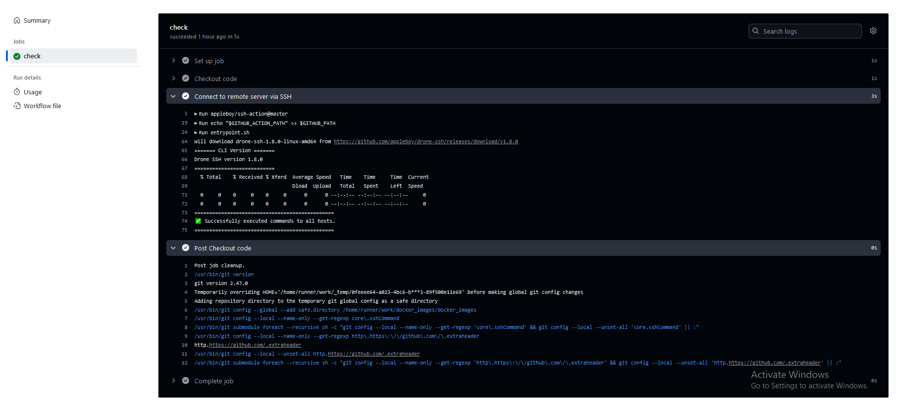
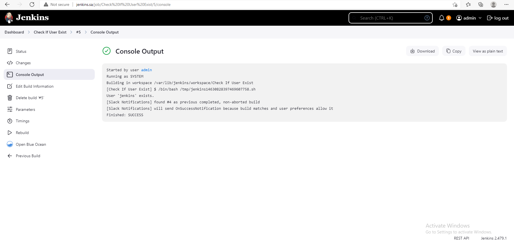
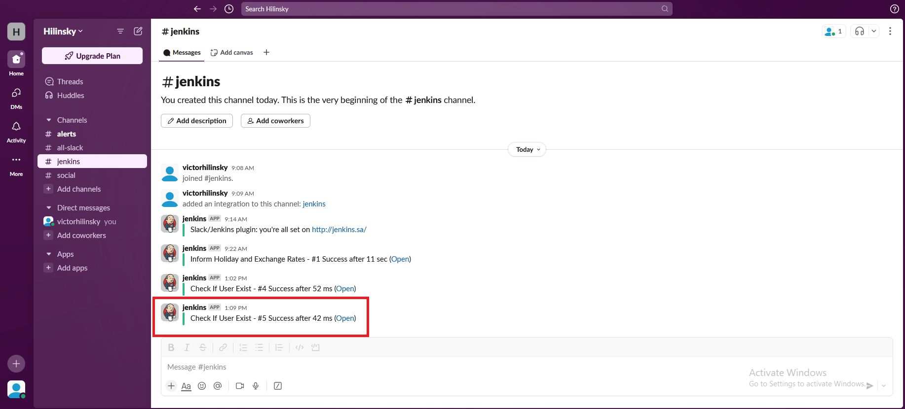
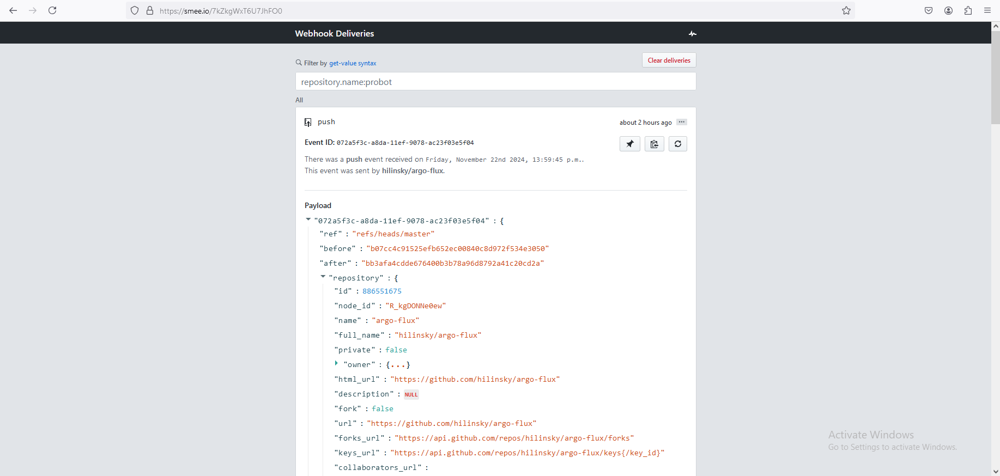
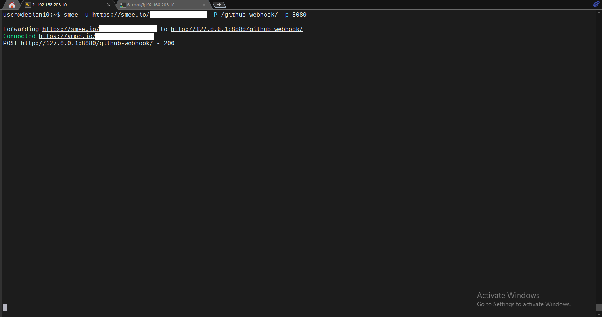
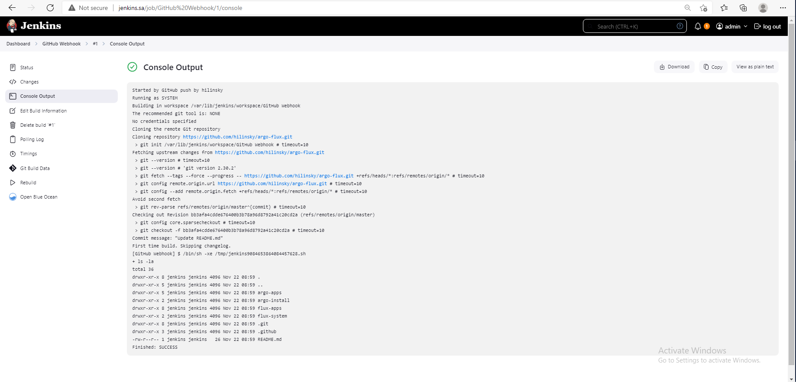

# 20. Jenkins. Routine

## Homework Assignment 1: Jenkins API

* Create Jenkins job which checking if user are exist in /etc/passwd:

  ```bash

    #!/bin/bash

    # Check if the user exists
    if getent passwd "$USERNAME" > /dev/null; then
        echo "User '$USERNAME' exists."
    else
        echo "User '$USERNAME' does not exist."
    fi

  ```

* Create GitHub action with parameters username:

  ```yaml

      name: Check if user exist
      
      on:
        workflow_dispatch:
          inputs:
            userToCheck:
              description: 'Username'
              required: true
              default: 'root'
      
      jobs:
        check:
          runs-on: ubuntu-latest
      
          steps:
            - name: Checkout code
              uses: actions/checkout@v3
      
            - name: Connect to remote server via SSH
              uses: appleboy/ssh-action@master
              with:
                host: ${{ secrets.HOST }}
                username: ${{ secrets.USER }}
                password: ${{ secrets.PASSWORD }}
                port: ${{ secrets.PORT }} 
                proxy_host: ${{ secrets.JUMP_HOST }} 
                proxy_port: ${{ secrets.JUMP_PORT }} 
                proxy_username: ${{ secrets.JUMP_USER }} 
                proxy_password: ${{ secrets.JUMP_PASSWORD }} 
                script: |
                  export API_TOKEN="${{ secrets.JENKINS_USERNAME }}:${{ secrets.JENKINS_TOKEN }}"
                  curl -X POST --user ${API_TOKEN} "http://jenkins.sa/job/Check%20If%20User%20Exist/buildWithParameters?USERNAME=${{ inputs.userToCheck }}"

  ```

* Include this parameter to API request for you Jenkins job:

  ```bash

      curl -X POST --user ${API_TOKEN} "http://jenkins.sa/job/Check%20If%20User%20Exist/buildWithParameters?USERNAME=${{ inputs.userToCheck }}"

  ```  

* Execute this chain of jobs:

  *  Github Action with user name -> API request -> Jenkins job -> notification slack if user exist/not exist:

  *  Github Action:

    

  * Jenkins job:

    

  * Notification slack:

    

## Homework Assignment 2: Webhook

* Add webhook to any your Job with git clone:

   * Smee: 

    
  
* Setup job to run only master/main branch changes:

   * Smee client logs: 

    

   * Jenkins job:
    
    
