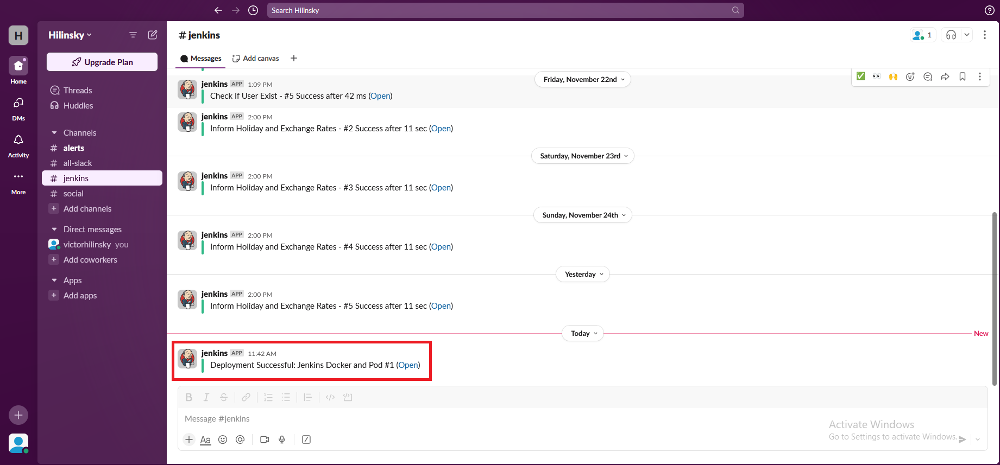

# 21. Jenkins. Docker and Pod

## Homework Assignment 1: Introduce the following pipeline:

* Repository content: https://github.com/hilinsky/jenkins-nodejs-app
    * Dockerfiles with application inside: https://github.com/hilinsky/jenkins-nodejs-app/blob/master/Dockerfile
    * Jenkinsfile with pipeline code: https://github.com/hilinsky/jenkins-nodejs-app/blob/master/Jenkinsfile
* Pipeline steps are:
    * Checkout code
    * Validate Dockerfile
    * Build image
    * Test image (run and check if webUI of application is accessible)
    * Push image to register (any)
* Deployment in two namespaces in sequence with manual approve from Jenkins WebUI
    * Deploy in namespace pre-prod
    * Test if deployment done
    * Display message about status of deployment and approve interface on Jenkins WebUI
    * deploy in namespace prod
    * cleaning: remove deployment from pre-prod

  

  
  
* Notification:
  
  
