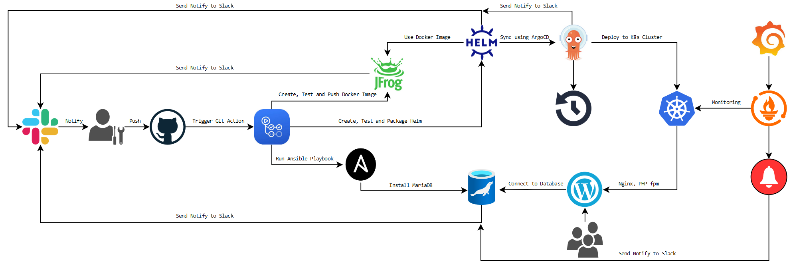

## Project

**Project's reporter:** Victor Trush

**Group number:** md-sa2-29-24

### Description of application for deployment

* **Name of application:** Theme of WordPress CMS
* **Which programming language is this application written in:** PHP, HTML, CSS, JS
* **What kind of DB:** MariaDB
* **Link on git repository with application:** https://github.com/hilinsky/project
* **Link on git repository with helm packages:** https://github.com/hilinsky/helm-project

### Pipeline. High Level Design

### Technologies which were used in project

**Orchestration:** Kubernetes

**Automation tools:** Ansible, Git Action, ArgoCD

**SCM:** GitHub

**Other tools:** Helm, Docker

**Monitoring:** Prometheus, Alertmanager, Grafana, Loki

**Notifications:** Slack

**CI description:** The pipeline starts after uploading the contents of the local repository to the main branch of the remote GitHub repository. As a result, the workflow file is trigerred. It has the next steps: connect to a remote server via SSH, install a MariaDB database server, create a database and a WordPress user, and send a notification to the Slack channel. Create a docker image from files that are in GitHub repository with the new version tag, performs testing and verification to receive a response to the request, upload the image to Jfrog, send a notification to the Slack channel. Create a HELM package, test it, and send a notification to the Slack channel.

**Deployment flows short description:** ArgoCD has created an application Wordpress that is synchronized with the Helm repository. When a new version of the application commits in the Helm repository, ArgoCD is automatically deployed to the cluster, after which it sends a notification to the Slack channel.

**Rollback flow description and implementation:** The rollback process is implemented using ArgoCD GUI.
