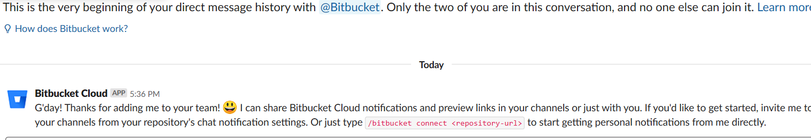
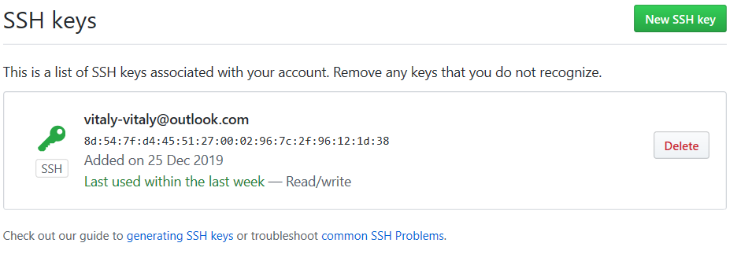
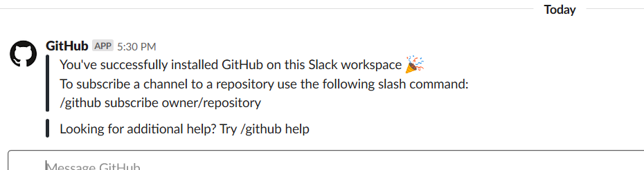
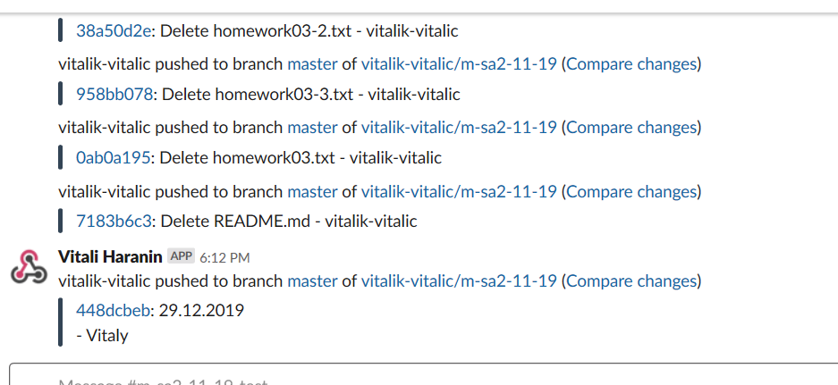
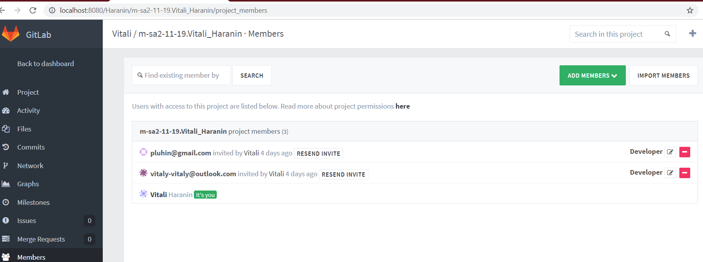
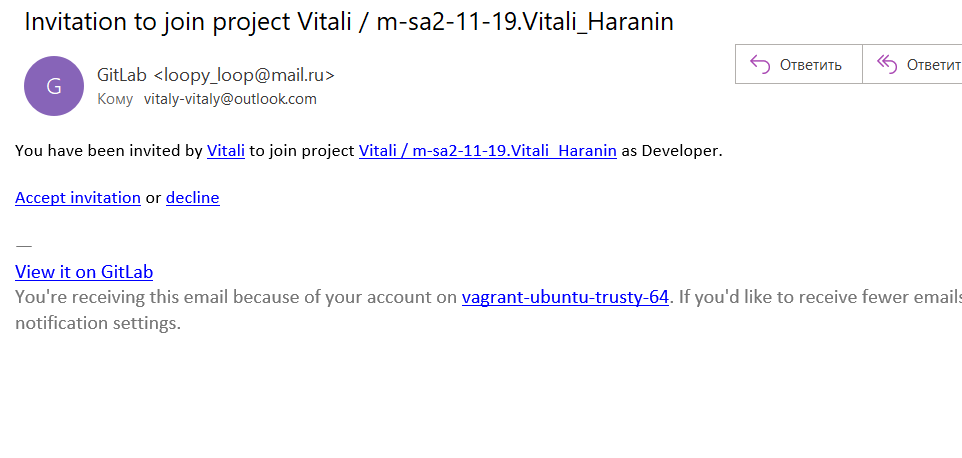

# 03. GIT hosting
<<<<<<< HEAD
<<<<<<< HEAD
## Links to remote repositories:
=======

## Links to remote repositories:

>>>>>>> remotes/up/m-sa2-11-19
=======

## Links to remote repositories:

>>>>>>> d06908ac46029d50c30d823989da07e6c1c36e39
* [bitbucket.org](https://bitbucket.org/vitalik-vitalic/m-sa2-11-19/src/master/)
* [gitlab.com](https://gitlab.com/vitalik-vitalic/m-sa2-11-19)
* [github.com](https://github.com/vitalik-vitalic/m-sa2-11-19)

## SSH keys:

<<<<<<< HEAD
<<<<<<< HEAD


=======




>>>>>>> d06908ac46029d50c30d823989da07e6c1c36e39

## Slack integration:

### bitbucket


### github



### gitlab



## Script:
<<<<<<< HEAD
=======


## Slack integration:

### bitbucket


### github


### gitlab


## Script:

>>>>>>> remotes/up/m-sa2-11-19
=======

>>>>>>> d06908ac46029d50c30d823989da07e6c1c36e39
```bash
#!  /bin/bash 
git push bb
git push github 
git push gitlab
```
# Additional task
<<<<<<< HEAD
<<<<<<< HEAD

=======



>>>>>>> d06908ac46029d50c30d823989da07e6c1c36e39
## Invitation to the project using GitLab notification



## Check difference between EE and CE
<<<<<<< HEAD
=======


## Invitation to the project using GitLab notification


## Check difference between EE and CE

>>>>>>> remotes/up/m-sa2-11-19
=======

>>>>>>> d06908ac46029d50c30d823989da07e6c1c36e39
| Differences        | CE           | EE  |
| ------------- |:-------------:| -----:|
| All the features of the CE      | * | * |
| Groups consisting of multiple people with a shared namespace for projects      | *      |   * |
| Share a project with other groups |     |    * |
| LDAP user authentication | *    |    * |
| Multiple LDAP server support |     |    * |
| LDAP group sync |     |    * |
| Create and remove admins based on an LDAP group |     |    * |
| Git hooks |     |    * |
| Branded login page |     |    * |
| Audit events |     |    * |
| Mention a JIRA ticket from GitLab |  *   |    * |
| Close JIRA issues with GitLab commits |     |    * |
| Display the merge request status for builds on the Jenkins CI |     |    * |
| The omnibus package supports the configuration of an external PostgreSQL database |     |    * |
| The omnibus package supports the configuration of an external MySQL database |     |    * |
| The omnibus package supports log forwarding |     |    * |
<<<<<<< HEAD
<<<<<<< HEAD
| An admin can e-mail all users of a project, group, or the entire server |     |    * |
=======
| An admin can e-mail all users of a project, group, or the entire server |     |    * |
>>>>>>> remotes/up/m-sa2-11-19
=======
| An admin can e-mail all users of a project, group, or the entire server |     |    * |
>>>>>>> d06908ac46029d50c30d823989da07e6c1c36e39
