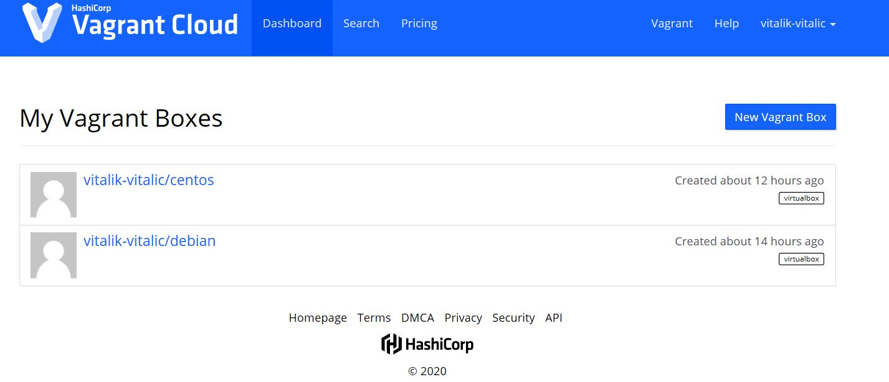
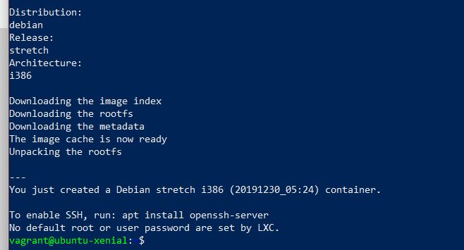
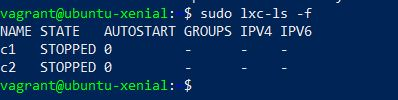
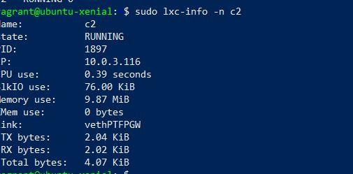
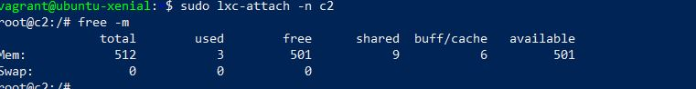
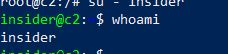
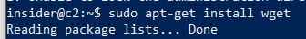

# 04. Infra Homework
## Vagrant


### Vagrant boxes:
1. [CentOS box](https://app.vagrantup.com/vitalik-vitalic/boxes/centos "CentOS box")
1. [Debian box](https://app.vagrantup.com/vitalik-vitalic/boxes/debian "Debian box")

## LXC
* *Create privileged containers*





* *Set RAM limit to 512MB*



* *Create user insider with any password*



* *User insider able to run any SUDO command without password*



### History commands
```bash
1  exit
    2  sudo services status all
    3  sudo service status all
    4  systemctls status all
    5  service --status-all
    6  cd /
    7  ls
    8  telnet
    9  netstat
   10  exit
   11  lsb_release -dc
   12  apt-get -y install -y lxc bridge-utils
   13  sudo apt-get -y install -y lxc bridge-utils
   14  apt-get -y install -y lxc bridge-utils
   15  sudo apt-get -y install -y lxc bridge-utils
   16  ps aux | grep -i apt
   17  sudo killall apt apt-get
   18  sudo kill 1869
   19  sudo kill 1874
   20  sudo apt-get -y install -y lxc bridge-utils
   21  dpkg --list | grep lxc | awk '{print $2,$3}'
   22  vim /etc/apt/sources.list
   23  sudo vim /etc/apt/sources.list
   24  sudo apt-get update
   25  apt-get -y install -y
   26  sudo apt-get -y install -y
   27  dpkg --list | grep lxc | awk '{print $2,$3}'
   28  cd ~
   29  ls
   30  ls -la /usr/share/lxc/templates/
   31  sudo lxc-create -t download -n c1
   32  lxc-ls -f
   33  sudo lxc-ls -f
   34  sudo lxc-start -n c1 -d -l DEBUG
   35  sudo lxc-ls -f
   36  sudo lxc-info -n c1
   37  sudo  brctl show
   38  sudo ip a s lxcbr0
   39  sudo ip a s vethVRD8T2
   40  sudo ip a s vethSL1CGE
   41  sudo  iptables -L -n -t nat
   42  sudo ps axfww
   43  sudo lxc-attach -n c1
   44  ls -la /var/lib/lxc/c1/
   45  sudo ls -la /var/lib/lxc/c1/
   46  sudo vim ls -la /var/lib/lxc/c1/config
   47  sudo vim /var/lib/lxc/c1/config
   48  lxc-stop -n c1
   49  sudo lxc-start -n c1 -d -l DEBUG
   50  lxc-info -n c1
   51  sudo lxc-start -n c1 -d -l DEBUG
   52  sudo lxc-ls -f
   53  sudo lxc-stop -n c1
   54  sudo lxc-start -n c1 -d -l DEBUG
   55  sudo lxc-ls -f
   56  lxc-info -n c1
   57  sudo lxc-info -n c1
   58  ls
   59  sudo lxc-attach -n c1
   60  history
```
Containers configs files:
1. <a href="configs/config-c1.md">CentOS config file</a>
2. <a href="configs/config-c2.md">Debian config file</a>