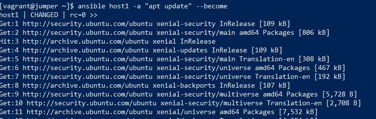

# HomeWork 05. Ansible start
* _Setup existing local user in your local sandboxes to run SUDO the following commands without password_

* _Use ansible add-hoc upgrade your hosts_

* _Connection to the remote host_

* _Using Vagrant deploy two host_

 
  
  * _Ubuntu 18.04_
    
  * _CentOS 7_
  

   
 * _Setup hosts for connection without password (ssh by key) using any speared "jump" server (can be another virtualhost/container )_
 
 
 
 * _Allow ansible user upgrade system_ 
 
 * _Using ansible need to do:_
    * _Connect to the hosts_
    
     
     
    * _Print out host names and IP_
     
     
     
    * _Upgrade packages_
          
     
          
* _Create own inventory with all variables and hierarchy_

 
 
## Configs
<a href="configs">Configs</a>