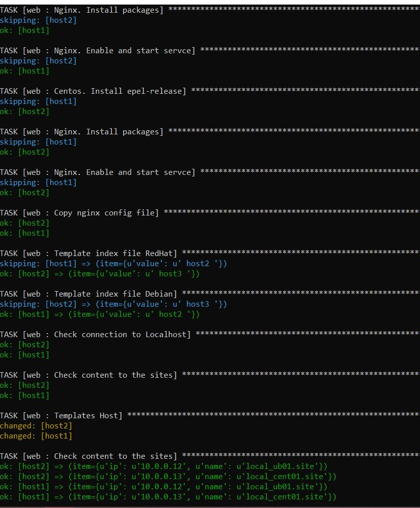

# HomeWork 07. Ansible cruise
* _Depends from OS (at least two)_


Configuration file: <a href="playbook/roles/web/tasks/main.yaml">main.yaml</a>

Listing:
```yaml
---
- name: Include deploy for Debian systems
  include: nginx_debian.yaml
  when: ansible_os_family == 'Debian'

- name: Include deploy for RedHat systems
  include: nginx_RedHat.yaml
  when: ansible_os_family == 'RedHat'
```

* _Setup Nginx for two virtualhosts using templates:_

_RedHat_

Configuration file: <a href="playbook/roles/web/tasks/nginx_RedHat.yaml">nginx_RedHat.yaml</a>

Listing:
```yaml
---
- name: Centos. Install epel-release
  yum:
    name: epel-release
    state: installed

- name: Nginx. Install packages
  yum:
    name: "{{ yum_nginx_packages }}"
    state: present

- name: Nginx. Enable and start servce
  service:
    name: nginx
    state: started
    enabled: yes
```
_Debian_

Configuration file: <a href="playbook/roles/web/tasks/nginx_debian.yaml">nginx_debian.yaml</a>

Listing:
```yaml
---
- name: Nginx. Install packages
  apt:
    name: "{{ apt_nginx_packages }}"
    state: present

- name: Nginx. Enable and start servce
  service:
    name: nginx
    state: started
    enabled: yes
```

_Using Template_

Configuration file: <a href="playbook/roles/web/tasks/main.yaml">main.yaml</a>

Listing:
```yaml
- name: Copy nginx config file
  template:
    src: /home/homework07/roles/web/templates/epel-nginx.conf.j2
    dest: /etc/nginx/nginx.conf
    backup: yes
```

* _Create and add index.html files_

Configuration file: <a href="playbook/roles/web/tasks/main.yaml">main.yaml</a>

Listing:
```yaml
- name: Template index file RedHat
  template:
    src: /home/homework07/roles/web/templates/index.html.j2
    dest: /usr/share/nginx/html/index.html
    backup: yes
  with_items: "{{ web_server_name }}"
  when: ansible_os_family == 'RedHat'

- name: Template index file Debian
  template:
    src: /home/homework07/roles/web/templates/index.html.j2
    dest: /var/www/html/index.html
    backup: yes
  with_items: "{{ web_server_name }}"
  when: ansible_os_family == 'Debian'
```

* _Check deployment/validate functionality of virtualhosts_

Configuration file: <a href="playbook/roles/web/tasks/main.yaml">main.yaml</a>

Listing:
```yaml
- name: Check connection to Localhost
  wait_for:
    host: "localhost"
    port: "80"
    state: started
    timeout: 3
  register: out

- name: Check content to the sites
  uri:
      url: http://localhost
      return_content: yes
  register: out
  failed_when: "'Hello DevOps World' not in out.content"

- name: Templates Host
  template:
    src: "hosts.j2"
    dest: "/etc/hosts"
    backup: yes

- name: Check content to the sites
  uri:
    url: "http://{{ item.name }}"
    return_content: yes
  loop: "{{ virtual_hosts }}"
```

PrintScreen Results



Path to the role directories: <a href="playbook/roles/web">web</a>
