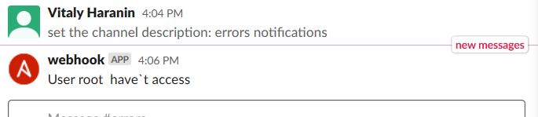
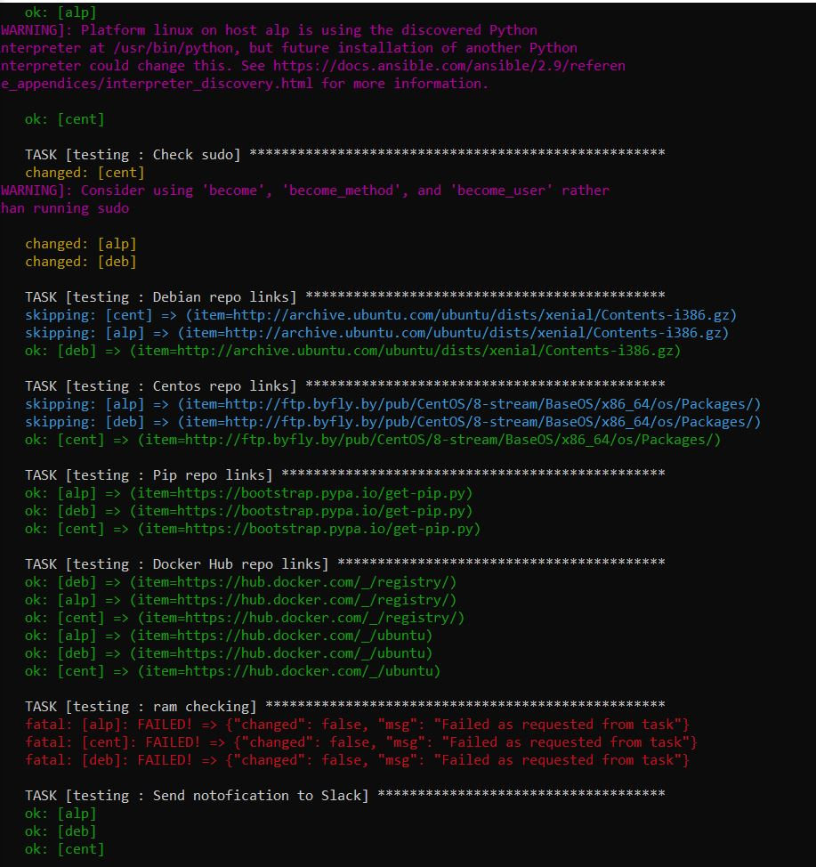

# HomeWork 08. Ansible. Spinup

_Playbook file_: homework08.yaml

```yaml
---
- hosts: infra
  become: yes
  roles:
    - testing
```

_Inventory file_: inv.yaml

```yaml
infra:
  children:
    internal:
      hosts:
        it-academy-centos:
          ansible_host: 192.168.201.1
          ansible_ssh_user: root
        it-academy-ubuntu:
          ansible_host: 192.168.201.2
          ansible_ssh_user: root
```

_Group_vars/all_: main.yaml

```yaml
---
default_home: "/var/www/html/"

debian_repo_links:
  - "http://archive.ubuntu.com/ubuntu/dists/xenial/Contents-i386.gz"

centos_repo_links:
  - "http://ftp.byfly.by/pub/CentOS/8-stream/BaseOS/x86_64/os/Packages/ModemManager-1.10.4-1.el8.i686.rpm"
pip_repo_links:
  - "https://bootstrap.pypa.io/get-pip.py"

docker_hub_repo_links:
  - "https://hub.docker.com/_/registry/"
  - "https://hub.docker.com/_/ubuntu"

mount: "{{ ansible_mounts | selectattr('mount','equalto', mount) | list | first }}"

```

_tasks_: main.yaml

```yaml
---
- name: Check sudo nopasswd
  block:
    - name: Check sudo
      command: sudo -v
      register: result
      failed_when: "'FAILED' in result.stderr"
  rescue:
    - name: Send notification to Slack
      slack:
        token: TFBPBNB2L/BRQJATF9R/2zbm0nl8LNNtDszgOh4u7CF5
        msg: "Failed: {{ ansible_user }} without sudo on {{ ansible_host }}"
        channel: 'ansible_natification'
        username: 'ansible-webhook'
        parse: 'full'

- name: Check Debian repo links
  include: debian_repo.yaml
  when: ansible_os_family == "Debian"                                                                                                                                                                           

- name: Check Centos repo links
  include: centos_repo.yaml
  when: ansible_os_family == "RedHat"

- name: Check Pip repo links
  include: pip_repo.yaml

- name: Check Docker Hub repo links
  include: docker_hub_repo.yaml

- name: Total Ram
  block:
    - name: ram checking  
      fail:
      when: ansible_memory_mb.real.total < 2048
  rescue:
    - name: Send notofication to Slack
      slack:
        token: TFBPBNB2L/BRQJATF9R/2zbm0nl8LNNtDszgOh4u7CF5
        msg: "not enough RAM"
        channel: "errors"
        username: "webhook"
        parse: "full"

- name: Check free space
  block:
    - name: Check free space
      fail:
      when: (item.mount == '/') and (item.size_available / 1000000000) < 7
      with_items: "{{ ansible_mounts }}"
  tags:
   - test
  rescue:
    - name: Send notofication to Slack
      slack:
        token: TFBPBNB2L/BRQJATF9R/2zbm0nl8LNNtDszgOh4u7CF5
        msg: "not enough free space"
        channel: "errors"
        username: "webhook"
        parse: "full"
```

_tasks_: centos_repo.yaml

```yaml
---
- name: Check Centos repo links
  block:
    - name: Centos repo links
      uri:
        url: "{{ item }}"
        return_content: no
      register: out_uri
      with_items: "{{ centos_repo_links }}"
      failed_when: out_uri.status != 200
  rescue:
    - name: Send notofication to Slack
      slack:
        token: TFBPBNB2L/BRQJATF9R/2zbm0nl8LNNtDszgOh4u7CF5
        msg: "Can`t rich current page"
        channel: "errors"
        username: "webhook"
        parse: "full"
```

_tasks_: debian_repo.yaml

```yaml
---
- name: Check Debian repo links
  block:
    - name: Debian repo links
      uri:
        url: "{{ item }}"
        return_content: no
      register: out_uri
      with_items: "{{ debian_repo_links }}"
      failed_when: out_uri.status != 200
  rescue:
    - name: Send notofication to Slack
      slack:
        token: TFBPBNB2L/BRQJATF9R/2zbm0nl8LNNtDszgOh4u7CF5
        msg: "Can`t rich current page"
        channel: "errors"
        username: "webhook"
        parse: "full"
```

_tasks_: pip_repo.yaml

```yaml
---
- name: Check Pip repo links
  block:
    - name: Pip repo links
      uri:
        url: "{{ item }}"
        return_content: no
      register: out_uri
      with_items: "{{ pip_repo_links }}"
      failed_when: out_uri.status != 200
  rescue:
    - name: Send notofication to Slack
      slack:
        token: TFBPBNB2L/BRQJATF9R/2zbm0nl8LNNtDszgOh4u7CF5
        msg: "Can`t rich current page"
        channel: "errors"
        username: "webhook"
        parse: "full"
```

_tasks_: docker_hub_repo.yaml

```yaml
---
- name: Docker Hub repo links
  block:
    - name: Docker Hub repo links
      uri:
        url: "{{ item }}"
        return_content: no
      register: out_uri
      with_items: "{{ docker_hub_repo_links }}"
      failed_when: out_uri.status != 200
  rescue:
    - name: Send notofication to Slack
      slack:
        token: TFBPBNB2L/BRQJATF9R/2zbm0nl8LNNtDszgOh4u7CF5
        msg: "Can`t rich current page"
        channel: "errors"
        username: "webhook"
        parse: "full"
```

_molecule_: molecule.yml

```yaml
---
dependency:
  name: galaxy
driver:
  name: docker
lint:
  name: yamllint
platforms:
  - name: cent
    image: centos:7
  - name: deb
    image: debian:10
  - name: alp
    image: alpine:3.7
provisioner:
  name: ansible
  lint:
    name: ansible-lint
verifier:
  name: testinfra
  lint:
    name: flake8
```

PrintScreen of the slack notification:



PrintScreen of the molecule test:

