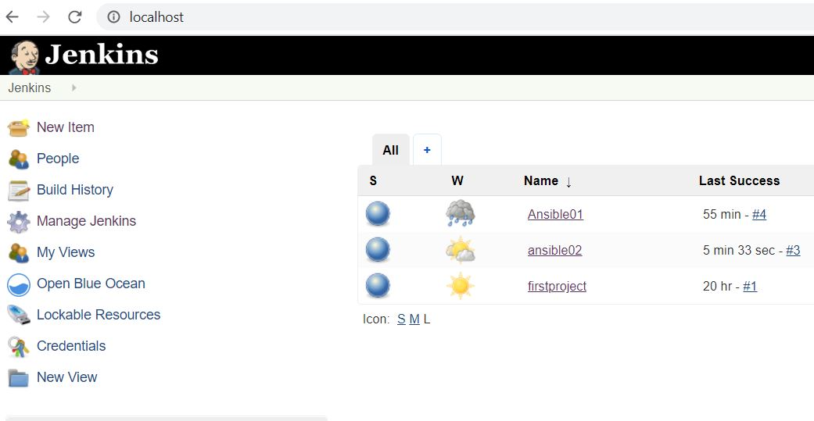

# 11. Jenkins. Routine

* _Implement the following Pipeline:_

Configuration files: 

<a href="configs/homework11.yaml">homework11.yaml</a>

<a href="configs/inv.yaml">inv.yaml</a>

homework11.yaml:
```yaml

---
- hosts: infra
  become: yes
  tasks:
    - name: Centos. Install nmap
      yum:
        name: nmap
        state: installed

    - name: Run nmap
      command: nmap -sn 192.168.201.0/24
      register: result

    - name: Remove nmap
      yum:
        name: nmap
        state: absent

    - name: Print nmap result
      debug: var=result.stdout_lines

```

inv.yaml:
```yaml

infra:
  children:
    internal:
      hosts:
        it-academy-centos:
          ansible_host: 192.168.201.1
          ansible_ssh_user: root

```

Console output
```bash
Started by user admin
Running as SYSTEM
Building in workspace /var/jenkins_home/workspace/ansible02
[ansible02] $ ansible-playbook /home/homework11/homework11.yaml -i /home/homework11/inv.yaml -f 5

PLAY [infra] *******************************************************************

TASK [Gathering Facts] *********************************************************
ok: [it-academy-centos]

TASK [Centos. Install nmap] ****************************************************
changed: [it-academy-centos]

TASK [Run nmap] ****************************************************************
changed: [it-academy-centos]

TASK [Remove nmap] *************************************************************
changed: [it-academy-centos]

TASK [Print nmap result] *******************************************************
ok: [it-academy-centos] => {
    "result.stdout_lines": [
        "",
        "Starting Nmap 6.40 ( http://nmap.org ) at 2020-02-04 13:52 UTC",
        "Nmap scan report for 192.168.201.2",
        "Host is up (0.00053s latency).",
        "MAC Address: 5E:99:8E:02:86:F8 (Unknown)",
        "Nmap scan report for 192.168.201.3",
        "Host is up (0.00022s latency).",
        "MAC Address: 92:3D:D5:FE:F2:27 (Unknown)",
        "Nmap scan report for 192.168.201.4",
        "Host is up (0.00019s latency).",
        "MAC Address: F2:6A:28:F1:07:10 (Unknown)",
        "Nmap scan report for 192.168.201.5",
        "Host is up (0.00019s latency).",
        "MAC Address: D2:62:B8:B3:12:03 (Unknown)",
        "Nmap scan report for 192.168.201.6",
        "Host is up (0.00021s latency).",
        "MAC Address: 8E:64:1B:B7:3D:82 (Unknown)",
        "Nmap scan report for 192.168.201.7",
        "Host is up (0.00017s latency).",
        "MAC Address: 4A:D2:6E:6C:DD:F1 (Unknown)",
        "Nmap scan report for 192.168.201.8",
        "Host is up (0.00017s latency).",
        "MAC Address: CE:A6:C5:34:BC:B9 (Unknown)",
        "Nmap scan report for 192.168.201.9",
        "Host is up (0.00017s latency).",
        "MAC Address: DE:60:08:5B:3F:2A (Unknown)",
        "Nmap scan report for 192.168.201.10",
        "Host is up (0.00019s latency).",
        "MAC Address: EE:C0:D1:D8:00:7F (Unknown)",
        "Nmap scan report for 192.168.201.11",
        "Host is up (0.00020s latency).",
        "MAC Address: 22:73:7E:D7:9A:D2 (Unknown)",
        "Nmap scan report for 192.168.201.12",
        "Host is up (0.00032s latency).",
        "MAC Address: 0A:48:E3:9E:AC:15 (Unknown)",
        "Nmap scan report for 192.168.201.13",
        "Host is up (0.00022s latency).",
        "MAC Address: BA:15:1A:17:94:25 (Unknown)",
        "Nmap scan report for 192.168.201.14",
        "Host is up (0.00019s latency).",
        "MAC Address: 9A:50:AC:CC:FA:32 (Unknown)",
        "Nmap scan report for 192.168.201.15",
        "Host is up (0.00020s latency).",
        "MAC Address: 8E:A7:CE:87:65:EC (Unknown)",
        "Nmap scan report for 192.168.201.16",
        "Host is up (0.00023s latency).",
        "MAC Address: 92:5B:23:97:77:87 (Unknown)",
        "Nmap scan report for 192.168.201.17",
        "Host is up (0.00022s latency).",
        "MAC Address: 9A:02:A0:CC:F4:11 (Unknown)",
        "Nmap scan report for 192.168.201.18",
        "Host is up (0.00023s latency).",
        "MAC Address: D2:79:8C:F1:4F:F1 (Unknown)",
        "Nmap scan report for 192.168.201.19",
        "Host is up (0.00020s latency).",
        "MAC Address: EE:69:F9:36:73:EB (Unknown)",
        "Nmap scan report for 192.168.201.20",
        "Host is up (0.00018s latency).",
        "MAC Address: 86:75:61:37:4A:08 (Unknown)",
        "Nmap scan report for 192.168.201.21",
        "Host is up (0.00021s latency).",
        "MAC Address: BA:09:CE:C9:86:DC (Unknown)",
        "Nmap scan report for 192.168.201.22",
        "Host is up (0.00022s latency).",
        "MAC Address: 8A:E2:68:55:58:95 (Unknown)",
        "Nmap scan report for 192.168.201.23",
        "Host is up (0.00026s latency).",
        "MAC Address: AA:A0:1C:70:17:E8 (Unknown)",
        "Nmap scan report for 192.168.201.24",
        "Host is up (0.00021s latency).",
        "MAC Address: C6:D5:FA:F0:F0:DE (Unknown)",
        "Nmap scan report for sa-centos-1.it-academy.local (192.168.201.1)",
        "Host is up.",
        "Nmap done: 256 IP addresses (24 hosts up) scanned in 8.90 seconds"
    ]
}

PLAY RECAP *********************************************************************
it-academy-centos          : ok=5    changed=3    unreachable=0    failed=0   

Finished: SUCCESS

```


PrintScreen of the current items:


