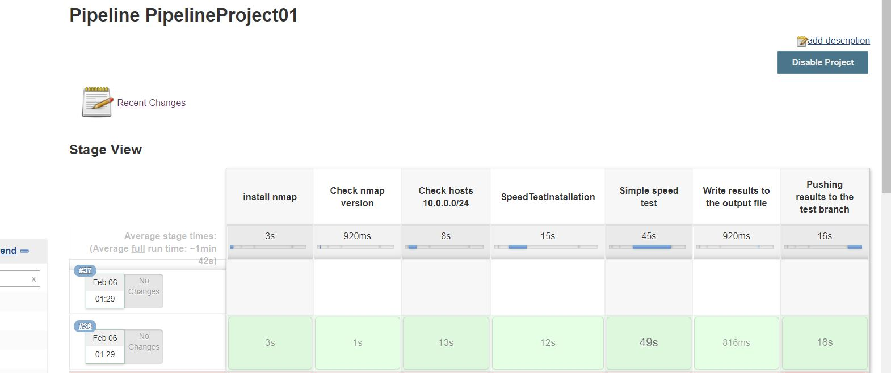
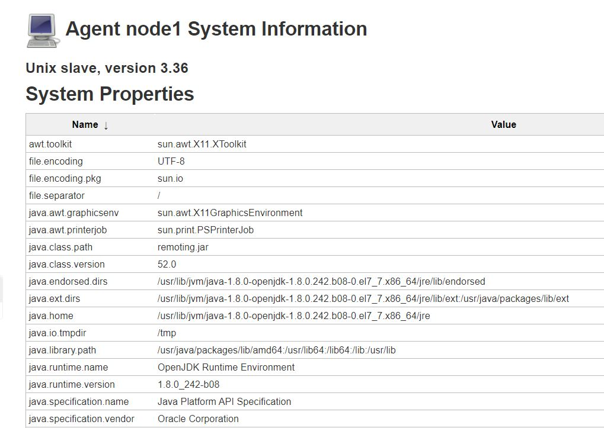

# 12. Jenkins. As code

* _Pipeline as code:_

Jenkins file:

```

node('node1'){
        stage("install nmap"){
            printMessage('Installing nmap')
            
            sh 'sudo yum install nmap -y'
            
            printMessage('Installation nmap finished')
        }
        stage("Check nmap version"){
            sh 'nmap –version'
        }
        stage("Check hosts 10.0.0.0/24"){
            NMAPOUTPUT = sh (
            script: 'nmap  -sn  10.0.0.0/24',
            returnStdout: true
            ).trim()
            //printMessage("Hosts: ${NMAPOUTPUT}")
        }
        stage("SpeedTestInstallation"){
            sh """
                sudo yum install wget -y
                sudo wget https://bintray.com/ookla/rhel/rpm -O bintray-ookla-rhel.repo
                sudo mv bintray-ookla-rhel.repo /etc/yum.repos.d/
                sudo yum install speedtest -y
            """
        }
        stage("Simple speed test"){
            SPEEDTESTRESULTS = sh (
            script: 'speedtest --accept-license',
            returnStdout: true
            ).trim()
            //printMessage("Speed test result: ${SPEEDTESTRESULTS}")
        }
        stage("Write results to the output file"){
            sh """
                sudo touch ~/output.txt
                sudo chown jenkins:jenkins ~/output.txt
                sudo chmod 777 ~/output.txt
                sudo echo "Nmap results:" >> ~/output.txt
                sudo echo "${NMAPOUTPUT}" >> ~/output.txt
                sudo echo "SpeedTest results:" >> ~/output.txt
                sudo echo "${SPEEDTESTRESULTS}" >> ~/output.txt
                sudo cat ~/output.txt
            """
        }
        stage("Pushing results to the test branch"){
            sh """
                sudo rm -rf ~/githuboutput
                sudo mkdir ~/githuboutput
                sudo chmod -R 777 ~/githuboutput
                sudo chown -R jenkins:jenkins ~/githuboutput
                cd ~/githuboutput
                sudo git clone git@github.com:vitalik-vitalic/homework12.git
                cd homework12
                sudo mv ~/output.txt ~/githuboutput/homework12/output.txt
                sudo git config --global user.email "vitaly-vitaly@outlook.com"
                sudo git config --global user.name "Vitaly"
                sudo git add --all
                sudo git commit -m "output results"
                sudo git push origin master
                cd ~
                sudo rm -rf ~/githuboutput
            """
        }
    }

def printMessage(message){
        echo "${message}"
    }

```

ReportFile:

<a href="https://github.com/vitalik-vitalic/homework12/blob/master/output.txt">output.txt</a>

output.txt:
```bash

Nmap results:
Starting Nmap 6.40 ( http://nmap.org ) at 2020-02-05 22:29 UTC
Nmap scan report for 10.0.0.1
Host is up (0.0033s latency).
Nmap scan report for 10.0.0.10
Host is up (0.0014s latency).
Nmap scan report for 10.0.0.11
Host is up (0.00018s latency).
Nmap scan report for 10.0.0.12
Host is up (0.0015s latency).
Nmap scan report for 10.0.0.13
Host is up (0.0020s latency).
Nmap done: 256 IP addresses (5 hosts up) scanned in 11.60 seconds
SpeedTest results:
Speedtest by Ookla

     Server: A1 - Minsk (id = 4521)
        ISP: Mobile TeleSystems JLLC
    Latency:   212.53 ms   (60.67 ms jitter)

   Download:     4.38 Mbps (data used: 7.2 MB)                               

     Upload:     4.35 Mbps (data used: 5.9 MB)                               
Packet Loss:     0.0%
 Result URL: https://www.speedtest.net/result/c/b671ddf4-ba98-4286-bc78-bb0eecd66480


```

PrintScreen of the current pipeline:



PrintScreen of the current node:


