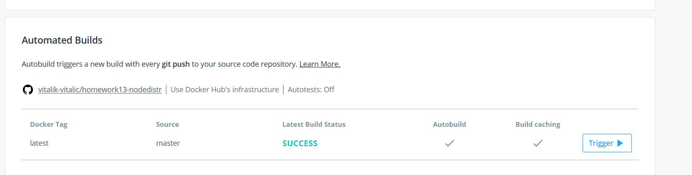
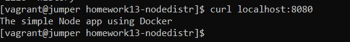
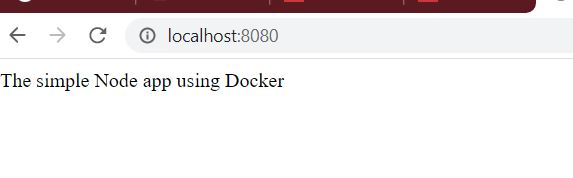

# 13. Docker. Lading

* _Create a Docker file of any Python application_ 
    * _As example: any API (port) listener_

Docker file: <a href="simpleNodeJs/Dockerfile">Dockerfile</a>

```Dockerfile

FROM node:8

# Папка приложения
ARG APP_DIR="/var/app"
RUN mkdir -p ${APP_DIR}
WORKDIR ${APP_DIR}

# Установка зависимостей
RUN git clone https://github.com/vitalik-vitalic/homework13-nodedistr.git

WORKDIR /var/app/homework13-nodedistr

RUN npm install

# Уведомление о порте, который будет прослушивать работающее приложение
EXPOSE 3000

# Запуск проекта
CMD ["npm", "start"]

```

* _Add automated build for that image to Dockerhub using Github <=> Dockerhub integration_ 



* _Run image as container and test it_ 
Send/receive API request using curl/telnet command

```bash
docker build -t node-app/node-app:V1 -f Dockerfile .
docker run -p 8080:3000 -d --name node-appv1 node-app/node-app:V1
```

Curl request:



Web request:



Links:

Github: <a href="https://github.com/vitalik-vitalic/homework13-nodedistr">homework13-nodedistr</a>

DockerHub: <a href="https://hub.docker.com/repository/docker/vitalikvitalic/homework13">homework13</a>