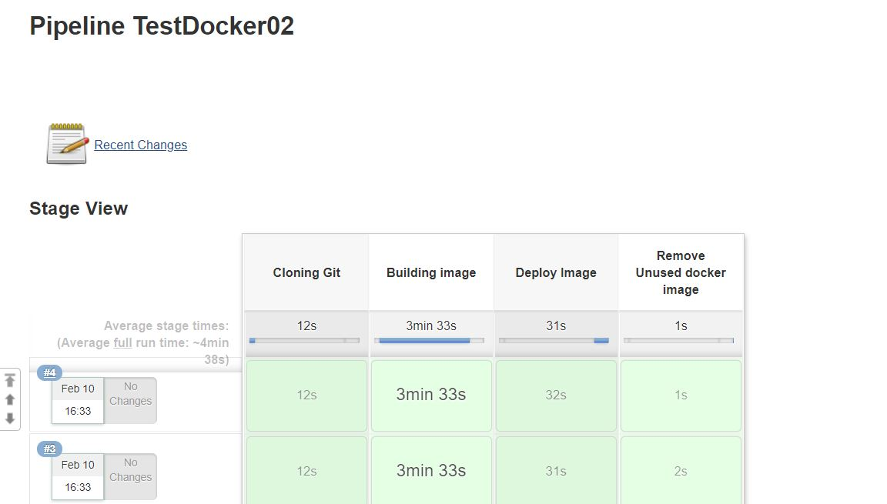
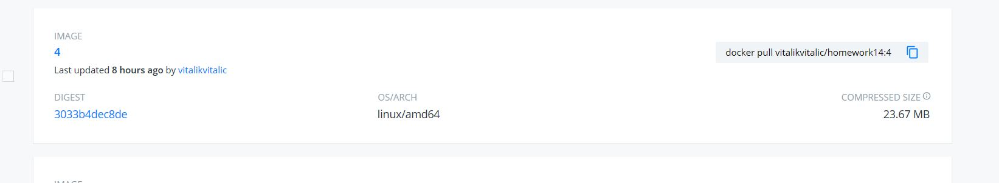
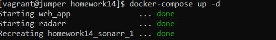
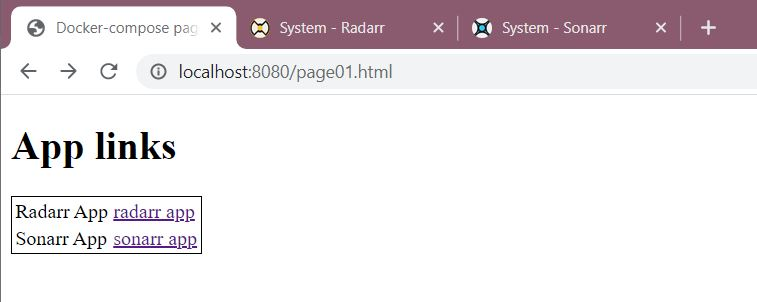
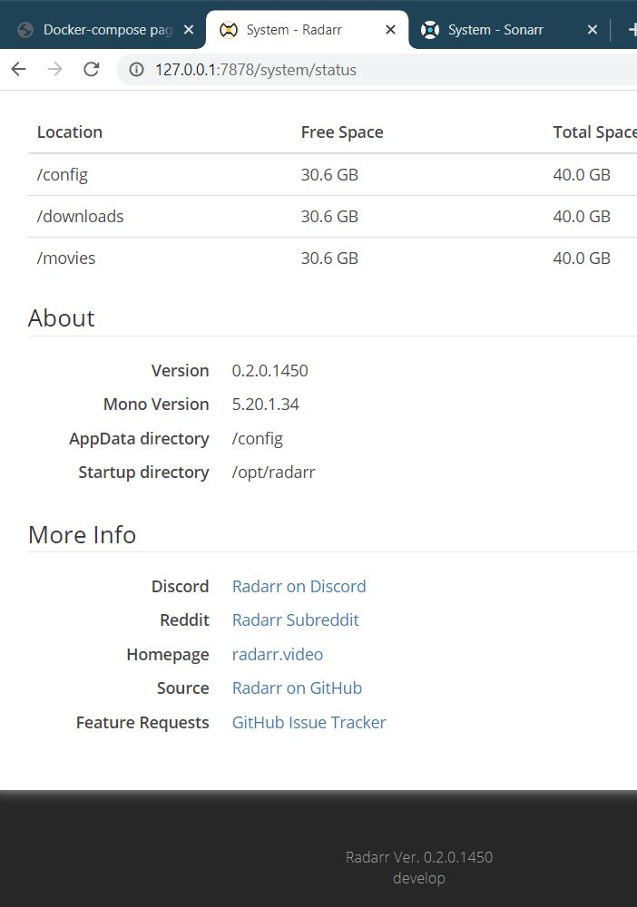
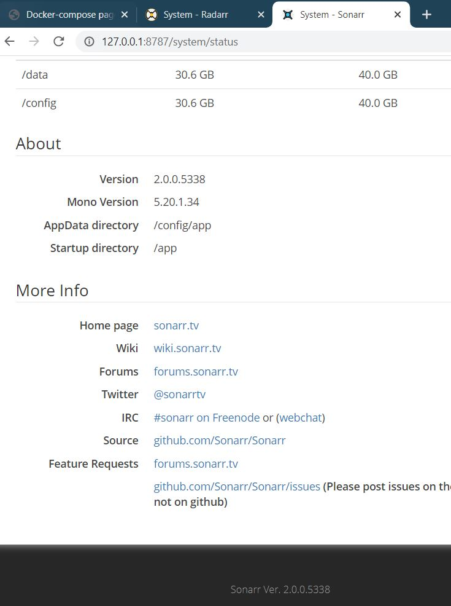

# 14. Docker. Logistics

* _Automate task **13. Docker. Lading** by Jenkinsfile_ 

Jenkins file: <a href="configs+output/Pipeline01.txt">Pipeline01.txt</a>

Dockerfile: <a href="configs+output/Dockerfile">Dockerfile</a>

```Jenkinsfile

pipeline {
	environment {
		registry = "vitalikvitalic/homework14"
		registryCredentials = "vitalikvitalic-dockerhub"
	}
	agent { label 'master'}
	stages {
		stage('Cloning Git') {
			steps {
				git 'https://github.com/vitalik-vitalic/homework14.git'
			}
		}
		stage('Building image') {
			steps {
				script {
					dockerImage = docker.build registry + ":$BUILD_NUMBER"
				}				
			}
		}
		stage('Deploy Image') {
			steps {
				script {
					docker.withRegistry( '', registryCredentials ) {
						dockerImage.push()
					}
				}				
			}
		}
		stage('Remove Unused docker image') {
			steps {
				sh "docker rmi $registry:$BUILD_NUMBER"				
			}
		}
	}	
}

```

Jenkins console output: <a href="configs+output/JenkinsConsoleOutput.txt">JenkinsConsoleOutput.txt</a>

Jenkins results:





<a href="https://hub.docker.com/repository/docker/vitalikvitalic/homework14/general">DockerHubLink</a>

<a href="https://github.com/vitalik-vitalic/homework14">GitHubLink</a>

* _Create docker compose file which contains the following applications:_
    * _Web server (with links to the Web apps, see below)_
    * _sonarr_
    * _radarr_
    
docker-compose file: <a href="configs+output/docker-compose.yaml">docker-compose.yaml</a>
    
```docker-compose

version: '3'

services:
  web:
    image: eboraas/apache-php
    container_name: web_app
    ports:
      - "8080:80"
    volumes:
      - ./app:/var/www/html/
  radarr:
    image: linuxserver/radarr
    container_name: radarr
    environment:
      - PUID=1000
      - PGID=1000
      - TZ=Europe/London
      - UMASK_SET=022 #optional
    volumes:
      - ./radarr/data:/config
      - ./radarr/downloadclient-downloads:/movies
      - ./radarr/movies:/downloads
    ports:
      - 7878:7878
    restart: unless-stopped
  sonarr:
    image: "hotio/sonarr"
    volumes:
        - ./sonarr/config:/config
        - ./sonarr/data:/data
    environment:
        - PUID=111
        - PGID=321
        - UMASK=002
    ports:
      - 8787:8989
    restart: unless-stopped

```

docker-compose results:







