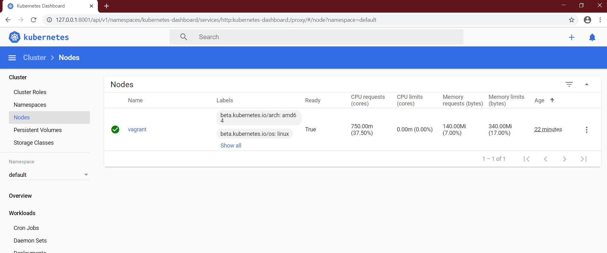
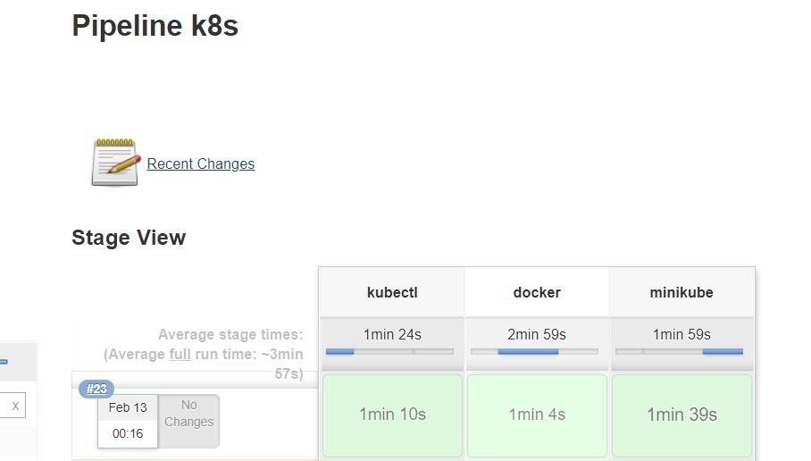

# 15. K8s. Structure

* _Install minikube on your bare/virtual host_
* _Provide access to the dashboard from your workstation_
* _Automate it (bash/ansible/Jenkinsfile) Your code and printscreen of dashboard put into folder_  

Jenkinspipeline file: <a href="configs/Jenkinspipeline.txt">Jenkinspipeline.txt</a>

```Jenkinspipeline

node('node01'){
        stage("kubectl"){
            printMessage('Installing kubectl')
            sh '''
                whoami
                sudo apt-get -qq update && sudo apt-get install -qqy apt-transport-https
                sudo curl -s https://packages.cloud.google.com/apt/doc/apt-key.gpg | sudo apt-key add -
                sudo touch /etc/apt/sources.list.d/kubectl.list
                sudo chmod 777 /etc/apt/sources.list.d/kubectl.list
                sudo echo "deb http://apt.kubernetes.io/ kubernetes-xenial main" > /etc/apt/sources.list.d/kubectl.list
                sudo apt-get update -qq
                sudo apt-get install -qqy kubectl
            '''
        }
        stage("docker"){
            sh '''
                sudo apt-get remove docker docker-engine docker.io
                sudo apt-get install apt-transport-https ca-certificates curl software-properties-common
                sudo curl -fsSL https://download.docker.com/linux/ubuntu/gpg | sudo apt-key add -
                sudo add-apt-repository "deb [arch=amd64] https://download.docker.com/linux/ubuntu $(lsb_release -cs) stable"
                sudo apt-get update -qq
                sudo apt-get install -yqq docker-ce
                sudo usermod -aG docker vagrant
                sudo docker run hello-world
            '''
        }
        stage("minikube"){
            sh '''
                sudo echo "Downloading minikube"
                sudo curl -Lo minikube https://storage.googleapis.com/minikube/releases/latest/minikube-linux-amd64 && sudo chmod +x minikube && sudo mv minikube /usr/local/bin
            '''
        }
    }

def printMessage(message){
        echo "${message}"
    }

```

minikubeDashboard:



Jenkins pipeline results:

<a href="configs/Jenkinsoutput.txt">Jenkinsoutput.txt</a>



