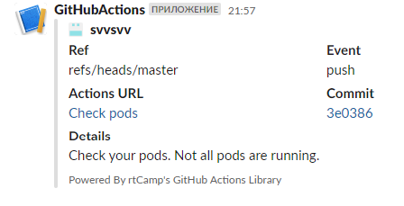

# Homework for 10.K3S
---

[>> GitHub Action <<](https://github.com/svvsvv/10.K8s.Install/actions/runs/4632136403/jobs/8195845947)


### K3s:


## Hometask. GitHub Action

[GitHub Action](https://github.com/svvsvv/10.K8s.Install/actions/runs/4632136403/jobs/8195845947)

### atifact


### Slack notification



### yaml file

```yaml
name: Check pods
on:
  push:

jobs:
  build:
    name: Build
    runs-on: ubuntu-latest
    env:
      result_file: result.log
    steps:

    - name: get info using SSH key
      run: |
        mkdir ~/.ssh
        eval `ssh-agent -s`
        ssh-add - <<< "${{ secrets.SSH_KEY }}"
        ssh-keyscan -p 22510 -H ${{ secrets.JUMP_IP }} >> ~/.ssh/known_hosts
        ssh -p 22510 ${{ secrets.JUMP_USERNAME }}@${{ secrets.JUMP_IP }} ssh-keyscan ${{ secrets.K3S_HOST }} >> ~/.ssh/known_hosts
        ssh -o ProxyCommand="ssh -W %h:%p ${{ secrets.JUMP_USERNAME }}@${{ secrets.JUMP_IP }} -p 22510" root@${{ secrets.K3S_HOST }} "kubectl get pods -A" >> ${{ env.result_file }}

    - name: check-crashed-pods
      id: check-pods
      run: |
        echo "pods-failed-count=$(cat ${{ env.result_file }} | grep -v Running | wc -l)" >> $GITHUB_OUTPUT

    - name: upload crashed pod's list
      if: steps.check-pods.outputs.pods-failed-count > 1
      uses: actions/upload-artifact@v3
      with:
        path: ${{ env.result_file }}

    - name: Notification in Slack
      if: steps.check-pods.outputs.pods-failed-count > 1
      uses: rtCamp/action-slack-notify@v2
      env:
        SLACK_CHANNEL: github_notifications
        SLACK_COLOR: 'red'
        SLACK_ICON: https://github.com/rtCamp.png?size=48
        SLACK_MESSAGE: 'Check your pods. Not all pods are running.'
        SLACK_TITLE: Details
        SLACK_USERNAME: Vitali Snisar
        SLACK_WEBHOOK: ${{ secrets.SLACK_WEBHOOK }}
```