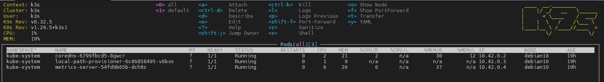
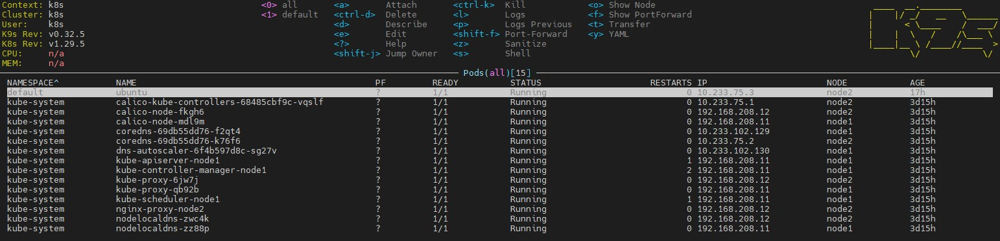
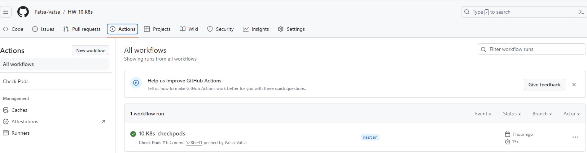

# 10.Kubernetes.Installation.WS

---

## K8s Installation

---


### Localhost.

1. Install kubectl for local run:

- Create a new SSH key using the Ed25519 algorithm:

```bash
sudo apt update
sudo apt upgrade
sudo apt install sshpass
sudo ssh-keygen -t ed25519
```
- Сopy the public key to the Kubernetes cluster for the user:

```
sudo ssh-copy-id root@IP_K8sCluster
sudo ssh-copy-id root@IP_K3s_Cluster
```
- Copying the Kubernetes configuration file:

```bash
sudo scp root@IP_K8s_Cluster:/root/.kube/config /root/.kube/config
sudo scp root@IP_K3s_Cluster:/etc/rancher/k3s/k3s.yaml /root/.kube/config-k3s
```

- Install kubectl:

```bash
sudo apt install curl
sudo curl -LO "https://dl.k8s.io/release/$(curl -L -s https://dl.k8s.io/release/stable.txt)/bin/linux/amd64/kubectl"
sudo install -o root -g root -m 0755 kubectl /usr/local/bin/kubectl
kubectl version
kubectl get nodes
kubectl get pods -A
```

2. Install k9s to maintain cluster:

```bash
wget https://go.dev/dl/go1.22.4.linux-amd64.tar.gz
sudo rm -rf /usr/local/go && sudo tar -C /usr/local -xzf go1.22.4.linux-amd64.tar.gz
nano .bashrc  ### Added line to the end of file: export PATH=$PATH:/usr/local/go/bin 
source .bashrc
```

3. Make print-screen of k9s with pods in all namespaces:




### Kubernetes host.

1. Finish workshop deployment if it is not done yet.

2. Deploy shell pod in default namespace which you can you use for internal checks inside the cluster:



### Monitoring of cluster.

1. Create GitHub action to check status of pods:

[Github repo HW_10.K8s](https://github.com/Patsa-Vatsa/HW_10.K8s)

- In the "Security" section of the sidebar, select Secrets and variables, then click Actions. Click the Secrets tab. Click New repository secret. In the Name field, type a name for your secret.

```bash
mkdir 10.k8s
cd 10.k8s/
mkdir .github/workflows
mkdir .github
mkdir .github/workflows
cd .github/workflows/
nano checkpod.yml
```

- checkpod.yml:

```yml
name: Check Pods
on: [push , workflow_dispatch ]
jobs:
  build:
    name: build
    runs-on: ubuntu-latest

    steps:
    - uses: actions/checkout@v2
    - name: executing remote ssh commands using password
      id: check-pods
      uses: appleboy/ssh-action@v1.0.3
      with:
        proxy_host: ${{ secrets.BASTION_IP }}
        proxy_port: ${{ secrets.BASTION_PORT }}
        proxy_username: ${{ secrets.BASTION_USER }}
        proxy_password: ${{ secrets.BASTION_PASS }}
        host: ${{ secrets.SERVER_IP }}
        port: ${{ secrets.SERVER_PORT }}
        username: ${{ secrets.SERVER_USER }}
        password: ${{ secrets.SERVER_PASS }}
        script: |
          kubectl get pods -A > output.log
          echo "crash-pods=$(kubectl get pods -A --context='k8s' | awk 'NR!=1 {print $4}' | grep -v 'Running' | wc -l)" >> $env:GITHUB_OUTPUT
```

```bash
cd
cd 10.k8s/
git init
git config --global user.name "Vitaliy Shvedov"
git config --global user.email "patsa_vatsa@tut.by"
git remote add origin git@github.com:Patsa-Vatsa/HW_10.K8s.git
git status
git add .
git git commit -m "10.K8s_checkpods"
git commit -m "10.K8s_checkpods"
git push -u origin master
```

