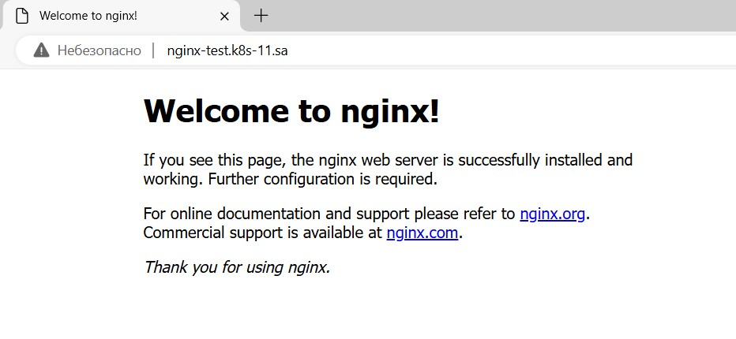

## 11.Kubernetes.Basic objects

---

### Nginx deployment

---

1. Create deployment of nginx service::


- replicas: 4
- set resources for pods
- deployment shouldn't have any outage (service is available all time)
- ingress rule for host name (nginx-test.k8s-<NUMBER>.sa)

```
wget https://raw.githubusercontent.com/kubernetes/ingress-nginx/main/deploy/static/provider/baremetal/deploy.yaml -O ingress-nginx.yaml
nano ingress-nginx.yaml
```

- Changes in ingress-nginx.yaml:


```yml
...
apiVersion: v1
kind: Service
metadata:
  labels:
    app.kubernetes.io/component: controller
    app.kubernetes.io/instance: ingress-nginx
    app.kubernetes.io/name: ingress-nginx
    app.kubernetes.io/part-of: ingress-nginx
    app.kubernetes.io/version: 1.6.4
  name: ingress-nginx-controller
  namespace: ingress-nginx
spec:
  ipFamilies:
  - IPv4
  ipFamilyPolicy: SingleStack
  ports:
  - appProtocol: http
    name: http
    port: 80
    protocol: TCP
    nodePort: 30001      ### Added line
    targetPort: http
  - appProtocol: https
    name: https
    port: 443
    protocol: TCP
    nodePort: 30002      ### Added line
    targetPort: https
....
```

```bash
kubectl create -f ingress-nginx.yaml
```

```bash
nano app-nginx.yaml
```

- app-nginx.yaml:


```yml
apiVersion: apps/v1
kind: Deployment
metadata:
  name: webserver-nginx
  labels:
    app: nginx
spec:
  replicas: 4
  strategy:
    type: RollingUpdate
    rollingUpdate:
      maxSurge: 2
      maxUnavailable: 2
  selector:
    matchLabels:
      app: nginx
  template:
    metadata:
      labels:
        app: nginx
    spec:
      containers:
      - name: nginx
        image: nginx:latest
        ports:
        - containerPort: 80
        resources:
          requests:
            cpu: 50m
            memory: 50Mi
          limits:
            cpu: 100m
            memory: 100Mi
---
apiVersion: v1
kind: Service
metadata:
  name: app-service
  labels:
    run: app-service
spec:
  ports:
  - protocol: TCP
    port: 80
  selector:
    app: nginx
---
apiVersion: networking.k8s.io/v1
kind: Ingress
metadata:
  name: ingress-sa-nginx
  annotations:
    nginx.ingress.kubernetes.io/server-alias: "nginx-test.k8s-11.sa"
spec:
  ingressClassName: nginx
  rules:
    - host: nginx-test.k8s-11.sa
      http:
        paths:
          - path: /
            pathType: Prefix
            backend:
              service:
                name: app-service
                port:
                  number: 80
```

```bash
kubectl create -f app-nginx.yaml
```


