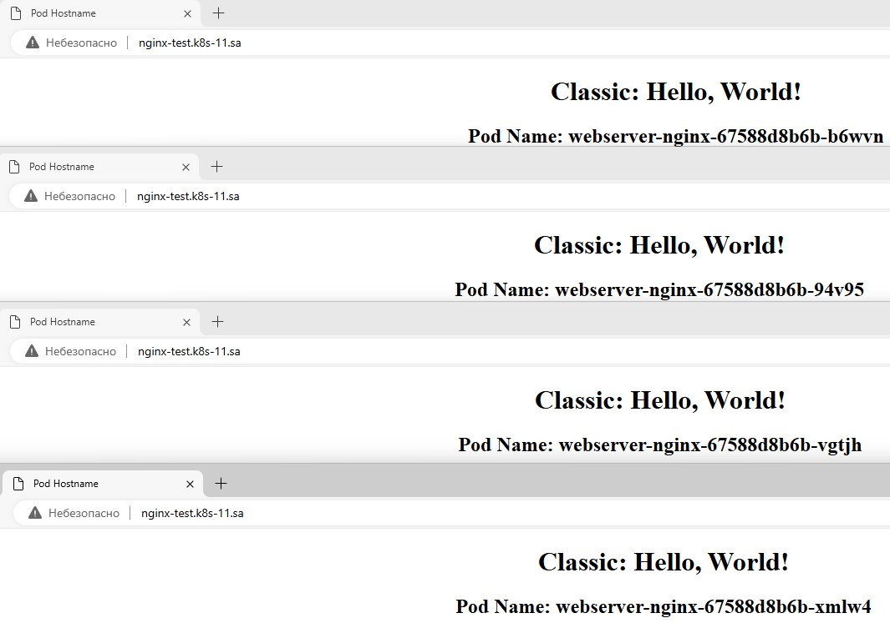

## 12.Kubernetes.Data.Security.

---

### Config maps and secrets

---

1. Add index.php page as config map, which should display hostname of pod as first level header, or generate index.html inside init container:

```bash
mkdir 12.Kubernetes.Data.Security
cd 12.Kubernetes.Data.Security
nano hw_12_nginx-manifest.yaml
```

- hw_12_nginx-manifest.yaml:


```yml
apiVersion: v1
kind: ConfigMap
metadata:
  name: html-config
data:
  index.html: |
    <!DOCTYPE html>
    <html>
    <head>
        <meta charset="UTF-8">
        <title>Pod Hostname</title>
        <style>
          .text {
          text-align: center;
          }
        </style>
    </head>
    <body>
        <div class="text">
        <h1>Classic: Hello, World!</h1>
        <h2>Pod Name: HOSTNAME</h2>
        </div>
    </body>
    </html>
---
apiVersion: apps/v1
kind: Deployment
metadata:
  name: webserver-nginx
  labels:
    app: nginx
spec:
  replicas: 4
  strategy:
    type: RollingUpdate
    rollingUpdate:
      maxSurge: 2
      maxUnavailable: 0
  selector:
    matchLabels:
      app: nginx
  template:
    metadata:
      labels:
        app: nginx
    spec:
      containers:
      - name: nginx
        image: nginx:latest
        ports:
        - containerPort: 80
        resources:
          requests:
            cpu: 51m
            memory: 50Mi
          limits:
            cpu: 100m
            memory: 100Mi
        volumeMounts:
        - name: index-html-for-nginx
          mountPath: /usr/share/nginx/html
        - name: ssh-secret
          mountPath: /root/.ssh
      initContainers:
      - name: config
        image: nginx:latest
        command: ["sh", "-c", 'cd /tmp/; sed -e "s/HOSTNAME/$HOSTNAME/" /tmp/index.html > /usr/share/nginx/html/index.html']
        env:
        - name: HTML_CONTENT
          valueFrom:
            configMapKeyRef:
              name: html-config
              key: index.html
        volumeMounts:
        - name: config-mount
          mountPath: /tmp
        - name: index-html-for-nginx
          mountPath: /usr/share/nginx/html
        - name: ssh-secret
          mountPath: /root/.ssh
      volumes:
      - name: config-mount
        configMap:
          name: html-config
      - name: index-html-for-nginx
        emptyDir: {}
      - name: ssh-secret
        secret:
          secretName: ssh-keys
---
apiVersion: v1
kind: Service
metadata:
  name: nginx-service
  labels:
    run: nginx-service
spec:
  ports:
  - protocol: TCP
    port: 80
  selector:
    app: nginx
---
apiVersion: networking.k8s.io/v1
kind: Ingress
metadata:
  name: ingress-sa-nginx
  annotations:
    nginx.ingress.kubernetes.io/server-alias: "nginx-test.k8s-11.sa"
spec:
  ingressClassName: nginx
  rules:
    - host: nginx-test.k8s-11.sa
      http:
        paths:
          - path: /
            pathType: Prefix
            backend:
              service:
                name: nginx-service
                port:
                  number: 80   
```

2. Generate pair public and private keys (or use existing) and add them to the pod for user root as secrets, please use sealsecret object for that:

- Install sealed-secret contoller and kubeseal:

```bash
kubectl apply -f https://github.com/bitnami-labs/sealed-secrets/releases/download/v0.27.0/controller.yaml
wget https://github.com/bitnami-labs/sealed-secrets/releases/download/v0.27.0/kubeseal-0.27.0-linux-amd64.tar.gz
sudo tar -C /usr/local/bin -xzf kubeseal-0.27.0-linux-amd64.tar.gz
kubeseal --version
```

- Output:

```
kubeseal version: 0.27.0

```

- Generate secret:

```bash
kubectl create secret generic ssh-keys --from-file=id_ed25519 --from-file=id_ed25519.pub
```

- Generate a ssh-keys-secret.yaml file containing the information about the ssh-keys secret:

```bash
kubectl get secret ssh-keys  -o yaml > ssh-keys-secret.yaml
```

- Create a sealed secret based on the existing `ssh-keys-secret.yaml`:

```bash
kubeseal < ssh-keys-secret.yaml > sealed-ssh-keys-secret.yaml
```

- Apply encrypted secret to Kubernetes cluster:

```bash
kubectl apply -f sealed-ssh-keys-secret.yaml
```

3. Validate secrets and index.html display:



```bash
kubectl exec -it webserver-nginx-67588d8b6b-vgtjh -- bash
ls /root/.ssh
```

- Output:

```
root@webserver-nginx-67588d8b6b-vgtjh:~# ls /root/.ssh
id_ed25519  id_ed25519.pub
```