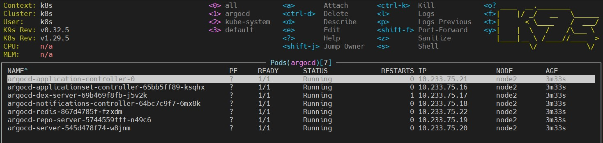
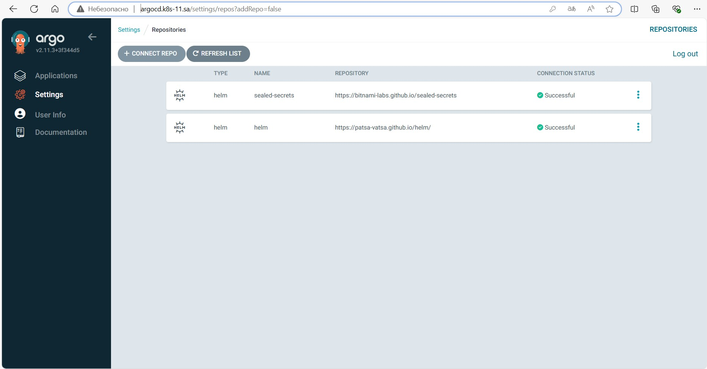
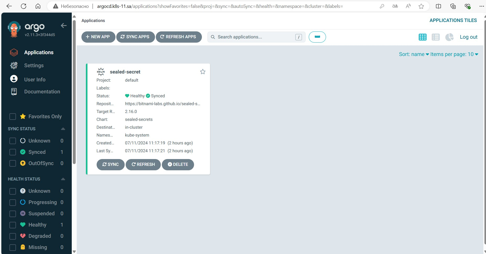
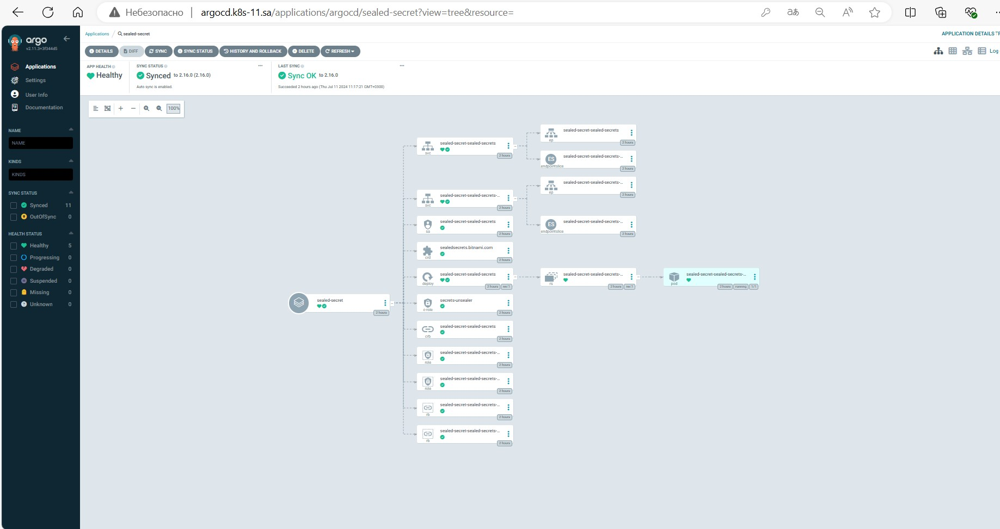
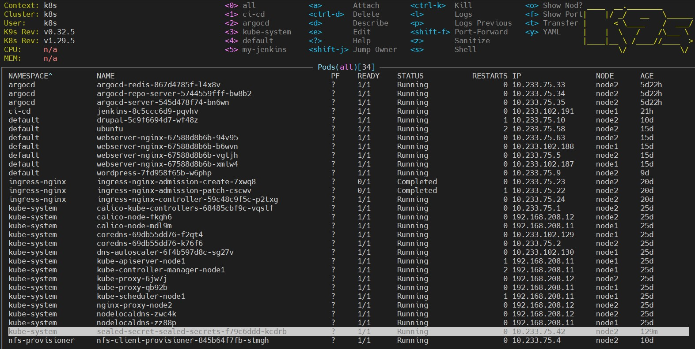

## 15.Kubernetes.ArgoCD

---

### Deploy ArgoCD into your cluster:

---

```bash
mkdir 15.K8s.ArgoCD
cd 15.K8s.ArgoCD/
kubectl create namespace argocd
wget https://raw.githubusercontent.com/argoproj/argo-cd/stable/manifests/install.yaml -O argocd.yaml
nano argocd.yaml
kubectl apply -f argocd.yaml -n argocd
```


### Add your repositories with helm packages as source for deployment:




### Apply Sealed secrets:

---







