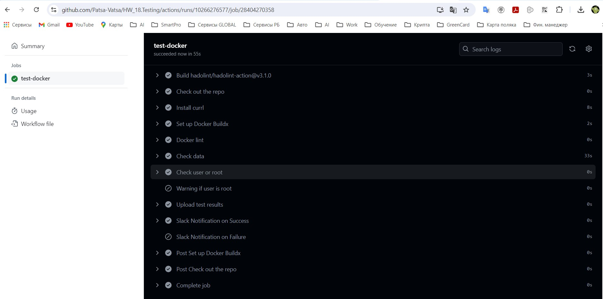
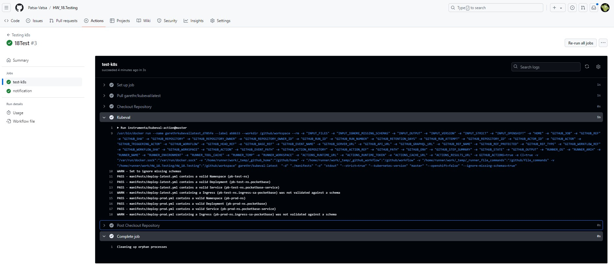
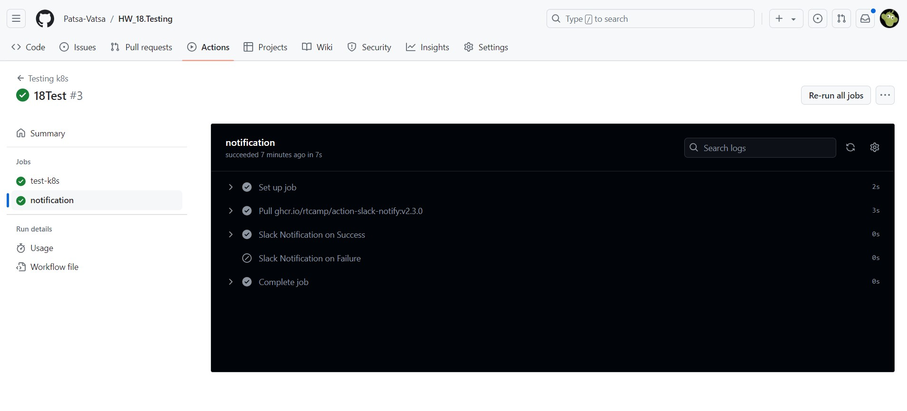

# 18. Testing
## Automate Docker images test by github action:

## Create CI for testing Kubernetes manifests using kubeval:

## Result:

## repository for the action test(folder lab18):

[GitHub link](https://github.com/Patsa-Vatsa/HW_18.Testing.git)