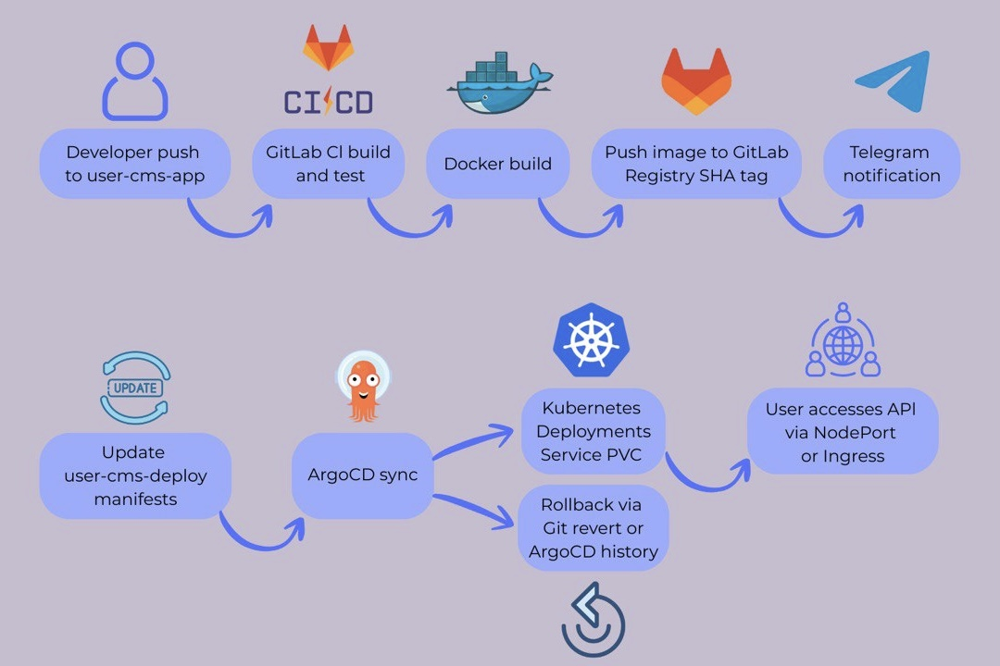

Project Reporter: Vlad Voitov  
Group Number: md-sa2-33-25

---

## 1. Application Description

Application name: user-cms  
Programming language(s): Java (Spring Boot)  
Database type: Embedded H2 database  
Repository / site / package link:  
- Application repository: https://gitlab.com/neroseccess/user-cms-app  
- Deployment repository: https://gitlab.com/neroseccess/user-cms-deploy  

---

## 2. Pipeline – High-Level Design

---

## 3. Technologies Used

**Orchestration:**  
Kubernetes is used to run and manage application containers. ArgoCD is used for GitOps-based continuous delivery and cluster synchronization.

**Automation tools:**  
GitLab CI is used for pipeline automation. Docker is used for containerization. Bash and Maven are used for build and test automation.

**CI implementation:**  
The CI pipeline is triggered by a Git push to the `main` branch. It includes application build, unit tests, Docker image build, functional API tests, image publishing to the registry, and pipeline notifications.

**Deployment flows:**  
New deployment is performed when a new Docker image is built and published by the CI pipeline. The Kubernetes Deployment manifest references the image by commit SHA, ensuring versioning and traceability. ArgoCD monitors the deployment repository and applies changes to the Kubernetes cluster automatically.  
Upgrade deployment is achieved by updating the image tag in the Deployment manifest. During the upgrade, the application pod is recreated with the new image while user data remains intact because the embedded H2 database is stored on a persistent volume.  
Rollback is implemented by reverting the Kubernetes manifests in the Git repository to a previous revision. ArgoCD detects the rollback commit and synchronizes the cluster back to the previous stable state. Rollback is triggered manually in case of deployment failure or incorrect application behavior, and is supported by versioned Docker images.

---

## 4. References & Links

- https://docs.gitlab.com/ee/ci/
- https://kubernetes.io/docs/
- https://argo-cd.readthedocs.io/
- https://spring.io/projects/spring-boot
- https://docs.docker.com/
